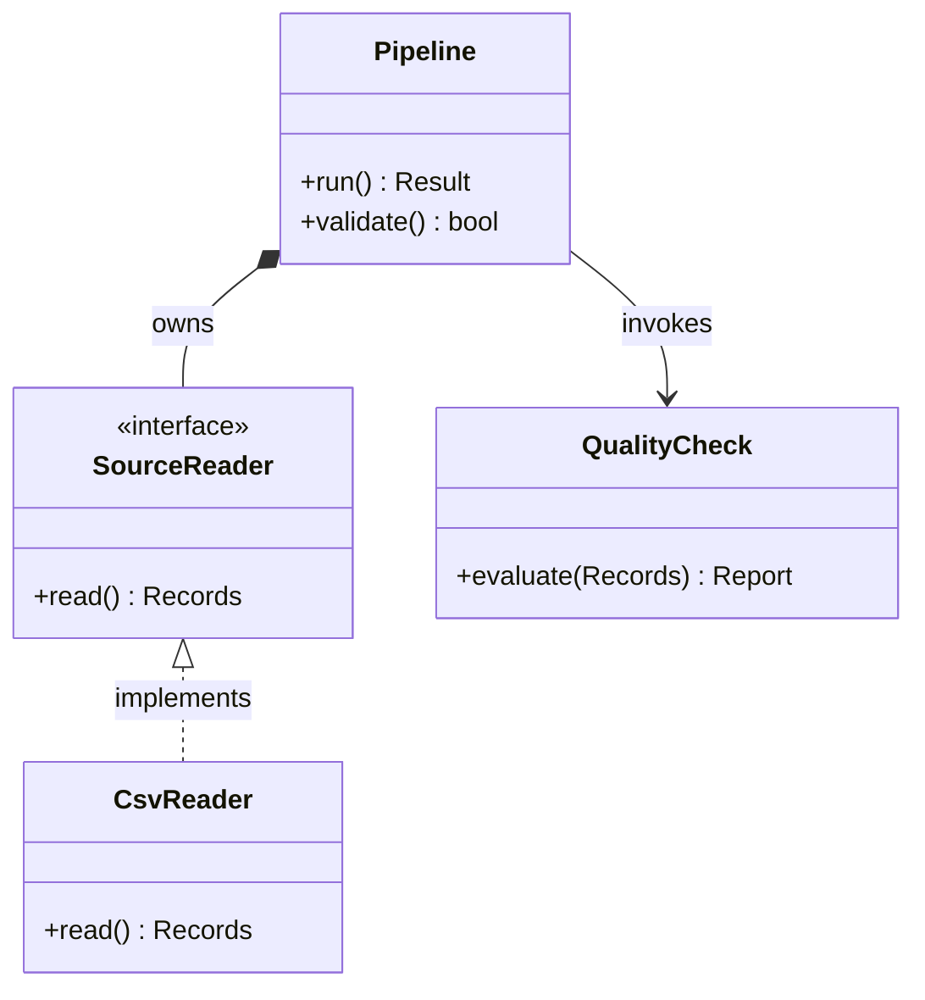
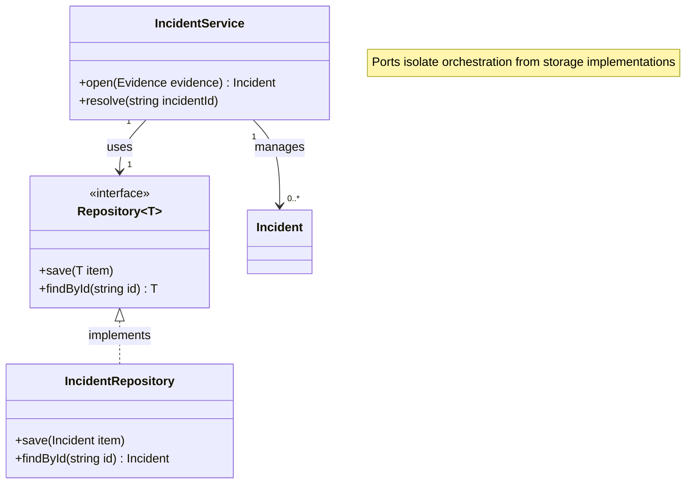
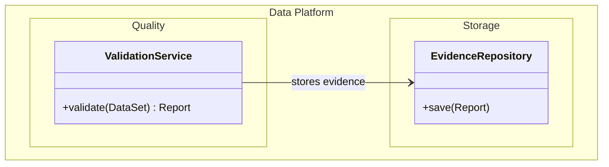
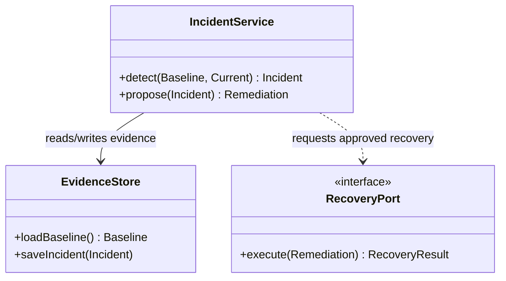

# Class Diagram

class, interface, member와 inheritance·composition·dependency가 핵심이면 `classDiagram`을 사용한다.

## Advanced: Generics, Multiplicity And Notes

## Advanced: Labeled And Nested Namespaces

Mermaid 11.15.0 이상에서는 namespace label과 hierarchical namespace를 사용할 수 있다. package boundary가 설계 질문에 중요할 때만 사용한다.

`hierarchicalNamespaces: false`는 기존 프로젝트가 fully-qualified namespace를 flat box로 표현하는 convention일 때만 사용한다.

## Relationship Choice

Mermaid의 relation syntax는 UML relation type을 표현한다. 실제 domain에서 어떤 relation이 맞는지는 source model과 설계 계약이 결정하며, 구현 습관만으로 더 강한 relation을 추론하지 않는다.

| Syntax | Meaning | Use |
| --- | --- | --- |
| `<|--` | inheritance | source가 subtype/base inheritance를 정의할 때 |
| `<|..` | realization | source가 interface realization을 정의할 때 |
| `*--` | composition | 강한 whole-part ownership이나 lifecycle 결합이 실제 model에 있을 때 |
| `o--` | aggregation | composition보다 약한 whole-part relation이 실제 model에 있을 때 |
| `-->` | association | 구조적·논리적 association이 확인될 때 |
| `..>` | dependency | dependency/use 관계가 확인될 때 |

Association을 항상 persistent reference로, dependency를 항상 temporary call로 해석하지 않는다. Multiplicity도 source가 뒷받침할 때만 구체화한다.

## Improvement: Model Responsibility, Not Every Field

class diagram은 source code listing이 아니다. 설계 질문과 관련된 member만 남기고, framework boilerplate와 trivial accessor는 생략한다.

## Rules

- class, member, stereotype와 relationship은 질문에 필요한 model만 보여준다.
- inheritance, realization, composition, aggregation, association과 dependency의 강도를 source보다 높여 표현하지 않는다.
- relation label은 relation type을 대체하지 않으며 둘이 모순되지 않게 한다.
- package나 namespace는 실제 boundary를 설명할 때만 추가한다.
