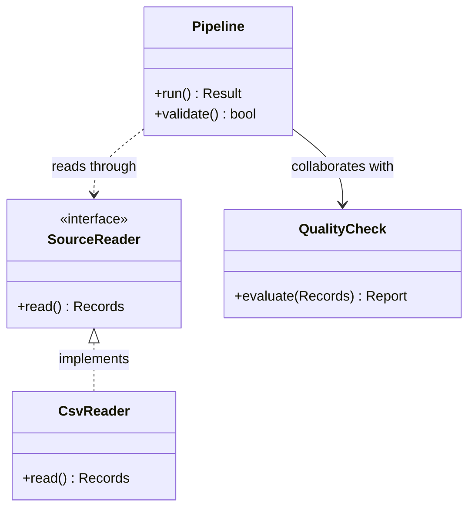
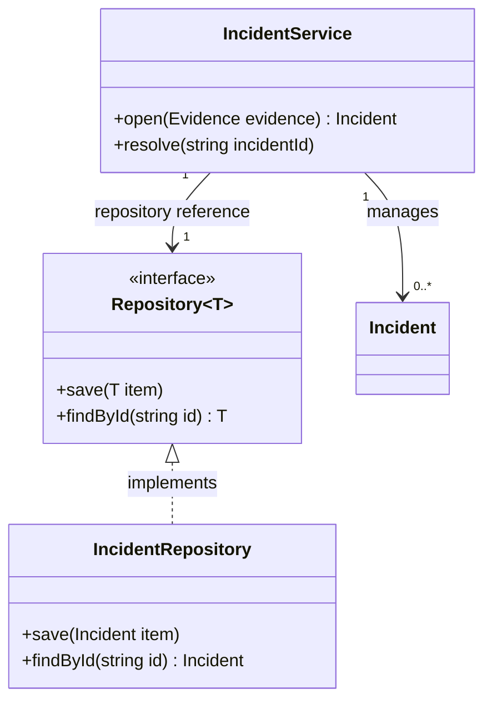
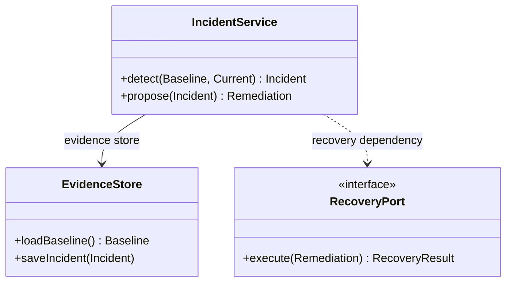
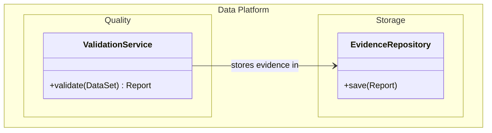

# Class Diagram

> `classDiagram`의 현재 syntax와 renderer behavior는 target renderer와 Mermaid 공식 문서를 확인한다.

Class, interface, member와 **static type relationship**이 핵심이면 `classDiagram`을 사용한다. Runtime message order, database cardinality 또는 organization ownership을 UML-style type relation으로 바꾸지 않는다.

Relation은 source model이 실제로 말하는 static structure를 표현한다. Method call이 보인다는 이유로 모든 runtime call을 dependency edge로 옮기지 않는다.

## Stable Class Identity Before Relationships

Mermaid는 relationship statement만으로도 class를 암묵적으로 만들 수 있다. 그래서 endpoint typo가 syntax error가 아니라 **의도하지 않은 phantom class**로 나타날 수 있다.

- 중요한 model에서는 핵심 class/interface를 명시적으로 선언하고 relation endpoint가 그 identity에 정확히 resolve되는지 review한다.
- Internal class name과 display label을 구분한다. Label을 바꾸더라도 relationship identity가 달라지지 않게 한다.
- 같은 type을 다른 namespace나 label로 반복 선언해 서로 다른 identity처럼 만들지 않는다.
- Source에 없는 type을 관계를 완성하기 위해 추가하지 않는다.
- Class name typo를 “새로운 class가 하나 더 생긴 것”으로 놓치지 않도록 final diagram의 entity set을 source model과 대조한다.

## Relationship Strength Must Be Source-Backed

Mermaid relation syntax는 서로 다른 UML-style relation을 표현한다. Relation type은 visual style이 아니라 model claim이다.

| Relation | Use when source model says |
| --- | --- |
| inheritance | subtype/base inheritance가 실제로 존재함 |
| realization | class가 interface/contract를 realization함 |
| composition | whole-part와 강한 lifecycle/ownership 결합이 존재함 |
| aggregation | composition보다 약한 whole-part relation이 존재함 |
| association | 구조적/logical association이 존재함 |
| dependency | use/dependency relation이 존재함 |

- Association을 항상 persistent field로, dependency를 항상 temporary method call로 해석하지 않는다.
- Composition을 단순 “owns”라는 영어 표현만 보고 선택하지 않는다. Part lifecycle이 whole에 실제로 결합돼 있는지 source가 뒷받침해야 한다.
- Aggregation은 composition보다 약해 보인다는 이유로 uncertainty fallback으로 사용하지 않는다. Source model이 그 distinction을 실제로 사용해야 한다.
- Relation label은 relation type을 대체하지 않는다. Label과 arrow가 서로 다른 의미를 주장하지 않게 한다.
- Bidirectional relation, lollipop interface 등 더 특수한 UML surface는 질문에 필요하고 target에서 검증할 때만 사용한다.

## Multiplicity Is A Contract, Not Decoration

Multiplicity는 linked instance 수에 대한 강한 claim이다.

`repository reference`는 source model이 `IncidentService`와 `Repository` 사이에 구조적 association을 실제로 정의한다는 전제다. 단순 method call만 있다면 `..>` dependency가 더 정확할 수 있다.

- Mermaid가 quoted multiplicity text를 그릴 수 있다는 사실이 source cardinality를 검증해 주지는 않는다.
- `1`, `0..*` 같은 값을 source model보다 강하게 추론하지 않는다.
- Multiplicity가 unknown이면 보기 좋은 default를 채우지 않고 생략한다.
- Relation direction과 multiplicity endpoint를 뒤집지 않았는지 source 관점에서 읽어본다.

## Generic Identity Is Not Parameterized Identity

Mermaid class generic notation은 표시/definition에 type parameter를 붙일 수 있지만 **generic parameter는 class identity의 일부가 아니다.**

- `class Repository~T~`를 정의했다면 relation에서 `Repository`로 참조한다.
- `Repository~Incident~`, `Repository~User~`를 서로 다른 concrete class identity처럼 만들지 않는다.
- 실제 source에 parameterized specialization이 독립 type identity로 존재하면 별도 concrete class 이름을 선언하거나 source에 맞는 다른 representation을 사용한다.
- Nested generic과 최근 추가된 generic syntax가 load-bearing이면 target renderer에서 실제 parse/render를 확인한다.

## Members Show Responsibility, Not Source Listing

Class Diagram은 source code dump가 아니다.

- 질문에 필요한 attribute/operation만 남긴다.
- Framework boilerplate, trivial accessor와 unrelated member를 completeness 때문에 넣지 않는다.
- 반대로 일부 member만 보여주는 excerpt를 complete API contract처럼 표현하지 않는다.
- Visibility, static/abstract classifier와 return type도 source contract에 있을 때만 사용한다.

## Namespace Is A Model Boundary Only When Source Says So

Namespace는 class grouping을 표현할 수 있고 recent Mermaid에서는 label/nesting도 지원한다.

- Namespace를 layout box로 추가하면서 package/module ownership을 발명하지 않는다.
- Namespace display label과 internal namespace identity를 구분한다.
- Hierarchical/compact rendering mode는 presentation이며 source package hierarchy를 바꾸지 않는다.
- 같은 class를 여러 namespace에 넣어 multi-membership을 암시하지 않는다.

## Class Versus Other Models

- **Class Diagram**: type, member, inheritance/realization/association 같은 static structure가 핵심.
- **ER Diagram**: entity grain, crow's-foot cardinality, identifying relation과 schema-oriented attribute가 핵심.
- **Sequence Diagram**: runtime participant/message order가 핵심.
- **Architecture/Flowchart**: deployable/service topology나 generic dependency가 핵심.

Class 이름이 코드에 존재한다는 이유만으로 runtime architecture를 Class Diagram으로 만들지 않는다.

## Renderer-Sensitive Review

Class Diagram은 syntax validity와 **static-model fidelity**를 따로 검증한다.

1. 모든 class/interface identity가 source model과 일치하고 relation typo로 phantom class가 생기지 않았는가.
1. Relation endpoint가 display label이 아니라 의도한 stable class identity를 참조하는가.
1. Inheritance, realization, composition, aggregation, association와 dependency 강도가 source-backed인가.
1. Relation label과 arrow type이 서로 모순되지 않는가.
1. Multiplicity가 source-backed이며 endpoint를 뒤집지 않았는가.
1. Generic parameter를 별도 class identity처럼 참조하지 않았는가.
1. Member excerpt를 complete source/API contract처럼 보이게 하지 않았는가.
1. Namespace가 실제 source grouping이며 layout 편의를 위해 invented boundary가 아닌가.
1. Runtime call order나 database relationship을 static class relation으로 과도하게 압축하지 않았는가.
1. Recent namespace/generic/presentation surface가 중요하면 actual target에서 안정적으로 render되는가.

문제가 있으면 더 강한 UML arrow를 선택해 model을 완성하지 않는다. Source type relation을 좁히거나 더 직접적인 Sequence/ER/Architecture representation으로 전환한다.

## Portable Fallback

Target renderer가 Class Diagram을 안정적으로 지원하지 않으면 **type identity, stereotype, selected members, relation type와 source-backed multiplicity**를 보존하는 type/relation table을 사용한다. Runtime interaction이나 schema cardinality가 핵심이면 해당 specialized diagram으로 전환한다.
