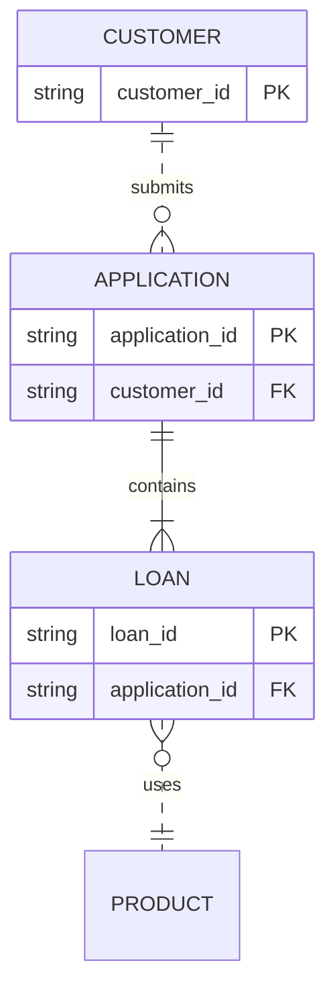
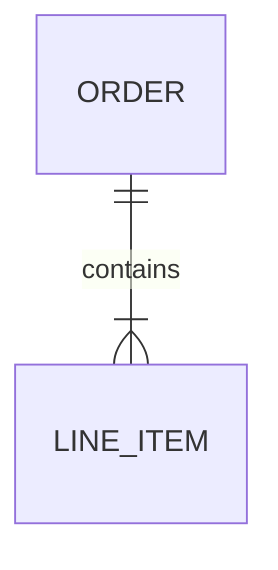
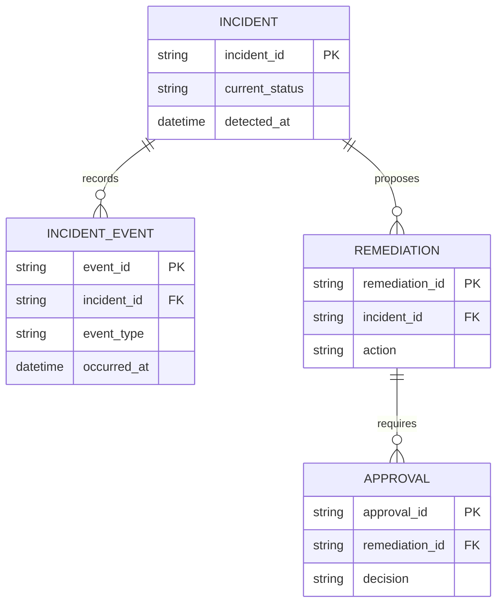

# ER Diagram

> `erDiagram`의 현재 syntax와 renderer behavior는 target renderer와 Mermaid 공식 문서를 확인한다.

Entity의 **grain, relationship cardinality와 identifying/non-identifying relation**이 핵심이면 `erDiagram`을 사용한다. 단순 table listing이나 runtime object relation을 schema fact처럼 만들지 않는다.



이 예제는 `APPLICATION`이 `CUSTOMER`와 non-identifying relation이고, `LOAN`은 해당 model에서 `APPLICATION` 없이는 독립 존재하지 않는 identifying relation이라는 **source-backed 전제**가 있을 때만 맞다. Solid/dashed line을 단순 styling으로 선택하지 않는다.

## Entity Grain Comes First

Entity는 무엇을 한 row/instance로 보는지 grain이 먼저 정해져야 한다.

- Entity 이름이 비슷하다는 이유로 current object, history event, aggregate와 lookup entity를 합치지 않는다.
- 같은 source concept를 서로 다른 grain으로 두 번 모델링할 때는 각 entity가 무엇을 한 instance로 보는지 분명히 한다.
- 일부 entity만 보여주는 diagram을 전체 schema inventory처럼 표현하지 않는다.
- History table, bridge entity, weak/dependent entity 같은 modeling pattern은 source schema/model이 실제로 그 구조를 가질 때만 사용한다.

## Cardinality And Identification Are Separate Contracts

Mermaid ER relationship은 양끝 cardinality와 가운데 identification type을 함께 표현한다.

- `||`, `o|`, `|{`, `o{` 등은 각 endpoint의 min/max cardinality를 나타낸다.
- Solid `--`는 **identifying relationship**, dashed `..`는 **non-identifying relationship**을 나타낸다.
- Cardinality가 같아도 identifying 여부는 다를 수 있다. 두 개념을 하나로 추론하지 않는다.
- FK가 존재한다는 이유만으로 identifying relationship이라고 단정하지 않는다. Child existence/identity가 parent에 실제로 의존하는지 source model을 확인한다.
- 반대로 lifecycle dependence가 source에 있는데 dashed line을 단순 visual preference로 쓰지 않는다.
- Unknown cardinality나 identification을 보기 좋은 default로 채우지 않는다.

## Relationship Labels Have A Perspective

Mermaid relationship label은 **first entity 관점**에서 읽힌다.



이는 `ORDER contains LINE_ITEM`으로 읽는다.

- Label을 반대 방향의 동사처럼 작성하지 않는다.
- Relationship line은 process-flow arrow가 아니다. Diagram direction `LR`/`TB`나 label 문장 방향을 runtime call/ownership flow로 해석하지 않는다.
- 양방향 business wording이 필요해도 Mermaid label 하나가 양쪽 role name을 모두 구조적으로 소유하는 것은 아니다. 중요한 role names는 companion schema/table을 검토한다.

## Keys Are Source Annotations, Not Inference

PK, FK, UK는 source schema/model이 뒷받침할 때만 표시한다.


- Field 이름이 `*_id`라는 이유로 PK/FK를 추론하지 않는다.
- Mermaid key annotation이 실제 database constraint나 referential integrity를 검증해 주지 않는다.
- Composite PK/FK, alternate key와 multi-key attribute가 중요하면 source schema를 기준으로 정확히 표현하고 renderer가 읽기 어려우면 schema table로 전환한다.
- Relationship cardinality와 FK presence가 서로 모순되지 않는지 별도로 검토한다.

## Attributes May Be An Excerpt

ER attribute block은 entity 이해에 필요한 **selected attributes**만 보여줄 수 있다. Diagram에 없는 field가 schema에 존재하지 않는다고 결론내리지 않는다.



이 예시는 current state와 history event를 분리하는 **한 가지 source model**일 뿐 ER의 일반 규칙이 아니다.

- 질문과 관련 없는 column을 모두 복제하지 않는다.
- Attribute subset이면 complete DDL/schema라고 표현하지 않는다.
- Mermaid type text는 database engine의 실제 type system을 검증하지 않는다. Exact SQL type/default/check/index가 핵심이면 schema/DDL artifact를 사용한다.

## Nullable Is Not Unknown

Recent Mermaid에서는 attribute type의 `?`로 optional/nullable을 표현할 수 있다.

```mermaid
erDiagram
    p[Person] {
        string first_name
        string? middle_name
        string last_name
    }
    a["Customer Account"] {
        uuid account_id PK
        string email UK
    }
    p ||..o| a : owns
```

- Nullable/optional이 실제 schema contract일 때만 `?`를 사용한다.
- Source가 nullability를 말하지 않는 **unknown** 상태를 nullable로 바꾸지 않는다.
- Application-level optionality와 database `NULL` 가능 여부가 다른 model이면 둘을 같은 marker로 압축하지 않는다.

## Entity Identity, Alias And Input Safety

Internal entity ID와 display alias를 구분한다.

- Alias를 바꿔도 relationship endpoint가 같은 entity identity를 가리키게 한다.
- Relationship statement가 source에 없던 entity를 만들어내지 않았는지 final entity set을 source model과 대조한다.
- Generated ER source에서 entity/relationship text를 가져올 때 quoting/escaping을 검증한다. Current Mermaid ER parser에는 malformed quote가 명확한 parse failure 대신 **fragmented phantom entities**로 재해석될 수 있는 사례가 있으므로 “parse succeeded”만 acceptance로 사용하지 않는다.
- Special character가 있는 source name이 load-bearing이면 actual parsed entity set과 target render를 함께 확인한다.

## Direction And Grouping Are Presentation

`direction LR/TB/...`와 recent grouping features는 readability를 조절할 수 있지만 model fact를 새로 만들지 않는다.

- 화면의 왼쪽 entity를 parent, 위쪽 entity를 owner라고 자동 해석하지 않는다.
- Grouping을 source-backed logical/schema domain이 아닌 단순 proximity 때문에 semantic boundary처럼 사용하지 않는다.
- Portrait viewport 때문에 cardinality endpoint나 identifying relation을 바꾸지 않는다.
- Entity/relationship가 많아지면 schema domain별 overview/detail이나 table split을 검토한다.

## ER Versus Other Models

- **ER Diagram**: entity grain, crow’s-foot cardinality, identifying relation와 schema-oriented attribute가 핵심.
- **Class Diagram**: type/member, inheritance/realization/composition 같은 static object model이 핵심.
- **Architecture/Flowchart**: service/system dependency나 runtime flow가 핵심.
- **Table/DDL**: exact column type, constraint, default, index와 migration contract가 핵심.

Database table이 보인다는 이유만으로 모든 physical schema detail을 ER Diagram에 넣지 않는다.

## Renderer-Sensitive Review

ER Diagram은 syntax validity와 **schema/model fidelity**를 따로 검증한다.

1. 각 entity의 grain과 identity가 source model과 일치하는가.
1. 양끝 cardinality가 source-backed이며 min/max를 뒤집지 않았는가.
1. Solid/dashed relation이 identifying/non-identifying 의미와 일치하는가.
1. FK 존재만으로 identifying relation이나 ownership을 추론하지 않았는가.
1. Relationship label이 first-entity 관점에서 자연스럽고 process arrow처럼 읽히지 않는가.
1. PK/FK/UK와 nullable annotation이 실제 source contract인가.
1. Attribute excerpt를 complete schema처럼 표현하지 않았는가.
1. Alias/quoted name 때문에 relationship endpoint나 entity identity가 바뀌지 않았는가.
1. Parse 성공 뒤에도 phantom/missing entity가 없는지 source entity set과 대조했는가.
1. Exact physical schema가 질문인데 ER가 DDL/schema artifact 역할을 대신하고 있지 않은가.

문제가 있으면 cardinality나 key를 추론해 diagram을 완성하지 않는다. Source grain/constraint를 먼저 확인하거나 schema table/DDL로 전환한다.

## Portable Fallback

Target renderer가 ER Diagram을 안정적으로 지원하지 않으면 **entity grain, attributes excerpt 여부, keys, cardinality, identifying/non-identifying relation과 relationship label perspective**를 보존하는 schema/relation table을 사용한다. Exact physical contract가 핵심이면 authoritative DDL/schema artifact를 우선한다.
