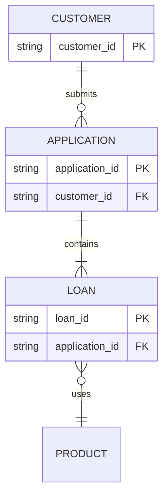
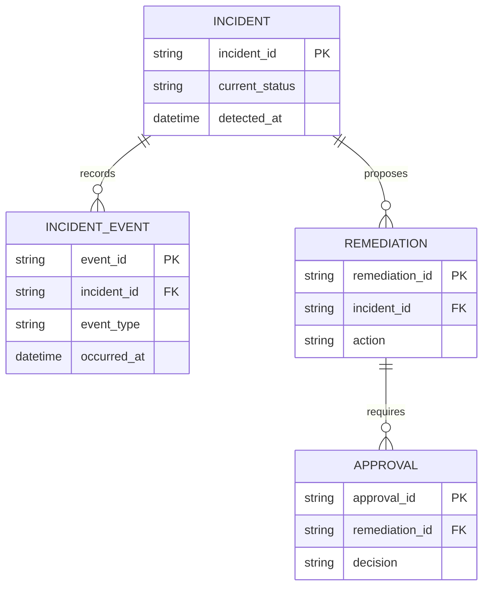
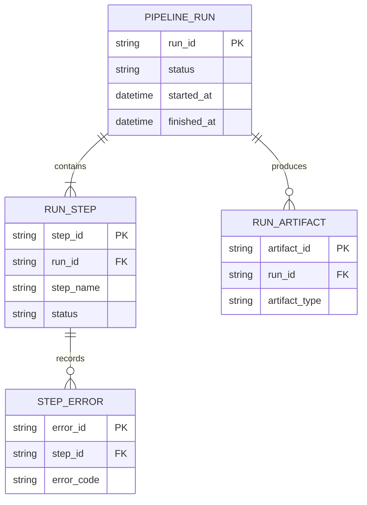

# ER Diagram

entity가 어떤 key와 cardinality로 연결되는지 보여줄 때 `erDiagram`을 사용한다.



## Grain And History

history나 반복 event를 별도 entity로 모델링해야 한다는 근거가 있을 때는 **각 entity의 grain과 relationship**이 읽히게 표현한다. History entity 분리나 append-only 설계 자체를 ER diagram의 일반 규칙으로 가정하지 않는다.



이 예시는 현재 상태와 event history를 분리한 **한 가지 모델링 패턴**이다. 실제 source schema가 다른 grain이나 history 전략을 사용하면 그 구조를 보존한다.

## Make Keys And Cardinality Explicit

PK, FK와 cardinality는 source가 뒷받침하고 질문에 필요할 때 함께 보여준다. Entity 이름이나 field를 이용해 ownership을 추측하지 않는다.



## Optional Types And Entity Aliases

Mermaid 11.16.0 이상에서는 nullable attribute type에 `?`를 붙일 수 있다. 내부 ID와 표시 이름을 분리하면 relationship source는 안정적으로 유지된다.

```mermaid
erDiagram
    p[Person] {
        string first_name
        string? middle_name
        string last_name
    }
    a["Customer Account"] {
        uuid account_id PK
        string email UK
    }
    p ||--o| a : owns
```

nullable 표시는 실제 schema 계약과 일치할 때만 사용하고, unknown과 optional을 혼동하지 않는다.

## Rules

- entity와 attribute는 실제 model 또는 schema의 grain을 보존한다.
- PK, FK, UK, nullable과 cardinality를 source보다 강하게 추론하지 않는다.
- relationship label은 source가 말하는 관계를 설명하되 ownership이나 lifecycle을 임의로 추가하지 않는다.
- history table, bridge table, weak entity 같은 modeling pattern은 실제 구조에 해당할 때만 사용한다.
