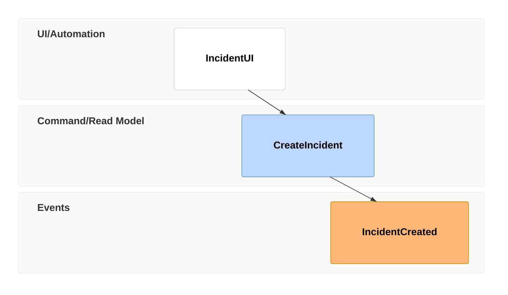
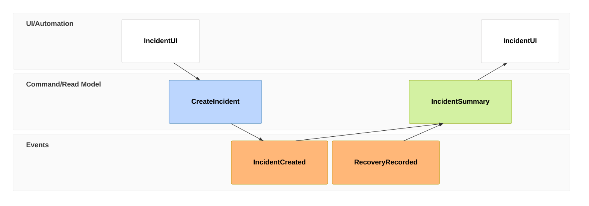

# Event Modeling

> `eventmodeling`의 현재 DSL, renderer behavior와 feature 지원은 target renderer와 Mermaid 공식 문서를 확인한다.

Event Modeling의 **UI/automation → command/read model → event information flow**를 시간축으로 탐색하는 것이 핵심이면 `eventmodeling`을 사용한다. 단순 message sequence나 일반 process를 그리기 위한 대체 syntax로 사용하지 않는다.

이 DSL은 관계를 일부 **자동 추론**한다. 따라서 declaration order, reset frame과 explicit source reference는 presentation detail이 아니라 model semantics에 영향을 줄 수 있다.

## Basic: State Change

이 예제는 UI action이 command로 이어지고 event가 기록되는 하나의 state-change slice를 표현한다. Runtime call stack, latency 또는 transport protocol을 자동으로 뜻하지 않는다.

## Time Frame Identity Versus Order

Time Frame number는 전체 diagram에서 frame을 구분하고 explicit reference에 사용하는 **unique identifier**다. 숫자 크기 자체가 timeline sorting key는 아니다.

- `tf 10`을 `tf 20`보다 먼저 선언할 수 있다. Declaration sequence가 읽는 timeline과 inference context를 만든다.
- 보기 좋은 번호 순서로 정렬하면서 frame declaration을 옮기면 inferred relation이 바뀔 수 있으므로 formatting edit로 취급하지 않는다.
- 번호를 다시 매길 때 `->>` reference도 함께 검증한다.
- 같은 entity identifier는 서로 다른 시점에 반복될 수 있다. 동일 이름이라는 이유로 여러 frame occurrence를 하나로 합치지 않는다.

## Inferred Relations Need Evidence

Explicit source reference가 없는 일반 frame은 주변 declaration과 swimlane context를 이용해 relation이 추론될 수 있다. Source가 그 relation을 뒷받침하는지 별도로 확인한다.

- `UI → Command → Event` 패턴이 source-backed일 때 compact inference를 활용한다.
- 인접 declaration이 단지 문서상 나열일 뿐 실제 information flow가 아니면 inference에 맡기지 않는다.
- Frame을 다른 위치로 옮기거나 entity type/namespace를 바꾸면 inferred source가 달라질 수 있으므로 semantic change로 review한다.
- 자동으로 그려진 connector를 causality proof, synchronous call 또는 guaranteed processing order로 확대 해석하지 않는다.

## Reset Frames And Explicit Sources

`rf` / `resetframe`은 자동 inference를 끊는 **semantic break**다. 시각적 여백을 만들기 위해 사용하지 않는다.

이 예제는 `RecoveryRecorded`를 이전 inferred chain의 연속으로 만들지 않고, read model이 `IncidentCreated`와 `RecoveryRecorded`를 source로 사용한다고 명시한다. 마지막 UI relation도 explicit source로 고정해 declaration 주변의 자동 inference에 의존하지 않는다.

- `rf` 뒤에 새 flow를 시작하는 이유가 source model에 있어야 한다.
- `->>`는 referenced Time Frame identity를 정확히 보존한다. 존재하지 않거나 잘못 renumber된 frame을 가리키지 않는지 확인한다.
- Multiple source relation은 “모두 필요”, “OR”, “AND” 같은 논리 조건을 자동으로 정의하지 않는다. 그런 rule이 중요하면 주변 prose나 별도 rule representation으로 설명한다.

## Entity Types And Namespaces

`ui`, `pcr`/`processor`, `cmd`/`command`, `rmo`/`readmodel`, `evt`/`event`는 다른 역할을 가진 entity type이다. 단순 색상 선택처럼 바꾸지 않는다.

- Command와 Event, Read Model과 UI를 source 없이 서로 교환하지 않는다.
- Namespace는 swimlane grouping에 영향을 주는 model identifier다. Layout을 예쁘게 만들기 위해 가짜 namespace를 만들지 않는다.
- Namespace가 여러 차례 다시 등장하거나 여러 type과 결합되는 복잡한 diagram은 target renderer에서 실제 lane grouping을 확인한다. Current renderer의 namespace/lane behavior는 version-sensitive할 수 있다.
- Swimlane의 vertical order나 spacing을 bounded context priority, ownership rank 또는 temporal duration으로 해석하지 않는다.

## Data Examples Are Not Schema Contracts

Inline data와 `data` block은 해당 frame에 예시 정보를 붙이는 기능이다.

- Example value와 schema/type declaration을 혼동하지 않는다.
- Data type marker가 존재해도 renderer가 해당 type의 semantics를 검증한다고 가정하지 않는다.
- Source에 없는 field를 완성된 payload처럼 채워 넣지 않는다.
- Data detail이 너무 길어 timeline을 압도하면 핵심 information-flow field만 남기고 schema/spec으로 분리한다.
- Data rendering은 version-sensitive surface로 취급한다. Data example이 load-bearing이면 actual target render에서 truncation, wrapping과 reference resolution을 확인한다.

## Choosing Event Modeling

Event Modeling은 transient implementation detail보다 **information change와 user-visible/read-model flow**를 설명할 때 가치가 있다.

- Exact message/call order가 핵심이면 Sequence Diagram을 사용한다.
- 일반 procedure, decision, retry와 handoff가 핵심이면 Flowchart/Swimlanes를 검토한다.
- Event stream, command, read model과 automation의 관계가 핵심일 때 Event Modeling을 유지한다.

## Viewport And Density

Event Modeling은 timeline이 길어지고 namespace/swimlane이 늘수록 넓어진다.

- 하나의 diagram에 모든 bounded context와 scenario를 넣기보다 state-change/state-view/translation 같은 질문별 slice로 나눈다.
- Width를 줄이려고 frame declaration order를 바꾸거나 inferred connector를 삭제하지 않는다.
- Inline data를 줄이는 것은 가능하지만 model entity, explicit source frame과 reset boundary를 presentation compression으로 제거하지 않는다.

## Renderer-Sensitive Review

Event Modeling은 syntax validity와 **inference fidelity**를 따로 검증한다.

1. 이 diagram이 단순 process가 아니라 Event Modeling의 information-flow 질문에 맞는가.
1. 모든 Time Frame number가 unique하고 explicit reference가 올바른 frame을 가리키는가.
1. Declaration order를 숫자 순서와 혼동하지 않았는가.
1. 자동으로 추론된 relation이 source-backed이며 재배치로 의도치 않게 바뀌지 않았는가.
1. Inference를 끊어야 하는 곳에 `rf`가 있고 단순 spacing 용도로 남용하지 않았는가.
1. Multiple source `->>`가 source model의 실제 relation을 보존하는가.
1. UI, processor, command, read model과 event type을 역할에 맞게 사용했는가.
1. Namespace가 실제 model grouping이며 renderer의 current swimlane behavior를 확인했는가.
1. Inline/data block을 authoritative schema나 validated payload처럼 과해석하지 않았는가.
1. Connector와 timeline 위치를 synchronous call, latency 또는 causal proof로 승격하지 않았는가.
1. Diagram이 너무 넓으면 semantic order를 바꾸기보다 scenario/pattern별 split을 검토했는가.

문제가 있으면 relation을 inference에 맡겨 숨기지 않는다. Reset, explicit source 또는 더 직접적인 representation으로 source semantics를 드러낸다.

## Portable Fallback

Target renderer가 Event Modeling을 안정적으로 지원하지 않으면 **timeframe order, entity type, event/command/read-model identity, reset boundary와 explicit source relation**을 보존하는 table 또는 Flowchart로 전환한다. Exact message sequence가 핵심이면 Sequence Diagram을 사용한다.
