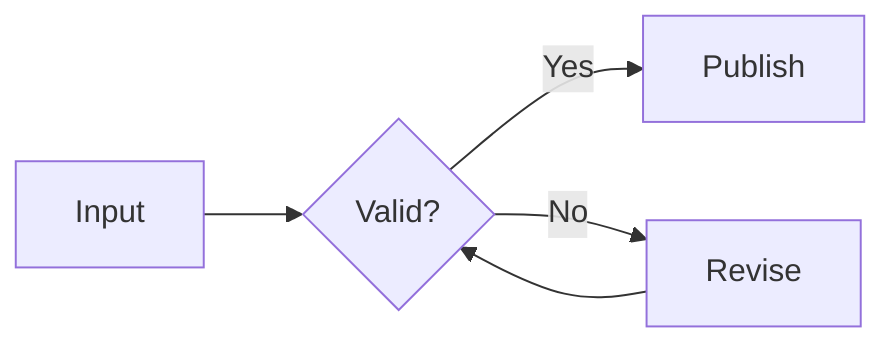
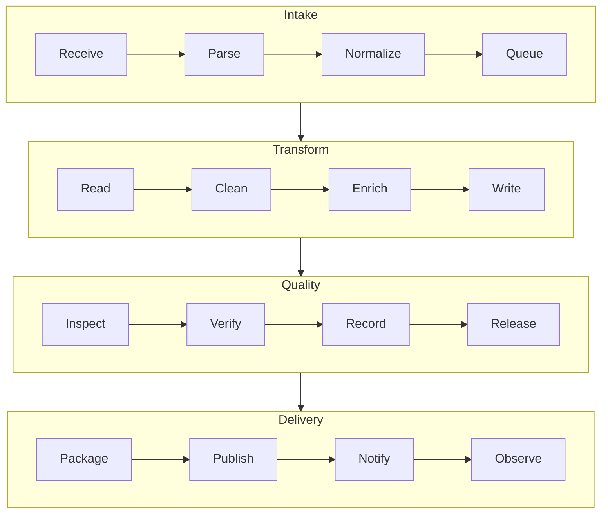
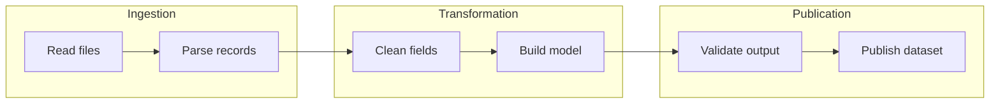
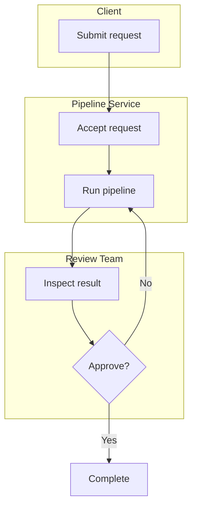
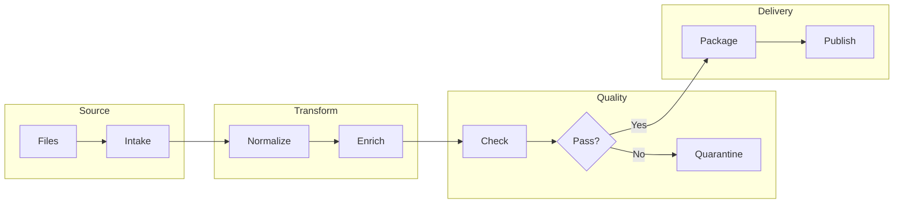
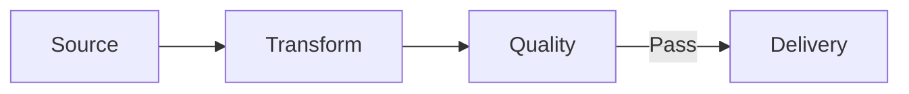
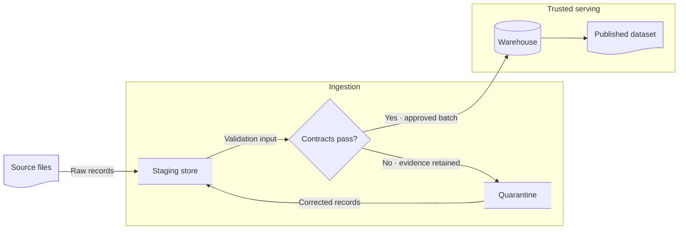
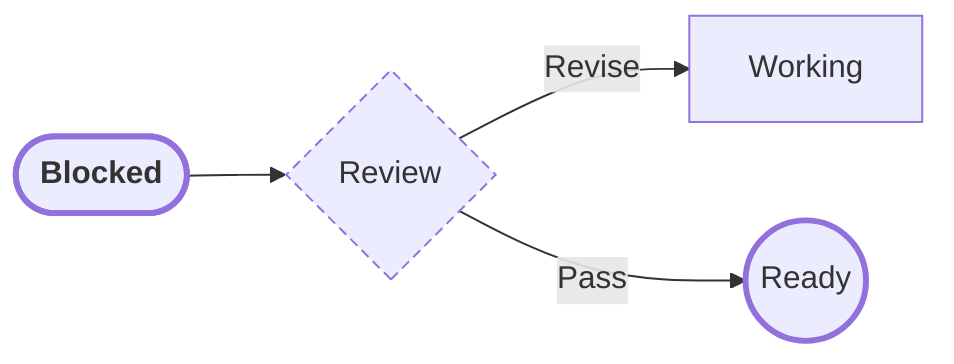
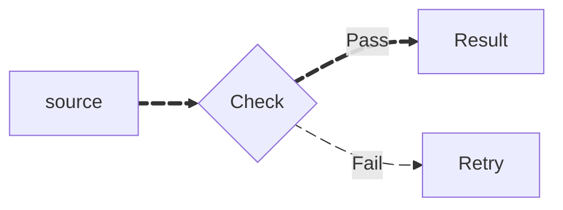

# Flowchart

> Flowchart의 현재 shape, edge, subgraph, styling과 animation syntax는 Mermaid 공식 문서와 target renderer를 확인한다.

**절차·분기·dependency path**처럼 node 사이의 directed relationship을 따라가는 것이 핵심이면 `flowchart`를 사용한다. 익숙하다는 이유만으로 ownership, message order, lifecycle, schema처럼 더 직접적인 notation이 있는 구조까지 Flowchart로 평탄화하지 않는다.

## Basic: Decision Flow

이 예제의 `revise --> validate`는 실제 retry/revalidation loop라는 전제다. Layout을 닫기 위해 임의의 back edge를 추가하지 않는다.

## Edge Semantics First

Flowchart arrow는 generic하다. Diagram을 작성하기 전에 edge가 주로 무엇을 뜻하는지 정한다.

- process flow라면 `A --> B`는 source-backed next step/order를 뜻한다.
- dependency view라면 `A --> B`가 `A depends on B`인지 `A enables B`인지 방향 convention을 먼저 정한다.
- handoff라면 artifact/message/condition이 중요할 때 edge label로 드러낸다.
- 같은 diagram에서 process order, data dependency와 ownership escalation을 같은 unlabeled arrow로 섞지 않는다.
- arrow direction을 layout 편의를 위해 뒤집지 않는다. `LR`/`TB`는 presentation이지만 edge source/destination은 semantic layer다.
- dotted/thick/animated edge는 presentation 차이만으로 새로운 relationship type을 만들지 않는다. 의미가 다르면 label이나 companion legend가 먼저다.

## Stable Node Identity

Node id는 graph identity이고 label은 reader-facing text다.

- 같은 id를 다른 entity에 재사용하지 않는다.
- label wording을 바꿔도 같은 entity라면 stable id를 유지하면 link/style reference가 덜 흔들린다.
- 같은 business entity가 여러 위치에 보여야 한다고 duplicate id를 별도 occurrence처럼 사용하지 않는다. 반복 occurrence 자체가 의미라면 별도 id와 설명을 사용한다.
- source에 없는 intermediate node를 단지 edge routing을 위해 semantic task처럼 이름 붙이지 않는다.

## Decision Branches

- decision의 outgoing edge가 서로 다른 condition이나 outcome을 뜻하면 각 branch를 label로 구분한다.
- `Yes`/`No`는 실제 rule이 binary일 때만 사용한다. Source가 `retry`, `reject`, `manual review`처럼 별도 outcome을 가진다면 binary로 축약하지 않는다.
- 하나의 decision에서 branch가 4개 이상이면 복합 rule을 한 node에 숨기지 않았는지 확인하고, nested decision, rule table 또는 detail diagram으로 분해를 검토한다.
- branch 수는 readability trigger일 뿐 validity limit가 아니다. 실제 source rule이 여러 outcome을 요구하면 의미를 줄이지 않는다.
- diamond shape만으로 approval authority나 ownership을 추론하지 않는다. 누가 판단하는지가 중요하면 Swimlanes나 explicit grouping을 검토한다.

## Viewport-Aware Composition

같은 수준의 group마다 내부 flow가 `LR`로 자연스럽더라도 모든 group을 하나의 긴 수평 chain으로 펼치지 않는다. width:height가 약 3:4인 portrait reading viewport를 기본으로 보고, group 내부 direction은 유지하면서 peer group을 세로로 쌓아 vertical scroll로 읽히게 한다.

이 예시는 상위 composition은 `TB`, 각 group 내부는 `LR`로 분리한다. Group-level 순서 자체가 source fact이면 group boundary 사이의 관계로 표현할 수 있다. 특정 node 사이의 handoff가 의미상 필요하면 layout을 위해 group-level edge로 바꾸지 않는다.

### Subgraph Direction Limitation

Mermaid Flowchart는 **subgraph 내부 node가 외부 node와 직접 연결되면 해당 subgraph의 local `direction`을 무시하고 parent direction을 상속할 수 있다.** 이건 공식 renderer limitation이다.

- local direction을 유지하려고 실제 node-level handoff를 subgraph-level edge로 바꾸지 않는다.
- renderer limitation 때문에 원하는 composition이 깨지면 fixed size나 unreadable downscale보다 overview/detail split을 우선한다.
- direction 차이는 presentation이므로 semantic relationship은 renderer가 재배치해도 읽혀야 한다.

## Subgraph Grouping

`subgraph`는 visual grouping syntax다. **실제 stage·ownership·system boundary 의미는 source가 소유한다.**

- Stage grouping: process stage가 실제 source model에 있을 때.
- Ownership grouping: node 책임 주체가 실제로 구분될 때. Ownership handoff가 핵심이면 Swimlanes가 더 직접적인지 먼저 검토한다.
- System grouping: logical subsystem이 source-backed일 때. Network/trust/deployment boundary를 단순 visual cluster에서 추론하지 않는다.
- Layout wrapper: readability만 위한 grouping이면 label이나 surrounding prose가 semantic boundary처럼 읽히지 않게 한다.
- 한 hierarchy level에서 stage, team, status 같은 서로 다른 partition criterion을 섞지 않는다.

### Grouping By Pipeline Stage

### Grouping By Ownership

이 표현은 ownership이 보조 정보일 때 적합하다. Lane 자체가 읽기의 핵심이면 Swimlanes로 전환한다.

## Splitting A Large Flowchart Package

큰 flowchart는 하나의 pipeline을 임의로 반으로 자르는 대신, source가 이미 가진 같은 수준의 책임 영역을 overview/detail package로 분리한다.

### Before: Four Equal Areas In One Diagram

### After: Overview

Overview는 source의 실제 boundary와 주요 handoff를 aggregate할 수 있지만 원본에 없던 feedback path, branch, dependency를 추가하지 않는다. `quality -->|Pass| delivery`처럼 source decision이 conditional이면 abstraction에서도 condition을 보존한다.

### After: Detail Diagrams

각 area는 원본 내부 relationship을 보존하는 detail diagram으로 분리한다. Overview node와 detail title/term을 일치시키고, split 때문에 원래 cross-boundary edge의 endpoint나 direction이 달라지지 않았는지 확인한다.

## Specialized Shapes

Shape는 domain meaning이 reader에게 실제 도움을 줄 때만 사용한다.

- shape difference가 document/store/decision 같은 domain type을 뜻한다면 source 또는 local notation convention이 그 의미를 뒷받침해야 한다.
- unsupported general shape syntax는 relationship을 바꾸지 말고 bracket/standard shape로 fallback한다.
- shape만으로 trusted/untrusted, mutable/immutable, success/failure 같은 fact를 만들지 않는다.

## Styling And Animation

기본 theme을 유지하고 label, shape, border와 line으로 먼저 의미를 구분한다.

색상이 반드시 필요하면 [Mermaid Diagram Style Policy](../style-policy.md)의 escalation 규칙에 따라 최소 범위에만 추가한다. 색상 없이도 label과 shape로 의미가 유지되어야 한다.

Edge ID/animation은 renderer가 지원하고 interaction value가 있을 때만 사용한다.

- animation은 emphasis다. Runtime activity, throughput, retry frequency 또는 liveness evidence를 자동으로 뜻하지 않는다.
- animation을 제거해도 edge existence, direction, condition과 focal path가 이해되어야 한다.
- portable documentation에서는 animation을 생략하는 편을 우선한다.

## Renderer-Sensitive Review

Flowchart는 syntax validity와 **relationship fidelity**를 따로 검증한다.

1. Flowchart가 실제로 process/branch/dependency 질문에 가장 직접적인 type인가.
1. Diagram의 dominant edge meaning이 일관되고 예외 relation은 label로 구분되는가.
1. 모든 edge existence와 direction이 source-backed인가.
1. Decision branch condition/outcome을 source 없이 binary 또는 generic Yes/No로 만들지 않았는가.
1. Back edge가 실제 retry/loop이며 layout closure를 위한 가짜 relation이 아닌가.
1. Node id가 stable identity를 보존하고 다른 entity를 같은 id로 합치지 않는가.
1. Subgraph가 실제 stage/ownership/system boundary인지 단순 layout wrapper인지 구분되는가.
1. Subgraph direction limitation 때문에 semantic endpoint를 바꾸지 않았는가.
1. Specialized shape, style와 animation을 domain fact로 과해석하지 않았는가.
1. Overview/detail split이 condition, direction, boundary와 cross-area handoff를 보존하는가.
1. 너무 복잡하면 edge 삭제나 label 축약으로 숨기기보다 concern별 split을 검토했는가.

## Portable Fallback

Target renderer가 사용한 Flowchart feature를 지원하지 않으면 **node identity, relationship, direction, branch condition와 실제 grouping**을 보존하는 더 단순한 Flowchart syntax로 먼저 fallback한다. Diagram 자체가 부적합하거나 relationship 수가 과도하면 ordered list, decision table 또는 dependency table을 사용한다.
