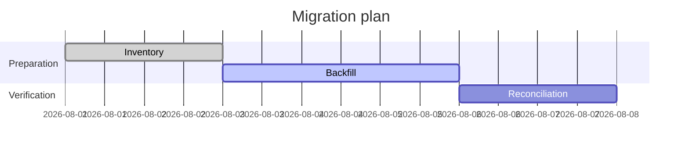
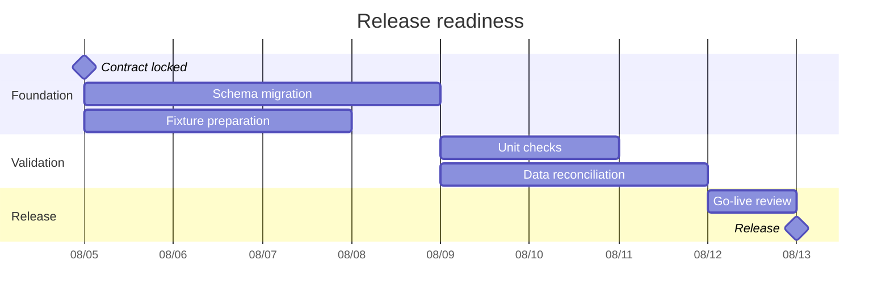

# Gantt

작업 기간과 dependency가 핵심이면 `gantt`를 사용한다.

## Advanced: Milestones And Parallel Work

milestone과 병렬 작업을 분리하면 **dependency와 병렬화 가능한 구간**을 더 쉽게 읽을 수 있다. Mermaid가 dependency만으로 critical path를 자동 판정한다고 가정하지 않는다.

## Decision Gates

사람이나 외부 절차의 승인 시점이 schedule dependency라면 milestone로 구분할 수 있다. 실제 승인 없이 gate가 통과된 것처럼 표현하지 않는다.

## Rules

- task start, duration, dependency와 completion state는 source schedule을 보존한다.
- `after`는 실제 dependency가 있을 때만 사용하고 단순한 표시 순서를 dependency로 바꾸지 않는다.
- `crit`는 source 또는 planning decision이 해당 task를 critical로 지정할 때만 사용한다. Diagram이 critical path를 계산했다고 주장하지 않는다.
- milestone은 의미 있는 event나 gate에 사용하고 일반 task를 장식하기 위해 남용하지 않는다.
- schedule uncertainty가 중요하면 고정 날짜로 임의 확정하지 않고 주변 설명에서 가정이나 범위를 밝힌다.
