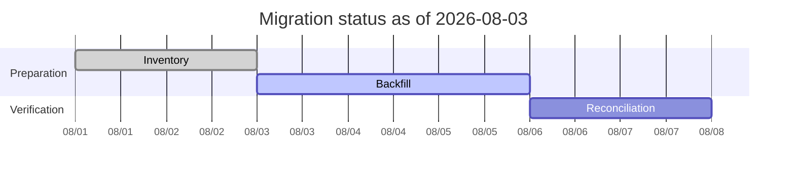
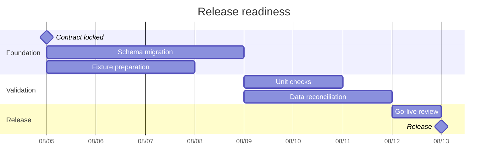
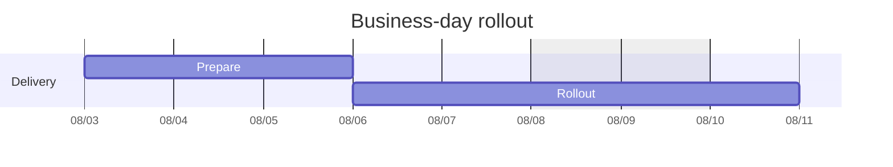
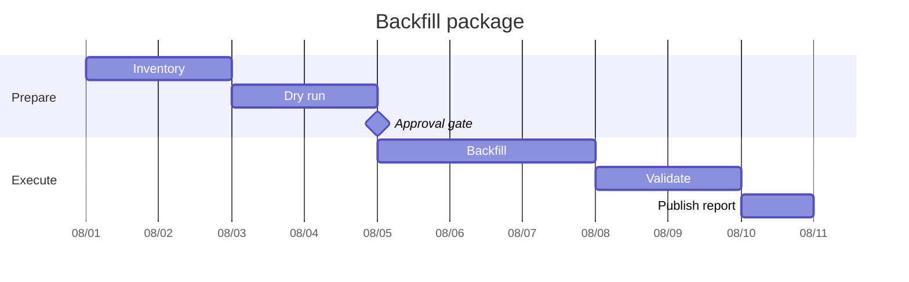

# Gantt

> Gantt syntax와 version-specific feature 지원은 target renderer와 Mermaid 공식 문서를 확인한다.

작업의 **start/end, duration, overlap과 schedule dependency**가 핵심이면 `gantt`를 사용한다. 단순 사건 순서만 필요하면 Timeline이 더 직접적이고, dependency topology 자체를 추적해야 하면 Flowchart나 companion table을 함께 검토한다.

## Basic: Source-Backed Schedule Snapshot

`done`과 `active`는 날짜에서 자동 추론한 상태가 아니라 **source snapshot이 말하는 상태**여야 한다. 재현 가능한 static example에서는 현재 날짜가 질문의 일부가 아니면 `todayMarker off`를 검토한다.

## Explicit Schedule Relationships

Mermaid Gantt는 start를 생략한 task를 기본적으로 이전 task의 end 뒤에 배치한다. 이 implicit sequencing도 실제 schedule claim이므로, 단순히 row를 보기 좋게 나열하려는 경우에는 의존하지 않는다.

Schedule relation이 중요한 task에는 source가 뒷받침하는 explicit start 또는 `after`를 우선한다.

여러 predecessor를 `after checks reconcile`처럼 지정하면 start는 그 predecessor들 중 **가장 늦은 end** 뒤로 계산된다. 이 fan-in은 schedule constraint이지 dependency arrow를 그리는 표현은 아니다.

- 모든 referenced task ID가 실제 task에 유일하게 대응하는지 확인한다.
- unresolved reference가 renderer에서 반드시 명확한 오류가 된다고 가정하지 않는다.
- dependency cycle이나 잘못된 reference를 renderer가 발견해 줄 것으로 의존하지 않는다.
- `section`과 row order를 dependency, ownership 또는 parallel-execution proof로 해석하지 않는다.

Dependency graph 자체를 검토하거나 cycle·fan-in·fan-out을 따라가는 것이 핵심이면 같은 schedule facts를 Flowchart나 predecessor table로 보조한다.

## Working Calendar And Date Integrity

`excludes` 같은 calendar rule은 decoration이 아니라 **duration 계산을 바꾸는 schedule semantics**다. Source가 실제 non-working calendar를 정의할 때만 사용한다.

Duration-based task가 excluded day를 지나면 Mermaid는 지정한 working duration을 유지하도록 end를 뒤로 조정한다. 따라서 calendar를 추가·삭제하면 downstream `after` task의 start도 달라질 수 있다.

- `dateFormat`은 source precision에 맞추고, 미관을 위해 더 정확한 timestamp를 발명하지 않는다.
- 같은 schedule에서 date-only와 date-time 표현을 임의로 섞거나 lenient parsing에 의존하지 않는다.
- source가 authoritative start/end를 주는 경우와 authoritative duration을 주는 경우를 구분한다. 표현을 서로 바꿔 working-calendar 의미를 변경하지 않는다.
- `excludes`·calendar exception·timezone이 중요한 schedule은 실제 target renderer에서 계산 결과와 bar endpoint를 검증한다.

Calendar behavior를 신뢰성 있게 표현할 수 없으면 날짜를 임의 보정하기보다 source schedule table을 fallback으로 사용한다.

## Schedule Uncertainty

Gantt bar의 정확한 위치와 길이는 강한 schedule claim으로 읽힌다. Source가 tentative date, approximate duration 또는 range만 제공하면 단일 exact value로 임의 확정하지 않는다.

- 계획값을 사용한다면 title이나 companion prose에서 **plan / estimate / as-of 기준**을 드러낸다.
- `3–5d`, `Q3 중`, `approval 이후 예상`처럼 uncertainty 자체가 중요한 경우 하나의 확정 bar로 압축하지 않는다.
- Mermaid Gantt가 uncertainty band나 confidence interval을 표현한다고 가정하지 않는다. 필요한 범위·가정은 table/prose 또는 별도 scenario로 유지한다.

## Milestones, Gates And Criticality

사람이나 외부 절차의 승인 시점이 schedule constraint라면 milestone로 구분할 수 있다. 실제 승인 없이 gate가 통과된 것처럼 표현하지 않는다.

Mermaid milestone의 위치는 start와 duration에서 계산된다. **정확한 한 시점을 뜻하는 milestone은 `0d`를 사용**해 duration 때문에 marker 위치가 이동하지 않게 한다.

`crit`는 Mermaid가 계산한 critical path가 아니다. Source schedule이나 명시적인 planning decision이 criticality를 뒷받침할 때만 annotation으로 사용한다.

## Viewport And Density

Gantt의 proportional time axis는 load-bearing information이다. Portrait viewport에 맞추려고 duration, overlap 또는 absolute placement를 바꾸지 않는다.

- 넓은 schedule은 무리하게 축소하거나 `compact` mode로 압축하기보다 phase별 overview/detail split을 먼저 검토한다.
- split 뒤에도 같은 task의 ID, date, duration과 predecessor semantics를 일치시킨다.
- `vert` marker는 소수의 공통 deadline·checkpoint에만 사용한다. 가까운 marker와 긴 label은 실제 render에서 overlap을 확인한다.
- title, section과 task label이 time axis보다 폭을 지배하면 wording을 줄이거나 detail을 companion prose/table로 옮긴다.

## Renderer-Sensitive Review

Gantt는 syntax validity와 **schedule integrity**를 따로 검증한다. Parser가 입력을 받아들였다는 사실만으로 rendered schedule이 올바르다고 판정하지 않는다.

1. 모든 task ID가 유일하고 모든 `after`/`until` reference가 실제 task에 resolve되는가.
1. implicit previous-task start가 실제 schedule relation일 때만 남아 있는가.
1. dependency graph에 source가 뒷받침하지 않는 edge나 cycle이 생기지 않았는가.
1. explicit date의 precision과 `dateFormat`이 일관되고 source보다 정밀한 시간을 만들지 않았는가.
1. duration, explicit end와 working calendar 중 무엇이 authoritative한지 보존했는가.
1. tentative/estimated 값이 committed 또는 observed schedule처럼 보이지 않는가.
1. `excludes` 같은 calendar rule 뒤의 computed end와 downstream start가 source schedule과 맞는가.
1. `done`·`active`·`crit`와 milestone/gate가 source snapshot 또는 planning decision을 반영하는가.
1. task metadata의 field count와 omission이 의도한 form과 일치하며 stray extra comma가 없는가.
1. date-time, calendar boundary, dense `vert`, compact layout처럼 renderer-sensitive한 조합은 실제 target에서 읽을 수 있는가.

문제가 있으면 styling으로 숨기거나 날짜를 임의 이동하지 않는다. 먼저 schedule facts, reference ID, calendar assumption과 representation choice를 고친다.

## Rules

- Row order나 section grouping을 schedule dependency로 승격하지 않는다.
- Implicit sequential start는 실제 chaining이 의도된 경우에만 사용한다.
- `after`·`until` reference는 모두 resolve되고 cycle이 없어야 한다.
- Date, duration, calendar, uncertainty와 status precision을 source보다 강하게 만들지 않는다.
- `done`·`active`는 snapshot state이고 `crit`는 source-backed annotation이다.
- Milestone은 실제 point event/gate에 사용하며 exact instant에는 `0d`를 우선한다.
- Gantt 자체가 critical path나 dependency graph를 자동 분석·시각화한다고 주장하지 않는다.

## Portable Fallback

Target renderer가 필요한 Gantt semantics를 안정적으로 지원하지 않으면 **task ID, task, start, end/duration, predecessor, status와 calendar assumption**을 보존하는 table로 전환한다. Dependency topology가 핵심이면 Flowchart를 함께 사용한다. Duration과 overlap이 load-bearing information이면 Timeline으로 단순 변환하지 않는다.
