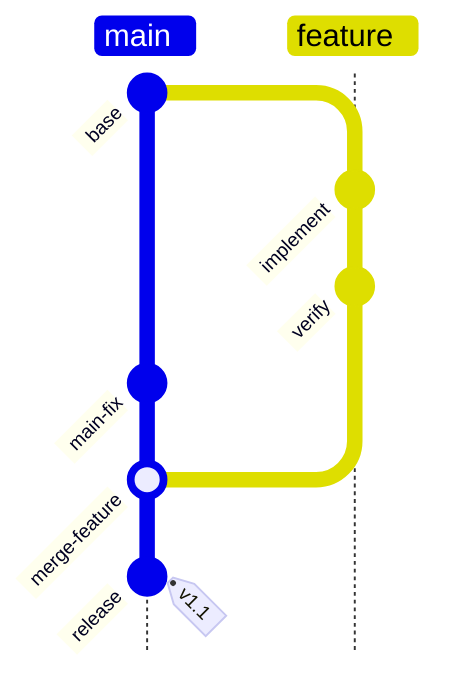
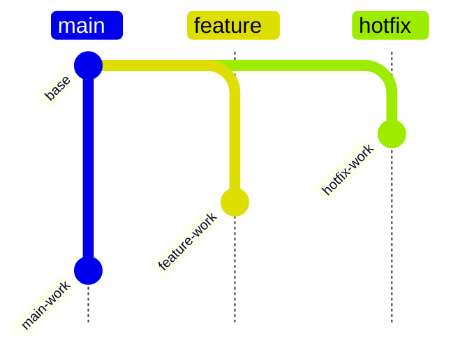
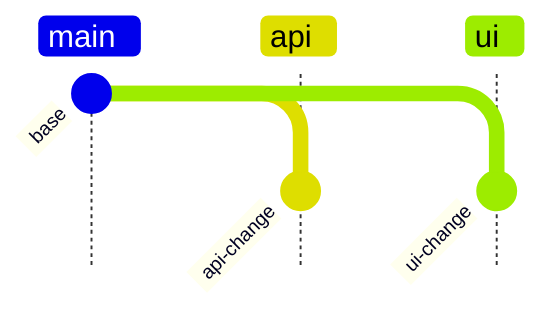

# Git Graph

> `gitGraph` syntax와 version-specific feature 지원은 target renderer와 Mermaid 공식 문서를 확인한다.

branch point, commit ancestry, merge-commit과 release marker처럼 **Git-style history topology**가 핵심이면 `gitGraph`를 사용한다. 다만 Mermaid `gitGraph`는 실제 repository history를 import하는 도구가 아니라 declaration 순서대로 synthetic history를 만드는 제한된 DSL이다.

실제 history의 정확성이 핵심이면 authoritative Git data를 먼저 확인하고, `gitGraph`가 표현할 수 있는 source-backed excerpt만 diagram으로 옮긴다. Fast-forward, squash, rebase처럼 integration method 자체가 질문이면 이를 generic `merge`로 치환하지 않는다.

## Basic: Source-Backed Merge-Commit History

이 예제는 두 branch가 실제로 diverge한 뒤 **merge commit을 만드는 history**를 표현한다. `merge feature`를 단순한 “feature가 main에 들어감”이라는 의미로 사용하지 않는다.

## Stable Commit Identity

Mermaid는 custom `id`가 없는 commit에 generated ID를 부여한다. 문서에서 commit을 다시 참조하거나 label이 안정적으로 보여야 하면 explicit ID를 사용한다.

- Custom commit ID는 diagram 안에서 유일하게 유지한다.
- 실제 SHA를 알고 있고 그 identity가 핵심일 때만 SHA처럼 보이는 값을 사용한다. Conceptual strategy라면 `base`, `verify`, `release`처럼 역할을 드러내는 synthetic ID가 더 정직하다.
- `tag`는 실제 tag 또는 명시된 strategy marker를 나타낼 때만 붙인다. Version-looking tag를 장식으로 만들지 않는다.
- Commit ID와 commit message를 같은 개념으로 취급하지 않는다. Repeated human-readable 설명이 필요하면 ID를 중복시키지 말고 주변 prose나 다른 지원 표현을 사용한다.

## Branch Points And Declaration Order

`branch name`은 **현재 HEAD에서 branch를 만들고 그 branch로 전환**한다. 따라서 branch declaration 위치 자체가 branch point를 만든다.

위 예제에서 `hotfix`와 `feature`는 둘 다 `base`에서 갈라진다. 이는 `checkout main`으로 source branch의 HEAD로 돌아온 뒤 두 번째 branch를 만들었기 때문이다.

- Declaration order를 단순한 source-code formatting으로 보지 않는다. `commit`, `branch`, `checkout`, `merge`의 순서는 synthetic history를 만든다.
- `order`는 branch lane의 **display order**다. Branch priority, creation order, merge precedence 또는 ownership을 뜻하지 않는다.
- `gitGraph`는 arbitrary old commit으로 자유롭게 reset해 branch를 만드는 full Git history editor가 아니다. 정확한 historical branch point를 현재 command model로 보존할 수 없으면 history를 억지로 재구성하지 않는다.

## Merge Semantics

Mermaid `merge`는 source branch head와 current branch head를 parent로 가진 **새 merge commit**을 만든다. 실제 Git의 모든 integration mode를 대표하지 않는다.

- 실제 또는 의도된 history가 merge commit을 만들 때만 `merge`를 ancestry 표현으로 사용한다.
- Fast-forward는 branch pointer만 이동할 수 있고 merge commit이 생기지 않을 수 있다. 이를 Mermaid `merge`로 그리면 존재하지 않는 commit을 추가하게 된다.
- Squash merge와 rebase는 원래 branch ancestry를 merge commit 형태로 남기지 않는다. Integration policy가 이 방식이면 Flowchart나 policy table이 더 직접적일 수 있다.
- 하나의 Mermaid `merge`는 두 parent를 가진 merge commit 모델이다. 더 복잡한 multi-parent history나 conflict-resolution topology가 load-bearing하면 다른 representation을 사용한다.
- Merge commit에 붙인 `tag`나 custom ID는 그 merge commit 자체에 대한 source-backed fact여야 한다.

## Cherry-Pick Is Not Ancestry

Git의 cherry-pick은 기존 commit이 만든 change를 현재 branch에 다시 적용해 새 commit을 기록하는 operation이다. Original commit이 새 commit의 Git parent가 되는 것은 아니다.

Mermaid `cherry-pick`은 source commit을 시각적으로 연결하는 자체 모델을 사용하므로, 그 connector를 **실제 Git ancestry나 merge relationship으로 해석하지 않는다**. Cherry-pick operation 자체를 설명해야 한다면 source와 target을 prose/table로 함께 명시하고, ancestry 정확성이 핵심이면 `gitGraph`의 visual connector에 의존하지 않는다.

Merge commit을 cherry-pick하는 Mermaid syntax는 parent 선택까지 요구하므로 특히 target-version 문법을 확인한다.

## Temporal Order And Parallel Layout

Mermaid는 command insertion order를 commit sequence로 기록한다. 실제 Git commit timestamp를 읽어 정렬하지 않는다.

기본 layout은 이 sequence를 branch 사이의 temporal ordering처럼 보이게 만들 수 있다. Source가 inter-branch 선후를 확정하지 않았다면 target이 지원하는 경우 `parallelCommits: true`를 **presentation option**으로 검토할 수 있다.

`parallelCommits: true`는 commits가 실제로 동시에 만들어졌다는 evidence가 아니다. Topological spacing을 조정할 뿐이며, source에 없는 concurrency를 주장하지 않는다.

## Presentation And Viewport

Orientation, branch `order`, label rotation과 visual commit type은 presentation layer다.

- `TB`는 branch 수가 적고 commit sequence가 길 때 portrait reading surface에 유리할 수 있다. Branch가 많아 side-by-side 폭이 커지면 `LR`이나 overview/detail split을 다시 검토한다.
- Orientation을 실제 chronology direction, branch importance 또는 upstream/downstream precedence로 해석하지 않는다.
- `HIGHLIGHT`와 `REVERSE`는 visual commit type이다. `REVERSE`를 `git revert` operation으로 해석하지 않고, strong emphasis는 source-backed 또는 명시적으로 설명된 editorial focus에만 사용한다.
- Commit label을 숨기거나 축약해 branch topology만 남길 수 있지만, identity가 질문의 핵심이면 readability를 위해 identity를 버리지 않는다.
- 많은 commit을 실제 history에서 그대로 복사하기보다 질문에 필요한 branch point, merge commit, release marker와 source-backed intermediate commit만 남긴다.

## Renderer-Sensitive Review

`gitGraph`는 syntax validity와 **history fidelity**를 따로 검증한다.

1. `commit`, `branch`, `checkout`, `merge`의 declaration 순서가 의도한 parent/branch history를 실제로 만드는가.
1. Custom commit ID가 유일하고, synthetic ID와 실제 SHA를 혼동시키지 않는가.
1. 각 branch가 source가 말하는 commit에서 갈라지는가.
1. 모든 `merge`가 실제 또는 의도된 **merge commit**을 뜻하며 fast-forward, squash, rebase를 잘못 대체하지 않는가.
1. Tag와 highlighted commit이 source fact 또는 설명된 editorial emphasis와 일치하는가.
1. `order`, orientation, `parallelCommits`와 lane position을 chronology, priority, ownership 또는 concurrency evidence로 승격하지 않았는가.
1. Cherry-pick connector를 Git parent relationship으로 읽게 만들지 않았는가.
1. 실제 repository history를 요약했다면 생략한 commit 때문에 branch point, parent, merge mode 또는 release identity가 달라지지 않았는가.
1. Dense branch/commit label, orientation과 target-specific config는 실제 target에서 읽을 수 있는가.

문제가 있으면 lane order나 highlight로 숨기지 않는다. 먼저 history facts와 representation choice를 고친다.

## Portable Fallback

Target renderer가 `gitGraph`를 안정적으로 지원하지 않거나 필요한 Git semantics를 표현하지 못하면 **branch, source point, integration method, resulting commit/tag**를 보존하는 table 또는 Flowchart로 전환한다. 실제 history가 핵심이면 authoritative Git history excerpt를 우선하고, visual simplification 때문에 존재하지 않는 merge commit이나 ancestry를 만들지 않는다.
