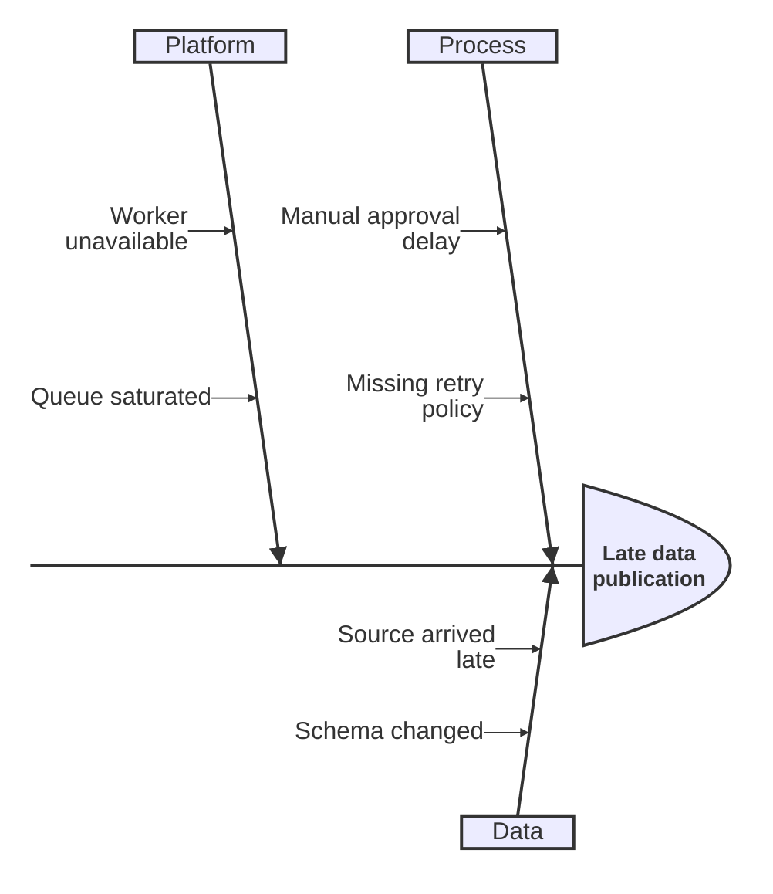
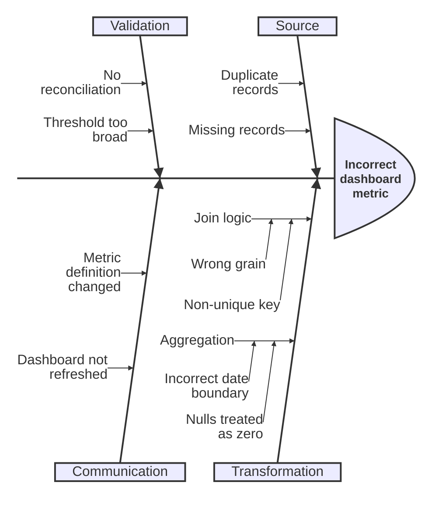

# Ishikawa Diagram

`ishikawa-beta`는 version-sensitive Mermaid syntax다. 정확한 현재 지원 범위와 declaration은 공식 Mermaid 문서와 target renderer에서 확인한다.

문제 결과와 잠재 원인을 category별로 탐색할 때 사용한다.

## Basic: Cause Categories

## Advanced: Nested Cause Decomposition

## Rules

- 원인과 해결책을 같은 branch에 섞지 않는다.
- 관찰된 evidence와 가설을 구분한다.
- causal proof가 아니라 investigation map임을 명확히 한다.
