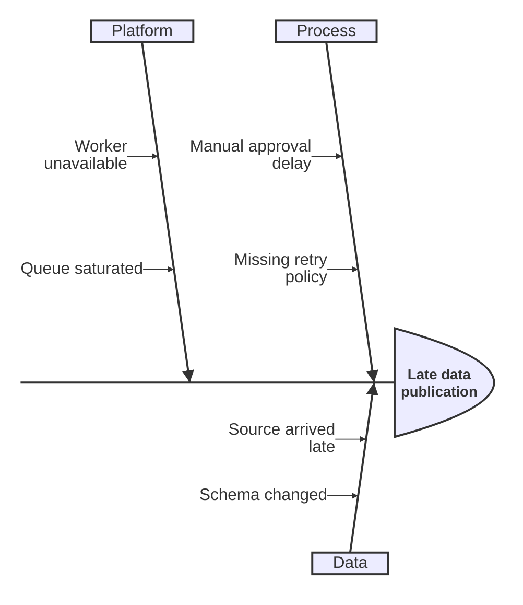
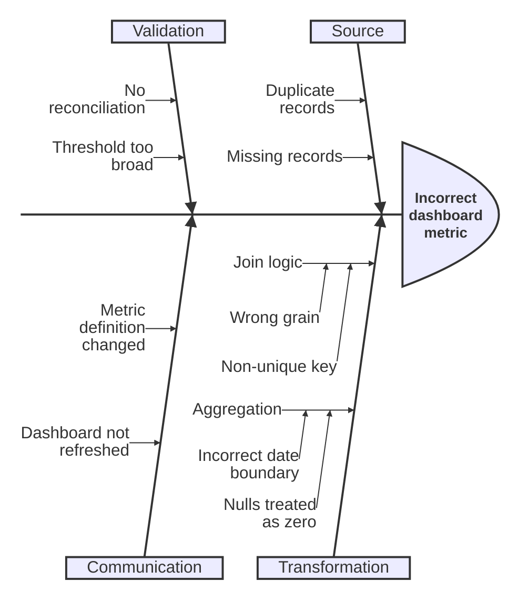

# Ishikawa Diagram

> `ishikawa-beta`는 새롭고 version-sensitive한 Mermaid syntax다. 정확한 현재 문법과 renderer 지원은 Mermaid 공식 문서와 target renderer에서 확인한다.

하나의 **effect/problem**을 두고 가능한 cause를 category와 sub-cause로 구조화해 investigation space를 읽는 것이 핵심이면 Ishikawa diagram을 사용한다. 이미 입증된 causal model이나 시간 순서, dependency graph를 표현하기 위한 notation으로 사용하지 않는다.

## Basic: Cause Categories

첫 번째 node는 diagram의 effect/problem이고 이후 node는 cause hierarchy다. `Process`, `Data`, `Platform`은 source나 investigation framing이 실제로 사용하는 category라는 전제다. 보기 좋은 fishbone을 만들기 위해 흔히 쓰는 category set을 자동으로 채우지 않는다.

## Indentation Owns Cause Hierarchy

Mermaid Ishikawa는 indentation으로 parent/child cause를 만든다. 첫 cause의 indentation을 기준으로 이후 relative depth가 해석되므로 indentation edit를 단순 formatting으로 취급하지 않는다.

- sibling cause는 같은 decomposition level을 사용한다.
- child cause는 parent를 더 구체적으로 분해한다는 근거가 있을 때만 한 단계 아래에 둔다.
- indentation depth를 원인의 중요도, 발생 확률, 증거 강도 또는 시간 순서로 해석하지 않는다.
- parser는 raw whitespace depth를 구조 입력으로 사용하므로 같은 hierarchy에서는 일관된 spaces를 사용하고 tabs/spaces 혼용이나 formatter의 자동 reindent를 피한다.
- root/effect line 자체가 더 들여쓰기 되어도 first cause를 기준으로 relative hierarchy가 계산될 수 있으므로, 화면상 column만 보고 parent relation을 추론하지 않는다.
- 같은 문구가 여러 category에 반복되더라도 Mermaid는 shared identity를 가진 하나의 cause node로 연결하지 않는다. 하나의 공통 cause가 여러 effect/category와 실제 관계를 가진다면 Flowchart나 table처럼 관계를 직접 표현하는 representation을 검토한다.

## Hypothesis Versus Evidence

Ishikawa는 **cause-oriented sensemaking surface**이지 causal proof가 아니다.

- 관찰된 fact, 확인된 contributing factor와 아직 검증되지 않은 hypothesis를 같은 확정 어조로 섞지 않는다.
- hypothesis가 핵심이면 label 또는 companion prose에서 `hypothesis`, `suspected`, `observed`처럼 evidence status를 구분한다.
- correlation, temporal proximity 또는 team intuition만으로 nested branch를 확정 causal chain처럼 만들지 않는다.
- root cause가 아직 확정되지 않았다면 diagram 제목이나 설명도 `root cause`보다 `possible causes`, `investigation` 같은 정확한 표현을 사용한다.
- 원인과 mitigation/action item을 같은 branch에 섞지 않는다. 해결책은 별도 action list, Flowchart 또는 follow-up artifact로 분리한다.

## One Effect Per Diagram

Fishbone의 head는 하나의 effect/problem을 소유한다.

- 서로 다른 symptom이나 outcome을 한 root label로 합쳐 공통 cause가 있는 것처럼 보이게 하지 않는다.
- 여러 effect가 서로 독립적으로 조사되어야 하면 diagram을 나눈다.
- 하나의 upstream factor가 여러 effect에 영향을 주는 관계 자체가 질문의 핵심이면 multi-edge 관계를 직접 표현할 수 있는 Flowchart/table을 사용한다.

## Category Discipline

Category는 cause를 찾기 위한 **decomposition lens**다.

- 한 diagram의 top-level category는 가능한 한 같은 분류 기준을 사용한다.
- `People`, `Process`, `Technology`처럼 generic template을 source evidence 없이 의무적으로 채우지 않는다.
- category 이름이 조직 ownership처럼 보이더라도 cause ownership을 자동으로 뜻하지 않는다.
- category 안에 cause가 없다는 사실을 “원인이 없다”는 증거로 해석하지 않는다. 조사 scope가 불완전할 수 있다.

## Layout Versus Semantics

Fishbone의 spine, 위·아래 branch 배치와 branch 길이는 renderer가 정하는 presentation이다.

- branch가 head에 가깝거나 길다고 더 강한 cause라고 해석하지 않는다.
- 위쪽/아래쪽 배치를 positive/negative, internal/external 또는 priority axis처럼 사용하지 않는다.
- declaration order를 chronology나 ranked importance로 승격하지 않는다.
- nested hierarchy와 text identity는 보존하되, renderer가 물리적 위치를 바꿔도 의미가 유지되어야 한다.

## Viewport And Density

Ishikawa는 category 수와 depth가 늘수록 horizontal density가 빠르게 증가한다.

- label을 지나치게 축약하거나 전체 diagram을 unreadable하게 downscale하지 않는다.
- 한 category가 지나치게 깊으면 그 branch를 별도 investigation tree/table로 분리한다.
- 전체 cause inventory를 완전하게 보여주지 않는 excerpt라면 complete root-cause analysis처럼 표현하지 않는다.
- portrait viewport preference보다 cause hierarchy fidelity를 우선하고, 필요하면 여러 diagram으로 나눈다.

## Renderer-Sensitive Review

Ishikawa Diagram은 syntax validity와 **cause-model fidelity**를 따로 검증한다.

1. 첫 node가 실제로 조사하려는 하나의 effect/problem인가.
1. 모든 top-level category가 같은 decomposition lens를 사용하고 source/investigation framing에 근거하는가.
1. Indentation이 의도한 parent/child cause hierarchy와 정확히 일치하는가.
1. Spaces/tabs 혼용이나 formatting 과정에서 raw indentation depth를 바꿔 cause parent를 변경하지 않았는가.
1. Observation, confirmed factor와 hypothesis를 causal proof처럼 섞지 않았는가.
1. Nested depth, branch order와 rendered position을 importance·probability·chronology로 과해석하지 않았는가.
1. Solution/mitigation을 cause branch에 섞지 않았는가.
1. Shared cause identity나 multi-effect relationship이 중요하지만 tree hierarchy로 손실되고 있지 않은가.
1. 너무 넓거나 깊으면 hierarchy를 왜곡하기보다 branch split이나 table fallback을 검토했는가.

문제가 있으면 fishbone을 채우기 위해 cause나 category를 발명하지 않는다. Investigation evidence와 decomposition을 먼저 고치거나 더 직접적인 relation representation으로 전환한다.

## Portable Fallback

Target renderer가 Ishikawa를 지원하지 않으면 **effect, category, cause/sub-cause hierarchy와 evidence status**를 보존하는 nested list 또는 cause table로 전환한다. Proven dependency나 causal chain 자체가 핵심이면 Flowchart 등 관계를 직접 표현하는 type을 사용한다.
