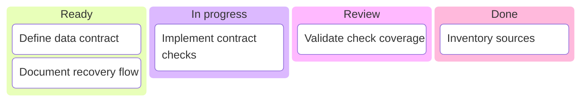
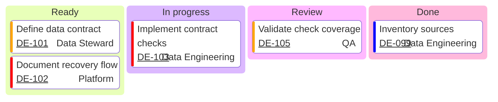

# Kanban

> `kanban` syntax와 version-specific feature 지원은 target renderer와 Mermaid 공식 문서를 확인한다.

workflow stage별 **현재 work-state snapshot**이 핵심이면 `kanban`을 사용한다. Kanban column은 현재 상태를 묶는 표현이며, column 사이의 transition·dependency·duration을 자동으로 의미하지 않는다.

Ordered process나 handoff가 질문이면 Flowchart/Swimlanes, duration·overlap·schedule dependency가 핵심이면 Gantt, nested work decomposition이 핵심이면 hierarchy나 table을 우선 검토한다.

## Snapshot Scope And Completeness

Mermaid source 자체는 external board와 live synchronization을 제공하지 않는다. 별도 generation/sync pipeline이 최신성을 보장한다는 근거가 없으면 **as-of snapshot**으로 취급하고, 상태나 card 수를 해석해야 할 때는 시점, 포함 범위와 filter를 source와 함께 확정한다.

- 전체 board를 옮긴 complete snapshot인지, 질문에 필요한 card만 뽑은 excerpt인지 구분한다.
- Excerpt라면 누락된 card가 있음을 주변 prose에서 밝히고 column별 card 수를 concentration, bottleneck 또는 queue size의 근거로 사용하지 않는다.
- Complete snapshot이라도 card count만으로 throughput, lead time, WIP limit 준수나 병목의 원인을 추론하지 않는다. 그런 판단에는 해당 metric과 workflow policy의 별도 source가 필요하다.
- Card count를 WIP라고 부르려면 source가 started/finished boundary와 어떤 states가 WIP에 포함되는지 정의해야 한다. 그렇지 않으면 단순한 visible card count로 다룬다.
- Card를 보기 좋게 재배치하면서 source의 실제 stage를 바꾸지 않는다.

## Board Is Not The Whole Kanban System

Mermaid `kanban`은 column, card와 일부 metadata를 시각화하는 board notation이다. Kanban 방법론의 전체 **Definition of Workflow**를 자동으로 모델링하거나 검증하지 않는다.

WIP control, explicit movement policy, started/finished definition, service-level expectation처럼 운영 판단에 중요한 policy가 source에 있다면 Mermaid card 배치만으로 암시하지 않는다. 필요한 policy·limit·metric은 companion prose/table이나 authoritative work system에 남기고, diagram에는 실제로 표현 가능한 work state만 둔다.

## Flat Column And Card Model

Mermaid Kanban의 의미 있는 구조는 **column → card** 한 단계다. Subtask, epic → story → task 또는 nested queue를 indentation으로 표현하지 않는다.

현재 parser는 더 깊은 indentation을 별도 hierarchy로 보존하지 않고 같은 section의 item으로 평탄화할 수 있다. 따라서 indentation depth를 parent-child relationship으로 해석하지 않는다.

Nested work 관계가 필요하면 다음 중 하나를 사용한다.

- Kanban에는 현재 stage를 대표하는 card만 두고 subtask는 ticket/source system에 남긴다.
- Parent-child가 핵심이면 TreeView, Mindmap 또는 source-backed hierarchy table을 사용한다.
- Work decomposition과 process transition을 함께 설명해야 하면 별도 diagram으로 질문을 분리한다.

Column ID와 card ID는 diagram 안에서 unique하게 유지한다. Label이 같아도 서로 다른 work item이면 ID를 공유하지 않는다.

## Column And Card Order

Declaration order는 renderer의 **visual order**에 영향을 주지만 그 자체로 새로운 workflow fact를 만들지 않는다.

- Source가 `Ready → In progress → Review → Done`처럼 ordered stages를 정의하면 column order로 보존할 수 있다.
- 인접 column이라고 해서 모든 card가 왼쪽에서 오른쪽으로 이동할 수 있다는 transition rule을 만들지 않는다.
- 같은 column의 card가 위에 있다는 이유만으로 더 높은 priority, 먼저 처리할 순서 또는 오래된 item이라고 해석하지 않는다.
- Source가 explicit rank/order를 갖는다면 그 순서를 보존하고, rank 자체가 질문의 핵심이면 numbered field나 table을 함께 검토한다.
- `priority` metadata와 visual card order는 별개다. Renderer가 priority를 기준으로 자동 정렬한다고 가정하지 않는다.

## Source-Backed Metadata And Traceability

`assigned`, `ticket`, `priority`는 board source가 실제로 제공하는 metadata를 옮길 때만 사용한다. Metadata가 없다는 이유로 owner, urgency나 ticket identity를 추론하지 않는다.

- `assigned`는 source가 말하는 assignment를 보존한다. 이를 accountable owner, approver 또는 exclusive responsibility로 자동 승격하지 않는다.
- `priority`는 현재 Mermaid Kanban이 문서화한 값과 target renderer 지원을 확인한다. 임의 enum을 만들거나 label 색상으로 urgency를 새로 추론하지 않는다.
- `ticket`과 `ticketBaseUrl`은 실제 traceability가 필요할 때만 사용한다. Synthetic example이 아닌 실제 문서에서는 존재하지 않는 ticket이나 URL을 만들지 않는다.
- Metadata를 추가하기 위해 card label에 같은 정보를 반복하지 않는다. Label은 work item을 식별하고 metadata는 보조 fact를 맡는다.

Kanban column 이름이 process step처럼 보여도 `kanban` 자체에는 card 간 dependency edge나 transition rule이 없다. WIP control, movement policy, SLE가 질문의 핵심이면 board와 companion prose/table 또는 authoritative work system을 함께 사용한다.

## Styling Safety

다른 Mermaid type의 `style`, `classDef`나 decoration syntax를 Kanban에도 동작한다고 가정하지 않는다. Kanban의 unsupported styling input은 명확한 parse error 대신 **구조적인 column/card처럼 해석되거나 render 단계에서 유실될 수 있으므로**, 현재 공식 Kanban surface와 실제 target render가 확인된 기능만 사용한다.

Styling이 핵심 정보를 전달해야 할 정도라면 먼저 metadata, label 또는 별도 representation으로 의미를 명시하고 색상·class만 semantic owner로 두지 않는다.

## Viewport And Density

Kanban renderer는 column을 수평으로 나란히 놓고 각 column 안의 card를 세로로 쌓는다. Column 수가 늘어날수록 board 폭이 구조적으로 커지므로 portrait viewport를 맞추기 위해 card의 실제 stage를 바꾸거나 label을 읽기 어려울 정도로 축소하지 않는다.

- 상위 [Mermaid Diagram Reference](../mermaid-diagrams.md)의 Kanban readability budget에 도달하면 scope/filter/split을 다시 검토한다.
- Split은 source-backed scope, team, product area 또는 명시된 filter처럼 실제로 설명 가능한 기준으로 한다.
- Filtered board라면 무엇이 제외됐는지 밝히고 complete board처럼 card 수를 해석하지 않는다.
- 하나의 card를 layout 편의를 위해 다른 column으로 옮기지 않는다.
- 긴 card label과 많은 metadata가 세로 밀도를 높이면 essential identity만 label에 남기고 detail은 ticket/prose/table로 이동한다.

## Renderer-Sensitive Review

Kanban은 syntax validity와 **snapshot fidelity**를 따로 검증한다.

1. Snapshot의 as-of 시점, scope와 filter가 해석에 필요한 만큼 명확한가.
1. Complete snapshot과 excerpt를 구분했고, excerpt의 card count를 queue/WIP evidence로 사용하지 않는가.
1. WIP라고 표현한 범위가 있다면 source의 started/finished boundary와 WIP definition이 이를 뒷받침하는가.
1. 모든 column/card ID가 unique하고 각 card가 source가 말하는 stage에 있는가.
1. Deeper indentation을 nested work relationship으로 잘못 사용하지 않았는가.
1. Column order와 card order를 source에 없는 transition, priority, FIFO 또는 chronology로 승격하지 않았는가.
1. `assigned`, `ticket`, `priority`가 source-backed이며 metadata 의미를 owner/approval/urgency로 과장하지 않았는가.
1. Dependency·transition·duration이나 workflow policy처럼 Kanban diagram이 소유하지 않는 사실을 column proximity로 암시하지 않았는가.
1. Wide board나 long-label density 때문에 downscaling이 필요한 경우 scope/filter/split을 먼저 재검토했는가.
1. Styling이나 decoration은 다른 Mermaid grammar의 syntax를 가져오지 않고 현재 공식 Kanban surface와 actual target render를 확인했는가.
1. Ticket link와 target-specific metadata rendering은 실제 target에서 읽고 사용할 수 있는가.

문제가 있으면 card를 임의로 재배치하거나 styling으로 숨기지 않는다. 먼저 snapshot scope, source facts와 representation choice를 고친다.

## Portable Fallback

Target renderer가 Kanban을 안정적으로 지원하지 않거나 board scope가 너무 넓으면 **stage, card identity, assigned, ticket, priority, as-of와 filter**를 보존하는 table로 전환한다. Transition·dependency가 load-bearing information이면 Flowchart/Swimlanes/Gantt 등 그 관계를 직접 표현하는 representation을 사용한다.
