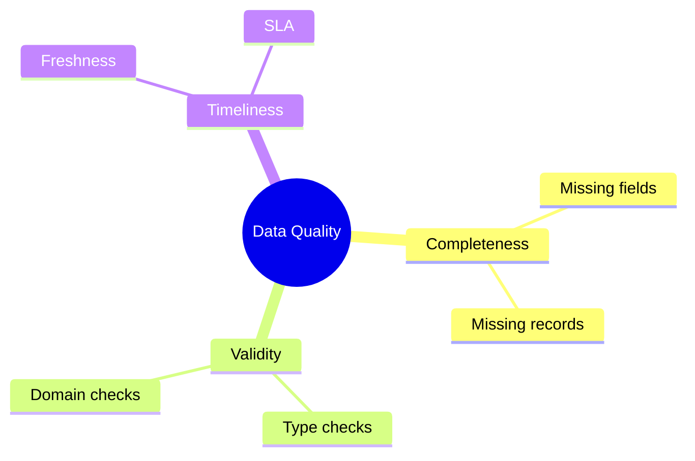
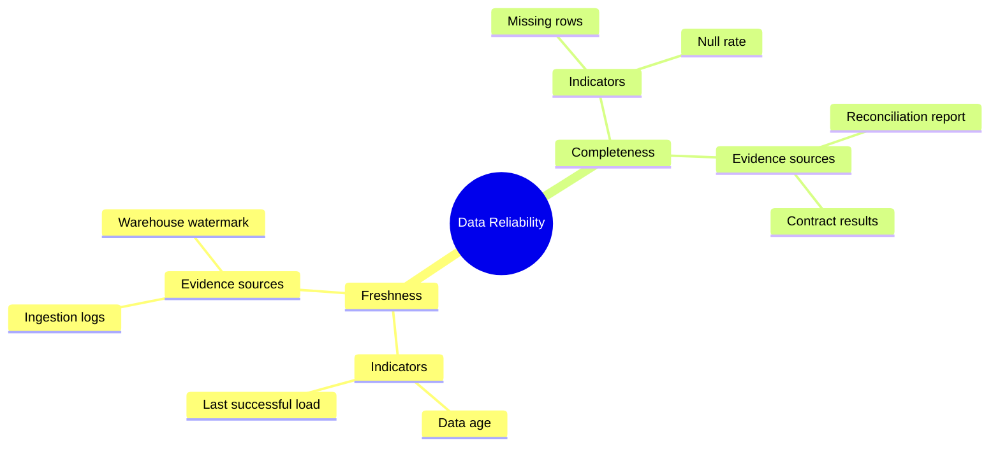

# Mindmap

> `mindmap` syntax와 version-specific feature 지원은 target renderer와 Mermaid 공식 문서를 확인한다.

하나의 중심 개념을 **single-root parent-child hierarchy**로 분해하거나 연관 개념을 계층적으로 묶는 것이 핵심이면 `mindmap`을 사용한다. Mindmap의 edge는 기본적으로 hierarchy/association을 나타내며 process transition, causality, dependency, ownership 또는 decision rule을 자동으로 의미하지 않는다.

실행 순서·조건 분기·handoff가 질문이면 Flowchart/Swimlanes, shared dependency·multi-parent·cycle이 핵심이면 Flowchart나 관계 table, directory-like literal hierarchy가 핵심이면 TreeView를 우선 검토한다.

## Basic: Source-Backed Concept Hierarchy

이 예제는 `Data Quality`를 세 개의 quality dimension으로 분해하고, 각 dimension 아래에 관련 check concept을 둔다. `Freshness`가 `SLA`보다 먼저 실행된다거나 `Missing fields`가 `Missing records`를 유발한다는 의미는 만들지 않는다.

## Tree Fidelity

Mindmap은 tree다. 하나의 root에서 시작하고 각 non-root node는 한 parent 아래에 놓인다.

- Source에 없는 parent-child 관계를 보기 좋은 taxonomy를 만들기 위해 추가하지 않는다.
- 하나의 entity가 실제로 여러 parent에 속하거나 여러 branch가 같은 dependency를 공유한다면 억지로 한 parent를 선택하지 않는다. Shared membership 자체가 중요한 경우 Flowchart나 table처럼 multi-parent 관계를 직접 표현할 수 있는 representation을 사용한다.
- 같은 label을 여러 branch 아래에 반복해도 renderer 관점에서는 별도 node occurrence다. 반복 label을 하나의 shared entity나 implicit cross-link로 해석하지 않는다.
- Cycle이나 back-reference가 load-bearing information이면 Mindmap으로 평탄화하지 않는다.
- Root는 질문의 실제 중심 scope여야 한다. 단지 모든 항목을 하나의 tree로 묶기 위한 가짜 상위 개념을 만들지 않는다.

## Indentation Is Structure

Mindmap syntax는 indentation으로 parent를 결정한다. Mermaid parser는 불규칙한 indentation도 이전의 더 얕은 node를 찾아 hierarchy를 보정할 수 있으므로, **parse된다고 해서 의도한 hierarchy라는 뜻은 아니다**.

- 한 diagram에서는 depth별 indentation 폭을 일관되게 유지한다.
- 보기 좋은 정렬을 위해 중간 indentation을 임의로 흔들지 않는다.
- 기존 source를 편집할 때 indentation change를 presentation edit로 취급하지 않는다. Parent가 바뀌는 semantic change인지 먼저 확인한다.
- Parser의 forgiving behavior에 기대어 모호한 indentation을 남기지 않는다. 최종 review에서는 source outline을 직접 읽어 parent-child가 한눈에 식별되는지 확인한다.

## Consistent Decomposition

한 parent 아래 sibling은 가능한 한 **같은 분해 질문**에 답하게 한다. 위 예제에서 `Freshness`와 `Completeness`는 같은 reliability dimension level이고, 두 branch 모두 `Indicators`와 `Evidence sources`라는 같은 facet으로 다시 분해된다.

- 같은 level에서 category, owner, signal, action, status처럼 서로 다른 차원을 무작위로 섞지 않는다.
- Depth가 바뀌면 decomposition criterion은 바뀔 수 있지만, 그 변화가 무엇인지 독자가 추적할 수 있어야 한다.
- `Condition → Action`, `State → Next state`, `Actor → Handoff`처럼 parent-child만으로 실행 규칙을 암시하지 않는다. 실제 decision/process semantics가 중요하면 해당 관계를 직접 표현하는 diagram으로 전환한다.
- Leaf가 단순 예시인지 exhaustively enumerated member인지 source가 구분한다면 그 차이를 주변 prose에서 보존한다. 몇 개 예시만 그린 branch를 완전한 taxonomy처럼 주장하지 않는다.

## Order And Layout Are Not Semantics

Sibling declaration order와 renderer의 spatial placement는 hierarchy를 읽기 위한 presentation이다.

- Sibling이 왼쪽/오른쪽, 위/아래에 있다는 이유만으로 priority, chronology, rank, maturity 또는 ownership을 만들지 않는다.
- Source에 명시적 rank/order가 있고 그 순서 자체가 핵심이면 label, numbered field 또는 table처럼 order를 직접 보존하는 표현을 함께 검토한다.
- Layout engine이 branch 위치를 바꿔도 parent-child meaning은 변하지 않아야 한다.
- `tidy-tree` 같은 alternate layout은 readability를 개선할 수 있지만 domain semantics를 추가하지 않는다. Target renderer 지원과 실제 결과를 확인한 뒤 presentation option으로만 사용한다.

## Shapes, Icons And Classes

Node shape, icon과 CSS class는 presentation layer다. Category type, risk level, ownership 같은 domain fact를 shape/color/icon 하나에만 맡기지 않는다.

Mindmap icon integration과 custom classes는 embedding host와 renderer capability에 의존할 수 있다. 필요한 경우 현재 공식 syntax와 target integration을 확인하고, 아이콘이나 class가 없어도 hierarchy의 핵심 의미가 남도록 작성한다.

## Viewport And Density

Mindmap은 root 주변으로 branch가 퍼질 수 있으므로 breadth가 커지면 portrait viewport에서 빠르게 넓어진다.

- 상위 [Mermaid Diagram Reference](../mermaid-diagrams.md)의 hierarchy readability budget에 도달하면 subtree split을 다시 검토한다.
- Split은 root의 질문을 보존한 overview와 source-backed subtree detail로 나눈다.
- Width를 줄이기 위해 서로 다른 sibling을 하나로 합치거나 parent-child relationship을 바꾸지 않는다.
- 긴 label은 핵심 concept identity만 남기고 상세 정의·근거는 companion prose/table로 이동한다.
- 특정 layout을 강제해 의미 있는 branch가 겹치거나 지나치게 축소되면 layout tuning보다 split을 우선한다.

## Renderer-Sensitive Review

Mindmap은 syntax validity와 **hierarchy fidelity**를 따로 검증한다.

1. 실제 질문에 맞는 하나의 root가 있고, 가짜 umbrella concept을 만들지 않았는가.
1. 모든 parent-child가 source-backed hierarchy/association이며 causality·transition·dependency를 잘못 대신하지 않는가.
1. Multi-parent, shared dependency, cycle 또는 cross-link가 중요한데 tree로 강제하지 않았는가.
1. 같은 label을 반복한 node를 shared identity로 오해하게 만들지 않았는가.
1. Indentation만 읽어도 intended parent-child가 명확하고 forgiving parser behavior에 의존하지 않는가.
1. 같은 parent의 sibling이 같은 decomposition criterion을 따르는가.
1. Sibling order, branch position, shape, icon과 class를 priority·chronology·ownership 등의 fact로 승격하지 않았는가.
1. Source의 partial examples를 complete taxonomy처럼 표현하지 않았는가.
1. Broad/deep hierarchy가 unreadable하면 layout trick보다 overview/detail split을 검토했는가.
1. Alternate layout, icon, class와 Markdown label 같은 renderer-sensitive 기능은 실제 target에서 읽을 수 있는가.

문제가 있으면 보기 좋은 tree를 만들기 위해 관계를 발명하지 않는다. 먼저 hierarchy facts와 representation choice를 고친다.

## Portable Fallback

Target renderer가 Mindmap을 안정적으로 지원하지 않으면 **root, parent-child와 sibling grouping**을 보존하는 indented outline이나 table로 전환한다. Shared relationship, cycle, dependency 또는 process가 핵심이면 Flowchart 등 그 관계를 직접 표현하는 representation을 사용한다.
