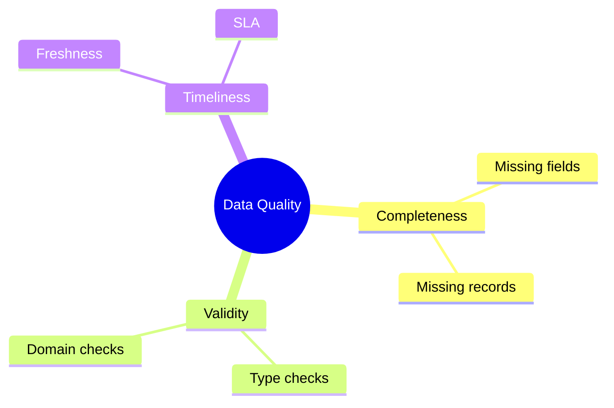
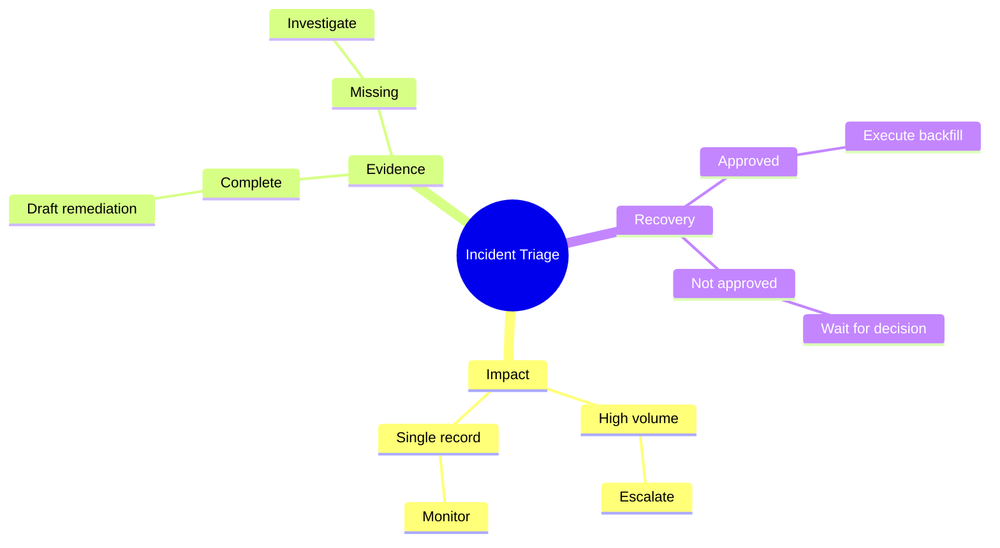
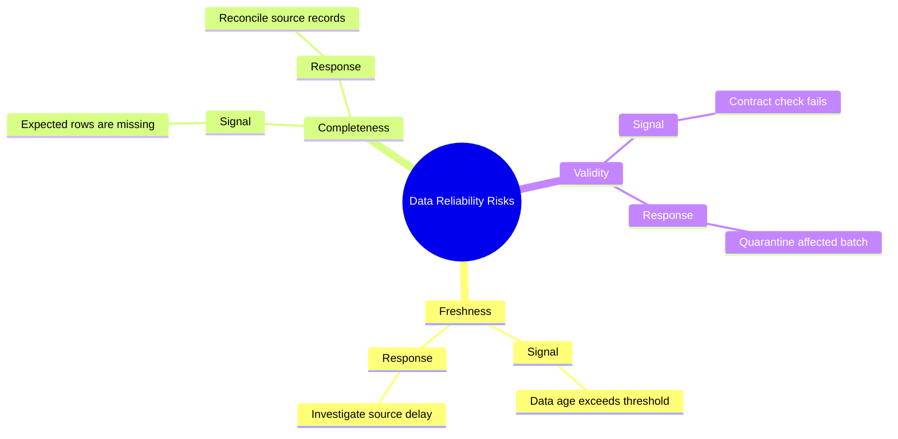

# Mindmap

개념이나 scope가 어떤 계층으로 분해되는지 보여줄 때 `mindmap`을 사용한다.

## Advanced: Decision And Action Map

taxonomy를 나열하는 데서 끝나지 않고, 각 branch에 관찰 기준과 다음 행동을 연결하면 mindmap이 decision map으로 확장된다. 같은 depth의 sibling은 가능한 한 **같은 종류의 질문**에 답하게 한다.

## Improvement: Keep A Consistent Decomposition Rule

한 parent 아래의 sibling은 같은 분해 기준을 사용한다. 예를 들어 risk category를 나눈다면 각 category 아래에서도 같은 `Signal → Response` 구조를 반복해, category·owner·action 같은 서로 다른 차원을 같은 level에 무작위로 섞지 않는다.

## Rules

- 같은 parent의 sibling이 무엇을 분해하는지 한 문장으로 설명할 수 있어야 한다.
- depth가 바뀌면 분해 기준도 바뀔 수 있지만 같은 level에서 category, owner, signal, action을 임의로 혼합하지 않는다.
- hierarchy가 깊어져 핵심 질문을 추적하기 어려우면 branch를 별도 mindmap으로 분리한다.
- source에 없는 parent-child 관계를 보기 좋은 taxonomy를 만들기 위해 추가하지 않는다.
