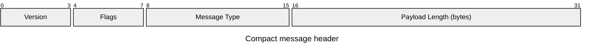
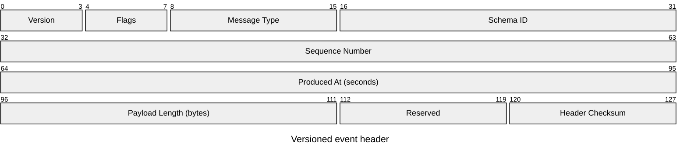

# Packet Diagram

> `packet`의 현재 syntax와 feature 지원은 target renderer와 Mermaid 공식 문서를 확인한다.

Network packet, binary header 또는 다른 **fixed contiguous bit layout**의 field boundary를 설명할 때 `packet`을 사용한다. Bit index와 width는 layout 장식이 아니라 protocol fact이므로 source보다 정밀하게 만들거나 보기 좋게 재배치하지 않는다.

Variable-length structure, conditional field presence, recursive payload 또는 arbitrary offset dependency가 핵심이면 Packet diagram 하나로 억지로 평탄화하지 않는다. Table, state/flow 설명 또는 protocol spec excerpt가 더 정확할 수 있다.

## Basic: Explicit Bit Ranges

Range의 시작·끝은 inclusive bit position이다. `0-3`은 4 bits다. Unit이 bytes, words, seconds처럼 별도 의미를 가지면 field label이나 주변 prose에서 source unit을 보존한다.

## Contiguity Is Part Of The Model

현재 Packet grammar는 bit stream을 앞에서부터 **연속된 field**로 구성한다. Gap이나 overlap을 단순 layout 여백으로 두지 않는다.

- Explicit range를 사용할 때 다음 field는 이전 field의 다음 bit에서 시작하는지 계산한다.
- `+N`은 이전 field 끝 다음 bit에서 N bits를 연속 배치하는 shorthand다. Width가 source-backed일 때만 사용한다.
- Gap이 실제 reserved/unused bits라면 source가 그렇게 정의할 때만 `Reserved` 같은 explicit field로 표현한다.
- Source excerpt가 bit 64부터만 보여준다고 해서 실제 offset을 `0`으로 renumber하지 않는다. Relative-offset diagram으로 의도적으로 재정의한다면 그 scope를 명시하고 absolute protocol offset처럼 읽히지 않게 한다.
- 원 source에 gap이 있지만 의미가 불명확한 경우 parser를 만족시키기 위해 임의의 reserved field를 발명하지 않는다. Table/spec excerpt fallback을 사용한다.

Mermaid parser가 contiguity, decreasing range, zero-width count 같은 일부 오류를 잡아주더라도 source spec과의 일치까지 검증해주는 것은 아니다.

## Advanced: Fixed Header, Variable Payload Boundary

아래 예제는 source protocol이 128-bit fixed header를 정의하고 `112–119`를 reserved bits로 명시한다는 전제다.

Payload는 bit 128 이후에 시작하지만 length가 runtime value라면 고정 width field처럼 임의로 그리지 않는다. `Payload Length`가 variable payload의 실제 size를 소유하고, diagram은 fixed header boundary까지만 보여준다고 설명한다.

## Row Wrapping Is Presentation

Renderer는 긴 field를 여러 visual row로 나눌 수 있다. 같은 field가 row boundary를 넘어 분할돼 보여도 protocol field가 둘로 나뉜 것은 아니다.

- Visual row break를 byte boundary, word boundary, checksum boundary 또는 protocol layer boundary로 해석하지 않는다.
- Width를 줄이기 위해 field range를 임의로 분할하거나 label을 다른 field처럼 복제하지 않는다.
- 실제 protocol이 32-bit word grouping 같은 별도 구조를 소유한다면 그 의미를 주변 prose나 별도 representation으로 명시하고 renderer row wrap에 맡기지 않는다.

## Bit Numbering And Byte Order

Packet syntax의 bit position만으로 wire-level bit order, byte order, MSB/LSB convention을 완전하게 설명할 수 있다고 가정하지 않는다.

- Endianness, bit numbering convention 또는 serialization order가 load-bearing information이면 diagram 밖의 protocol note/table로 명시한다.
- `bit 0`이 가장 먼저 전송되는 bit인지, most-significant bit인지 같은 사실을 source 없이 추론하지 않는다.
- Multi-byte field의 byte order를 rectangle의 좌우 위치만으로 설명하지 않는다.

## Fixed Versus Variable Structure

Packet diagram은 fixed range를 강하게 암시한다.

- Variable-length payload, optional extension, TLV 반복, alignment/padding rule처럼 runtime에 따라 offset이 변하면 단일 fixed range로 사실을 고정하지 않는다.
- 단지 일부 bytes를 예시로 보여주려면 `Payload Preview` 같은 label이 실제 field 정의로 오해되지 않도록 sample/excerpt임을 주변 prose에서 분명히 한다.
- Conditional field를 항상 존재하는 block처럼 그리지 않는다. Condition이 핵심이면 table/Flowchart 등으로 presence rule을 함께 설명한다.

## Renderer-Sensitive Review

Packet Diagram은 syntax validity와 **bit-layout integrity**를 따로 검증한다.

1. 첫 field부터 마지막 fixed field까지 bit range가 source와 정확히 일치하는가.
1. 모든 range가 inclusive라는 전제로 width를 다시 계산했는가.
1. Explicit range와 `+N`을 섞었다면 다음 start bit를 독립적으로 재계산했는가.
1. Gap, overlap, reserved bits와 padding을 source 없이 발명하지 않았는가.
1. Variable-length field를 fixed-size rectangle로 오해시키지 않았는가.
1. Unit, endianness와 bit-numbering convention처럼 syntax가 소유하지 않는 protocol fact를 별도로 보존했는가.
1. Renderer의 visual row wrap을 실제 protocol boundary로 읽히게 만들지 않았는가.
1. Excerpt를 renumber하거나 preview range를 full packet layout처럼 제시하지 않았는가.
1. 긴 packet이 unreadable하면 field semantics를 바꾸기보다 header/substructure별 split이나 table을 검토했는가.

문제가 있으면 parser를 통과시키기 위해 protocol fact를 추가하지 않는다. Source layout을 보존할 수 있는 representation으로 전환한다.

## Portable Fallback

Target renderer가 Packet diagram을 지원하지 않으면 **absolute bit range, width, field name, unit과 fixed/variable 여부**를 보존하는 table로 전환한다. Bit numbering이나 byte order가 중요하면 fallback table에 그 convention도 함께 적는다.
