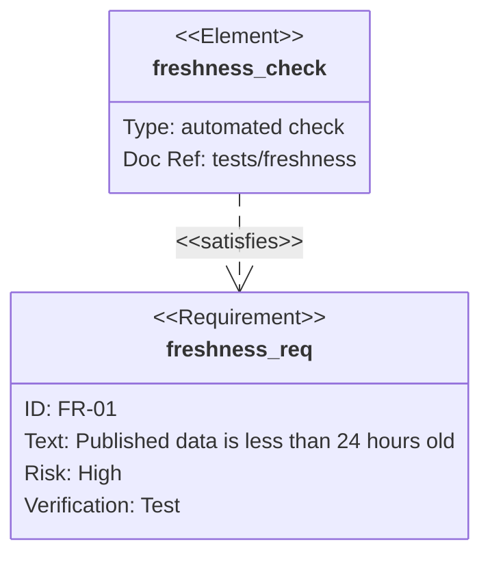
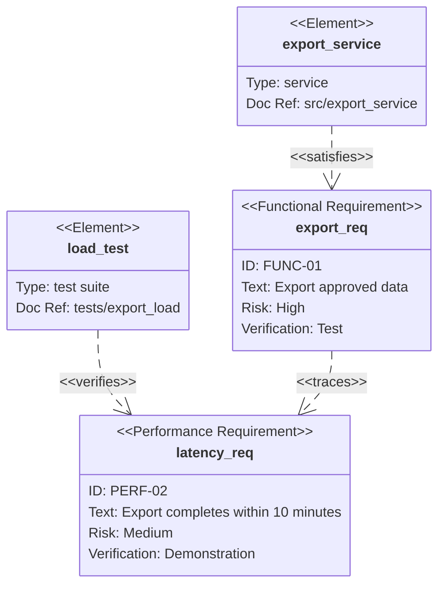

# Requirement Diagram

> `requirementDiagram`의 현재 syntax, styling과 direction 지원은 target renderer와 Mermaid 공식 문서를 확인한다.

Requirement와 다른 requirement·documented element 사이의 **typed traceability**가 핵심이면 `requirementDiagram`을 사용한다. Mermaid의 requirement notation은 SysML 계열의 requirement type과 relationship vocabulary를 사용하므로 edge 하나가 일반 dependency보다 강한 주장이다.

Source가 단지 “관련 있다” 정도만 말하는데 보기 좋은 graph를 만들기 위해 `satisfies`, `verifies`, `derives`, `refines` 같은 관계를 추론하지 않는다. Typed traceability 근거가 없으면 Flowchart나 traceability table이 더 정확할 수 있다.

## Basic: Requirement Satisfaction

이 예제는 source requirement model이 `freshness_check`가 `FR-01`을 **satisfies**한다고 명시한다는 전제다. Test가 존재한다는 사실만으로 implementation이 requirement를 만족한다고 추론하지 않는다.

## Requirement Identity And Fields

Diagram 안의 requirement **name**과 requirement body의 `id:`는 같은 책임이 아니다.

- Relationship endpoint는 requirement/element declaration의 **name**을 참조한다.
- Declaration name은 diagram 안에서 unique하게 유지한다. 같은 name을 두 번 선언해도 두 개의 독립 requirement가 안전하게 생긴다고 가정하지 않는다.
- 모든 relationship source/destination name이 실제 requirement 또는 element declaration으로 resolve되는지 확인한다. Parser가 relation text를 받아들였다는 사실만으로 endpoint integrity를 보장받았다고 보지 않는다.
- `id:`는 source가 소유하는 requirement identifier다. 이름을 짧게 만들더라도 displayed ID와 requirement text를 임의로 바꾸지 않는다.
- Requirement type, `risk`, `verifymethod`는 source-backed metadata다. Source가 값을 제공하지 않으면 편의를 위해 `low`, `test` 같은 기본값을 발명하지 않는다.
- User-defined value에 whitespace, punctuation 또는 Mermaid keyword가 포함되면 quote를 사용해 parsing ambiguity를 줄인다.
- 같은 displayed ID를 다른 requirement에 중복하는 것이 source defect라면 diagram에서 조용히 정규화하지 않는다. 원 source를 고치거나 ambiguity를 보고한다.

## Typed Traceability

아래 예제의 관계는 **source trace model이 해당 type과 direction을 명시했다는 전제**다.

`contains`, `copies`, `derives`, `satisfies`, `verifies`, `refines`, `traces`는 서로 교환 가능한 edge label이 아니다. Source model의 relation vocabulary와 direction을 그대로 보존한다. 일반적인 architecture dependency나 call relation을 이 vocabulary로 번역하지 않는다.

## Direction Is Presentation

`direction TB|BT|LR|RL`은 diagram layout을 바꾼다. Relationship의 source/destination 의미나 relationship type을 뒤집지 않는다.

Portrait viewport에서 `LR`가 너무 넓다고 해서 `A - satisfies -> B`를 `B <- satisfies - A`와 다른 의미로 재작성하지 않는다. 같은 semantic edge를 유지한 채 supported direction, grouping, split 또는 table fallback을 검토한다.

## Traceability Completeness

Requirement diagram이 전체 trace matrix인지 질문에 필요한 subset인지 구분한다.

- 일부 requirement/element만 보여주는 diagram을 complete coverage 증거로 사용하지 않는다.
- `verifies` edge가 보이지 않는다고 “검증되지 않았다”고 결론내리지 않는다. Diagram scope가 complete verification matrix인지 먼저 확인한다.
- 반대로 source가 요구하는 safety-critical trace를 viewport 때문에 임의로 생략하고 complete diagram처럼 제시하지 않는다.
- Parallel relationships가 실제 source에 존재하면 시각적으로 복잡하다는 이유만으로 하나의 generic edge로 합치지 않는다.

## Styling And Emphasis

Style/class는 presentation layer다. Risk, verification status, pass/fail, ownership 같은 fact를 fill color 하나에만 맡기지 않는다.

Risk나 verification method는 requirement body의 source-backed field가 의미를 소유한다. Highlight가 필요하면 그 fact를 대체하지 않는 보조 표현으로만 사용한다.

## Renderer-Sensitive Review

Requirement Diagram은 syntax validity와 **traceability fidelity**를 따로 검증한다.

1. Requirement/element declaration name이 unique하고 모든 relationship endpoint가 실제 declaration으로 resolve되는가.
1. Requirement name, displayed `id:`와 text가 source identity를 보존하는가.
1. Requirement type, risk와 verification method를 source 없이 추론하지 않았는가.
1. 모든 relationship type과 direction이 source trace model에 실제로 존재하는가.
1. Generic dependency를 `satisfies`·`verifies`·`derives`·`refines` 같은 강한 relation으로 승격하지 않았는가.
1. Relationship endpoint가 displayed ID가 아니라 올바른 declaration name을 참조하는가.
1. Diagram subset을 complete requirement/verification coverage처럼 해석하지 않았는가.
1. Layout `direction`이나 styling을 semantic edge, risk 또는 status로 오해하지 않았는가.
1. Quote가 필요한 user-defined text가 parser keyword와 충돌하지 않는가.
1. Dense trace graph가 읽기 어려우면 relationship을 삭제하기보다 requirement concern별 split이나 trace table을 검토했는가.

문제가 있으면 관계 type을 약한 의미로 재해석하지 않는다. Source가 가진 trace semantics를 보존할 수 있는 representation을 선택한다.

## Portable Fallback

Target renderer가 Requirement Diagram을 안정적으로 지원하지 않으면 **requirement ID/text/type, element identity, typed relationship와 direction**을 보존하는 traceability table로 전환한다. Typed relation 자체가 필요하지 않고 일반 dependency만 중요하면 Flowchart를 사용한다.
