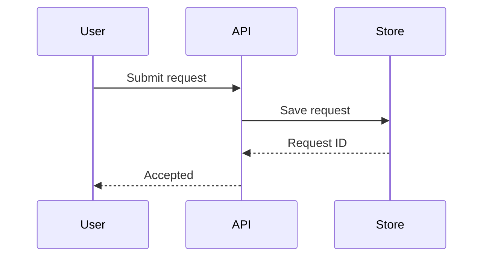
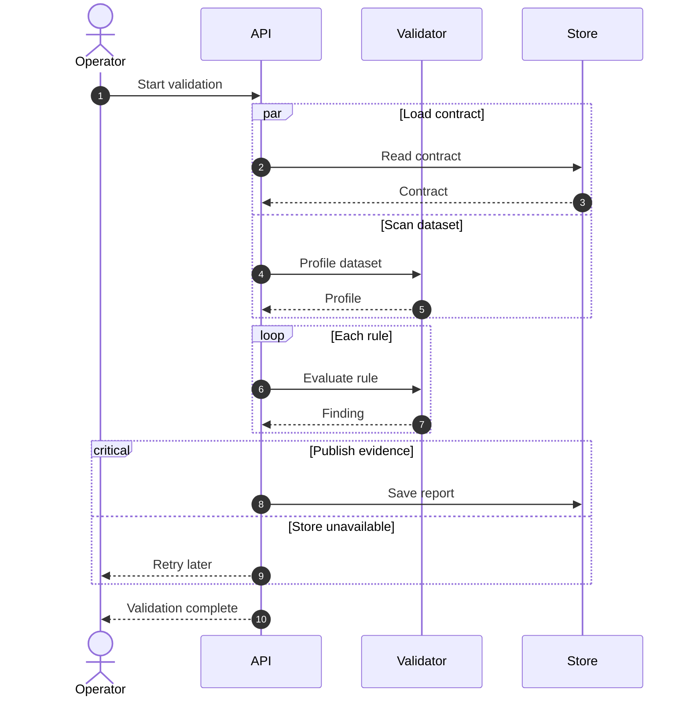
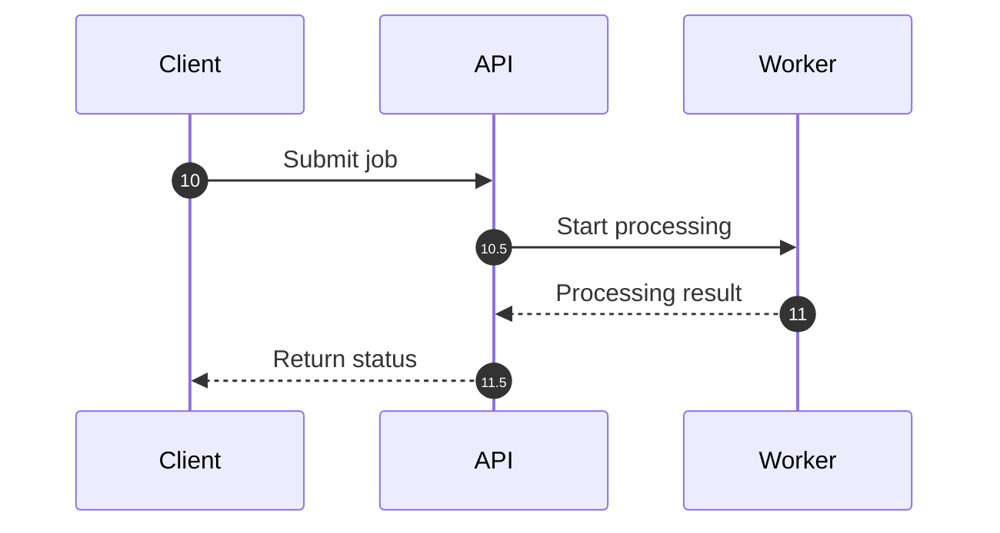
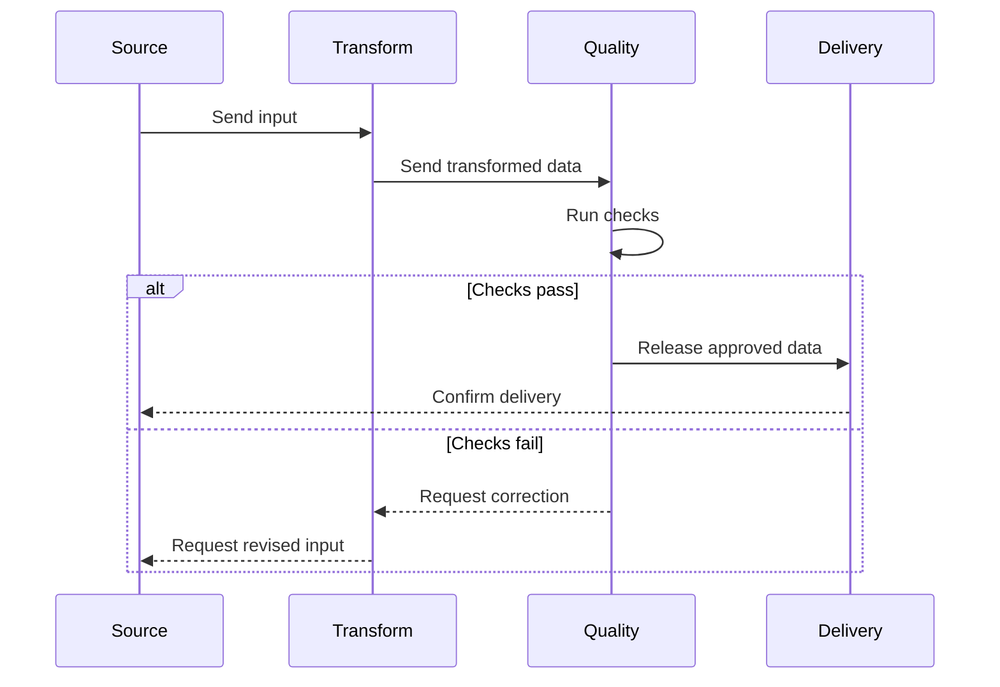
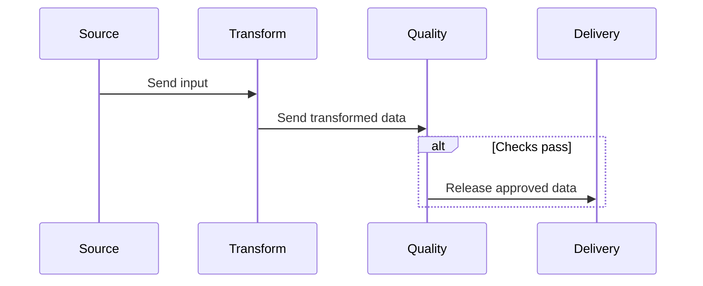
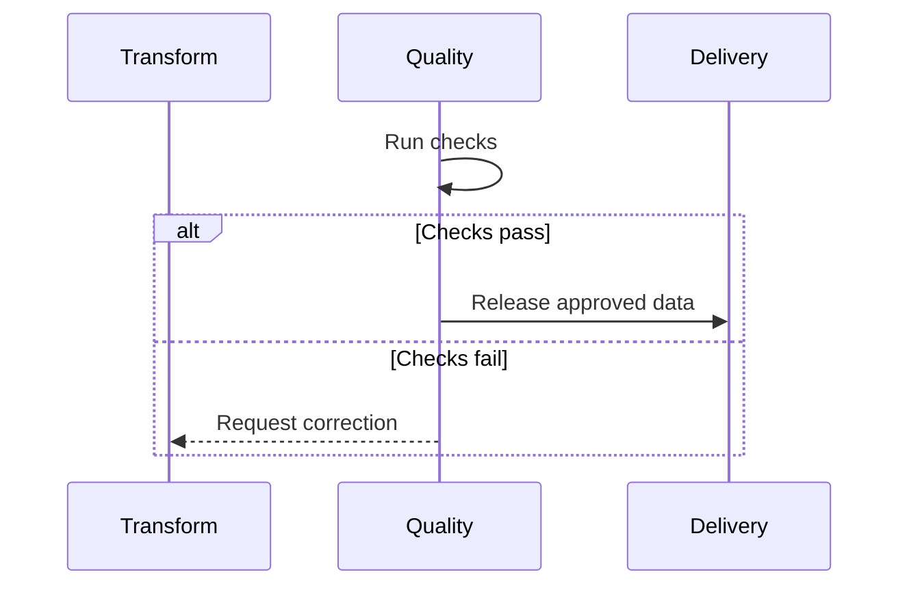

# Sequence Diagram

participant가 누구에게 어떤 message를 보내는지가 핵심이면 `sequenceDiagram`을 사용한다.

## Advanced: Loop, Parallel Work And Critical Section

## Intermediate: Custom Sequence Numbering

Mermaid 11.15.0 이상에서는 `autonumber <start> <increment>`로 시작값과 증가값을 지정할 수 있다. 번호는 설명 순서를 보조할 때만 사용한다.

문서 본문에서 message를 번호로 참조한다면 source 변경 후 번호가 바뀌지 않았는지 다시 검토한다.

## Splitting Large Sequence Diagrams

participant 수나 interaction이 많아 message 추적이 어려워지면 **interaction scenario 또는 책임 경계**를 기준으로 overview와 detail을 분리한다. Split은 이미 확인된 message와 participant를 재배치하거나 일부 생략하는 작업이지 새로운 interaction을 만드는 작업이 아니다.

### Before

### Overview

전체 흐름을 이해하는 데 필요한 주요 message만 남기되, 생략으로 인해 조건이 사라져 의미가 강해지지 않게 한다.

### Detail

특정 scenario를 확대할 때도 원본에 있던 participant, message 방향과 조건을 보존한다.

## Rules

- message direction, order와 condition은 source가 뒷받침할 때만 구체화한다.
- participant를 단순히 diagram을 채우기 위해 추가하지 않는다.
- overview는 detail을 축약할 수 있지만 condition을 제거해 optional message를 unconditional interaction처럼 만들지 않는다.
- split 과정에서 새로운 participant, message, acknowledgement 또는 failure path를 발명하지 않는다.
