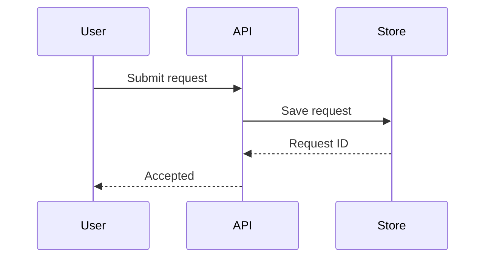
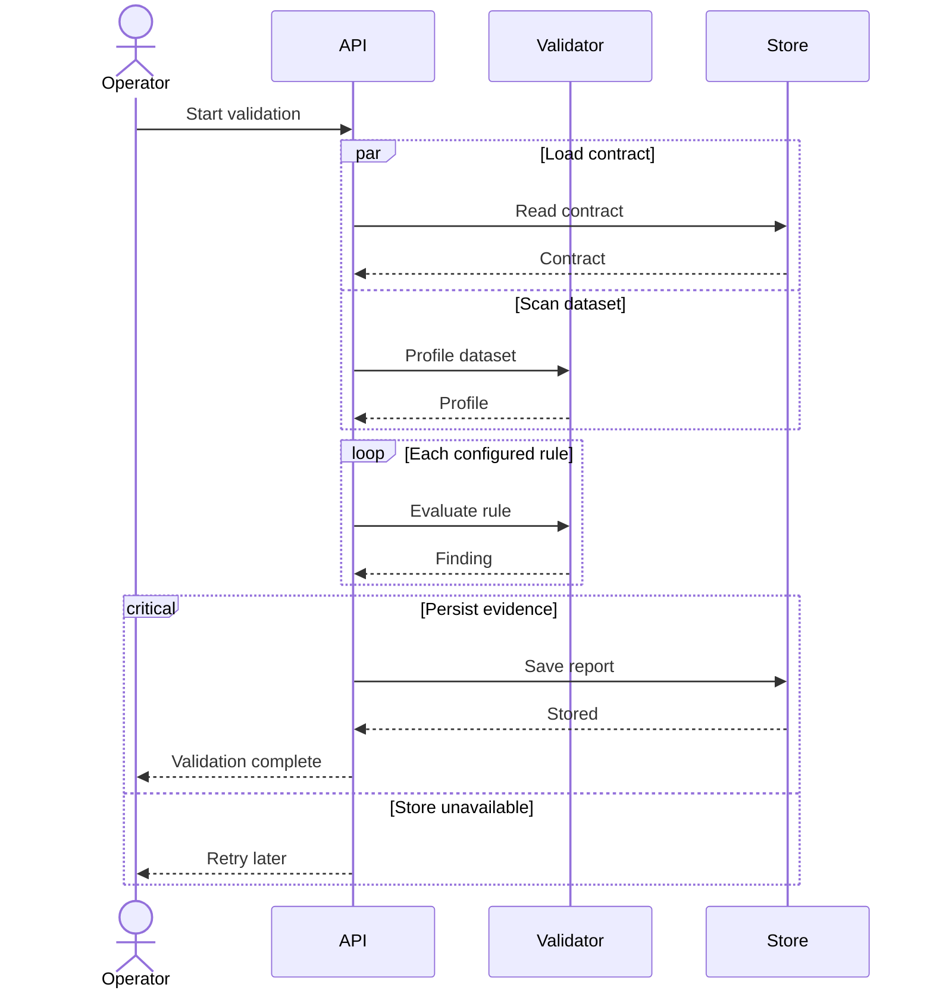
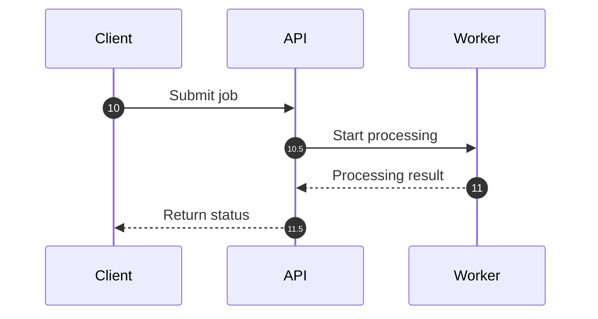
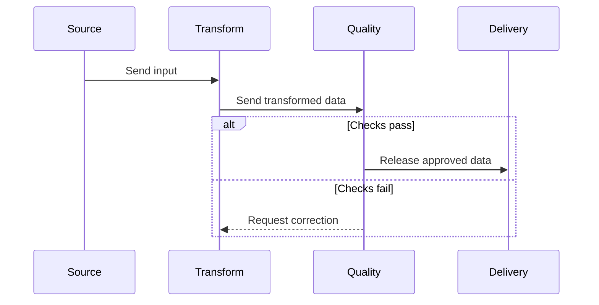

# Sequence Diagram

> `sequenceDiagram`의 현재 syntax와 renderer behavior는 target renderer와 Mermaid 공식 문서를 확인한다.

여러 participant 사이의 **message direction과 interaction order**가 핵심이면 `sequenceDiagram`을 사용한다. 단순 dependency topology나 책임 구조를 message sequence처럼 만들지 않는다.

위에서 아래로 내려가는 message declaration은 interaction order를 소유한다. 보기 좋은 배치를 위해 message를 재정렬하면 chronology를 바꾸는 semantic edit가 된다.

## Participant Identity And Order

Participant ID와 display label을 구분하고 같은 participant를 diagram 안에서 하나의 stable identity로 유지한다.

- Participant declaration order는 화면의 left-to-right order를 결정하는 데 사용될 수 있지만 business priority나 ownership rank를 뜻하지 않는다.
- Source가 actor와 system을 구분할 때만 `actor`와 `participant` 같은 표현 차이를 사용한다. Shape 차이 자체로 새로운 responsibility를 만들지 않는다.
- Message에 등장했다는 이유만으로 participant의 ownership, deployment boundary 또는 long-lived dependency를 추론하지 않는다.
- 동일한 display label을 가진 서로 다른 participant가 실제로 필요하면 stable ID와 주변 설명으로 identity를 구분한다.
- participant metadata나 최근 추가된 presentation surface를 사용하면 target renderer에서 실제 parse/render 결과를 확인한다.

## Message Semantics

Arrow는 source가 뒷받침하는 **sender, receiver, order와 message meaning**을 표현한다.

- Request와 response가 실제로 존재할 때만 왕복 message를 만든다. 보기 좋은 대칭을 위해 acknowledgement나 return을 추가하지 않는다.
- Solid/dotted line, arrowhead와 signal notation은 source 또는 local notation convention이 그 차이를 소유할 때만 protocol semantics로 해석한다.
- Message label에 성공 여부가 없다면 dashed return을 `success`, solid arrow를 `blocking call`처럼 자동 해석하지 않는다.
- Self-message는 실제 recursive/self processing interaction이 있을 때만 사용한다. 단순 내부 computation을 채우기 위한 node로 만들지 않는다.
- Actor creation/destruction을 표현할 때는 실제 lifecycle event가 source에 있어야 한다. Participant가 처음 보인다는 이유로 `create`를, 마지막 message라는 이유로 `destroy`를 추가하지 않는다.

## Fragments Are Behavioral Claims

`alt`, `opt`, `loop`, `par`, `critical`, `break`는 layout wrapper가 아니라 interaction behavior를 강화하는 fragment다.

- `alt`/`else`는 source-backed alternative path를 표현한다. 조건이 없는 source에 guard를 발명하거나 optional branch를 unconditional message로 만들지 않는다.
- `opt`는 실제 optional interaction에 사용한다. 단순 detail 생략을 `opt`로 표시하지 않는다.
- `loop`는 반복 조건이나 반복 단위가 source에 있을 때만 사용한다. 같은 message가 여러 번 발생할 수 있다는 추측만으로 loop를 만들지 않는다.
- `par`는 branch가 병렬로 진행될 수 있다는 강한 claim이다. Branch declaration 순서를 global execution order로 읽지 않으며, source가 단순 unordered라는 이유만으로 parallel이라고 확정하지 않는다.
- `critical`은 반드시 수행되어야 하는 region과 conditional handling을 나타내므로 visual emphasis 용도로 사용하지 않는다.
- `break`는 조건 발생 시 sequence가 중단되는 behavior를 표현한다. 일반 error note나 red highlight 대용으로 쓰지 않는다.

## Activation Is Not Duration Evidence

Activation bar는 participant가 해당 interaction에서 active processing을 수행한다는 의미가 source-backed일 때만 사용한다.

- Activation 높이를 latency나 CPU time처럼 정량적으로 해석하지 않는다.
- `activate`/`deactivate` pair는 실제 processing scope를 보존하고, 단순 visual grouping을 위해 임의로 늘리거나 줄이지 않는다.
- Nested activation을 사용하면 source가 재진입·nested call 같은 behavior를 뒷받침하는지 확인한다.
- Mermaid는 inactive participant의 deactivation을 오류로 처리할 수 있으므로 syntax acceptance와 semantic scope를 함께 검증한다.

## Sequence Numbering Is Presentation

Mermaid가 지원하는 renderer에서는 `autonumber`와 custom start/increment를 사용할 수 있다. 번호는 **rendered message order의 reference aid**이지 source의 immutable message ID가 아니다.

본문이 번호를 참조하면 diagram edit 후 numbering drift를 다시 확인한다. Stable cross-document identity가 필요하면 message label이나 companion table에 별도 source identifier를 둔다.

## Splitting Large Sequence Diagrams

participant나 message가 많아 interaction을 추적하기 어려우면 **scenario, fragment 또는 responsibility boundary**를 기준으로 overview/detail을 나눈다. Split은 source-backed interaction을 생략하거나 재배치할 수 있지만 새로운 message를 만들 수는 없다.

- Overview에서 optional/conditional message를 남길 때 guard를 함께 보존한다.
- Failure-only detail을 happy path의 후속 sequence처럼 이어 붙이지 않는다.
- `par`을 split하면 branch 사이에 없던 total order를 만들지 않는다.
- participant를 detail에서 생략해도 message endpoint identity가 다른 participant로 바뀌지 않는다.
- 읽기 어렵다면 participant 약 5개, message 약 12개, fragment nesting 2단계라는 상위 readability trigger를 기준으로 split을 재검토하되 숫자를 validity limit로 사용하지 않는다.

## Renderer-Sensitive Review

Sequence Diagram은 syntax validity와 **interaction-order fidelity**를 따로 검증한다.

1. 모든 participant identity와 message endpoint가 source와 일치하는가.
1. Declaration order가 실제 interaction order를 보존하며 보기 좋은 정렬 때문에 chronology가 바뀌지 않았는가.
1. Request에 source에 없는 response, acknowledgement 또는 failure message를 추가하지 않았는가.
1. `alt`/`opt`/`loop`/`par`/`critical`/`break`가 실제 behavior를 표현하며 decoration으로 사용되지 않았는가.
1. `par` branch를 global total order나 guaranteed simultaneity로 과해석하지 않았는가.
1. Activation이 실제 processing scope를 나타내며 latency·duration으로 읽히게 하지 않았는가.
1. Autonumber를 stable domain identity나 business sequence number처럼 사용하지 않았는가.
1. Actor creation/destruction을 화면 출현·소멸과 혼동하지 않았는가.
1. Overview/detail split이 condition, participant identity와 message direction을 보존하는가.
1. Target renderer에서 사용한 participant metadata, recent syntax와 nested fragment가 실제로 안정적으로 render되는가.

문제가 있으면 message를 추가해 sequence를 자연스럽게 만들지 않는다. Source order와 condition을 먼저 고치거나 더 직접적인 representation으로 전환한다.

## Portable Fallback

Target renderer가 Sequence Diagram을 안정적으로 지원하지 않으면 **ordinal order, sender, receiver, message와 condition/fragment context**를 보존하는 interaction table을 사용한다. Exact order보다 dependency나 procedure가 핵심이면 Flowchart/Swimlanes 등 해당 relation을 직접 표현하는 type으로 전환한다.
