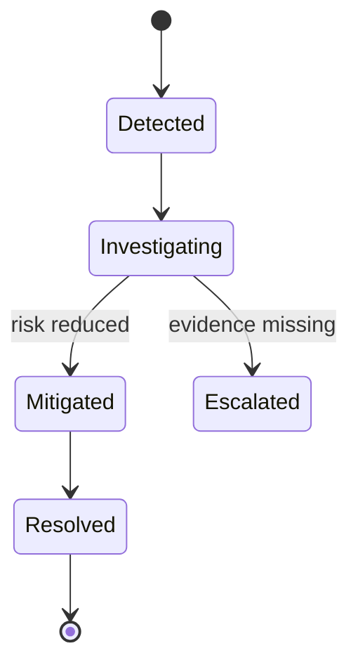
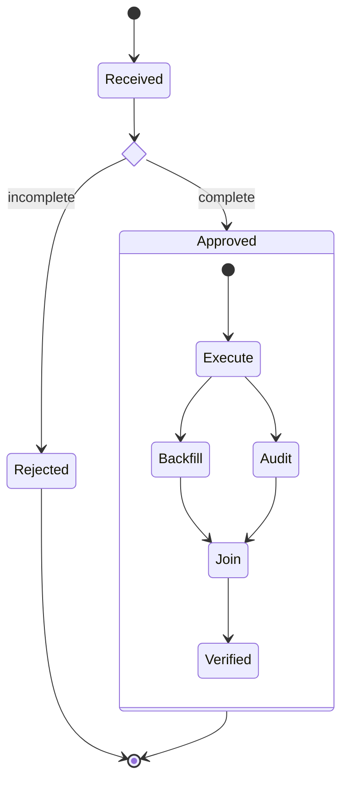
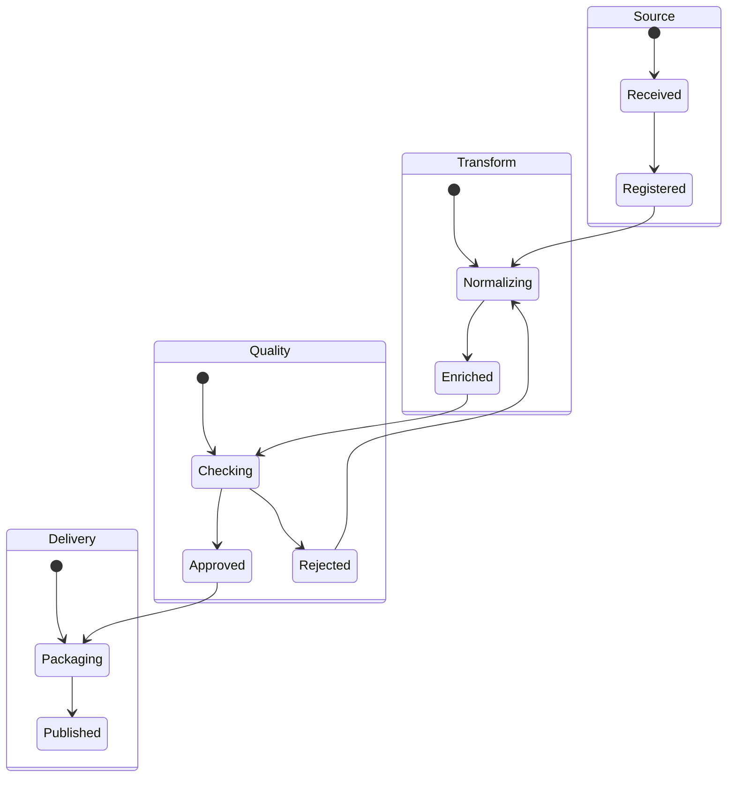
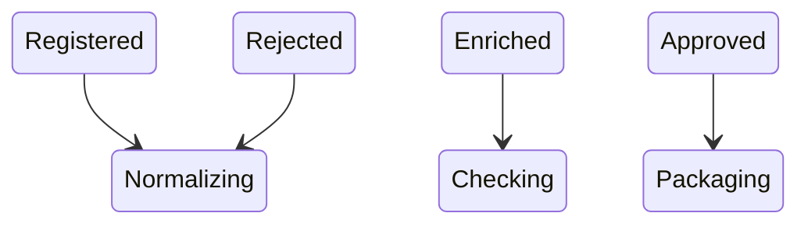
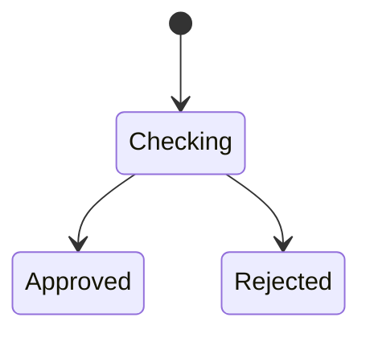

# State Diagram

incident나 workflow가 어떤 상태를 거쳐 이동하는지 보여줄 때 `stateDiagram-v2`를 사용한다.

## Advanced: Choice, Fork And Concurrent Regions

## Splitting Large State Diagrams

state와 transition이 많아 lifecycle을 추적하기 어려우면 **composite state 또는 lifecycle responsibility**를 기준으로 overview와 detail을 분리한다. Split은 기존 state machine을 다른 zoom level로 표현하는 작업이며 새로운 entry, exit 또는 transition을 만드는 작업이 아니다.

### Before

### Overview

복잡한 내부 구조를 생략하더라도 원본에 있던 concrete transition을 그대로 사용한다.

### Detail

특정 composite state를 확대할 때 원본에 있던 내부 state와 transition만 유지한다.

## Rules

- state와 transition은 source가 실제로 뒷받침하는 lifecycle 의미만 표현한다.
- `[*]`는 단순한 layout marker가 아니라 entry 또는 exit semantics이므로 근거 없이 추가하지 않는다.
- overview는 state를 생략할 수 있지만 concrete transition을 더 넓은 macro transition으로 일반화하지 않는다.
- split 과정에서 편의를 위해 terminal state, recovery path 또는 transition을 발명하지 않는다.
