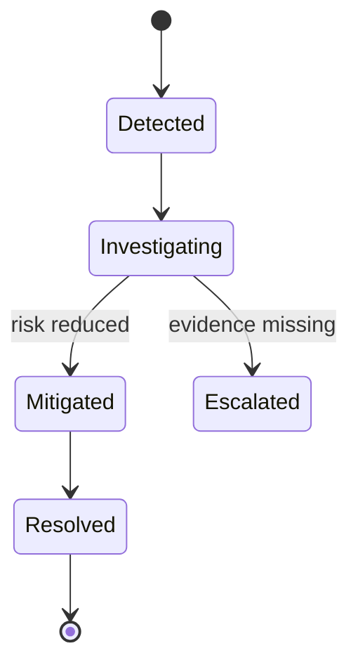
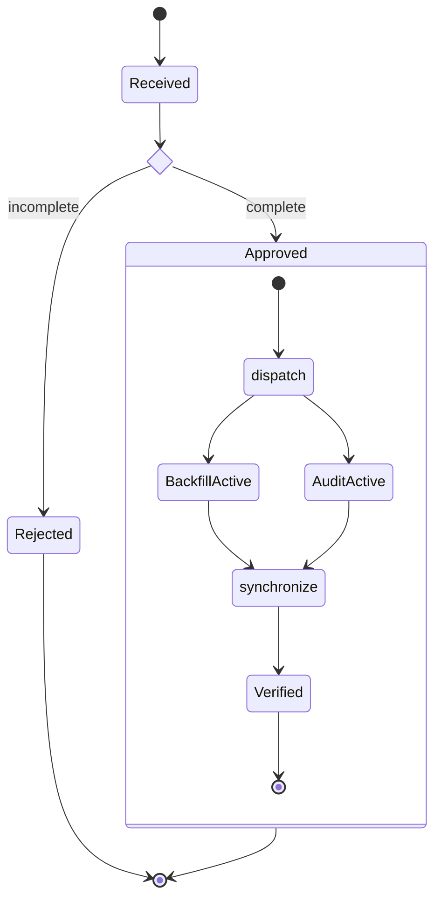
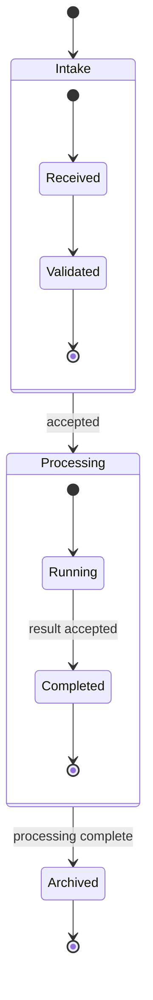
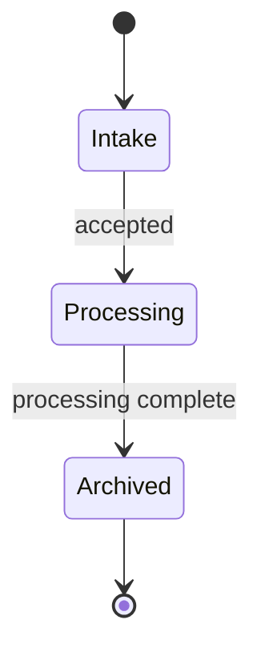
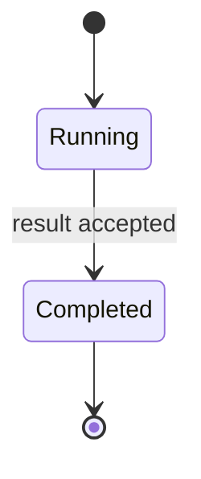

# State Diagram

> `stateDiagram-v2`의 현재 syntax와 renderer behavior는 target renderer와 Mermaid 공식 문서를 확인한다.

한 entity/system이 **어떤 finite state에 있고 어떤 event/condition으로 다른 state가 되는지**가 핵심이면 State Diagram을 사용한다. 단순 procedure step이나 task 순서를 state로 바꾸지 않는다.

State는 순간적인 action보다 일정 기간 유지되는 condition/mode를 나타내는 것이 기본이다. `Investigating`이 실제 lifecycle state가 아니라 단지 “조사한다”라는 작업 단계라면 Flowchart/Swimlanes가 더 정확할 수 있다.

## State Identity And Transition Evidence

State ID와 display description을 구분하고 같은 lifecycle state를 하나의 stable identity로 유지한다.

- Transition은 source가 실제로 허용하거나 관찰한 state change만 표현한다.
- Source에 없는 shortcut, retry, recovery 또는 terminal transition을 보기 좋은 lifecycle을 위해 추가하지 않는다.
- Transition label은 event, guard, outcome 등 source가 실제로 말하는 의미만 담는다. Mermaid label 한 줄이 formal event/guard/action grammar를 검증해 주는 것은 아니다.
- 같은 label을 가진 state가 서로 다른 scope에서 존재하면 identity를 분명히 한다. Display text가 같다는 이유로 하나의 state로 합치지 않는다.
- State declaration/render position은 lifecycle order, frequency 또는 severity를 뜻하지 않는다. Transition graph가 허용된 movement를 소유한다.

## Initial And Final Pseudostates Are Semantic

`[*]`는 layout marker가 아니라 start/final pseudostate다.

- Top-level `[*] --> State`는 diagram이 모델링하는 lifecycle의 initial entry를 주장한다.
- `State --> [*]`는 해당 lifecycle의 final termination을 주장한다.
- Composite state 안의 `[*]`는 **그 composite scope의 local entry/final**이다. Global system start/end와 자동으로 같은 의미가 아니다.
- Source가 시작 상태나 종료 상태를 확정하지 않았다면 diagram을 완성하기 위해 `[*]`를 추가하지 않는다.
- 여러 valid entry/exit가 있지만 notation이 질문을 흐리면 explicit state/transition table을 병행한다.

## Choice, Fork And Join Are Strong Claims

Choice, fork/join과 concurrency는 visual decoration이 아니라 state-machine behavior다.

`BackfillActive`와 `AuditActive`는 source가 실제로 concurrent lifecycle state를 정의한다는 전제다. 단순히 두 작업을 병렬 실행한다는 절차만 있다면 Flowchart/Sequence가 더 정확할 수 있다.

- `<<choice>>`는 condition에 따라 alternative transition을 선택하는 decision point다. Source에 guard가 없는데 branch label을 발명하지 않는다.
- `<<fork>>`는 하나의 flow가 concurrent paths로 갈라진다는 claim이다. 단순 unordered work를 concurrency로 확정하지 않는다.
- `<<join>>`은 concurrent paths의 synchronization을 나타낸다. 여러 edge를 한 곳에 모으기 위한 layout node로 사용하지 않는다.
- Composite 내부의 `--` concurrency separator도 orthogonal concurrent region을 뜻하므로 section divider처럼 사용하지 않는다.
- Choice/fork/join pseudostate를 business state처럼 duration, ownership 또는 persistence를 가진 entity로 해석하지 않는다.

## Composite State Scope Must Be Preserved

Composite state는 실제 nested lifecycle/state scope가 있을 때 사용한다.

이 예제는 `Intake`와 `Processing` 자체가 source-backed composite state이고 parent-level transition도 실제 model에 있다는 전제다.

- 서로 다른 composite state의 **internal child state끼리 직접 cross-transition을 만들지 않는다.** Mermaid 공식 State Diagram도 이런 cross-composite internal transition을 지원하지 않는다.
- Internal state의 이동을 parent-level transition으로 임의 승격하지 않는다. Parent transition은 별도 source fact가 있어야 한다.
- Composite를 layout grouping 용도로 추가하면서 실제 nested lifecycle이 있는 것처럼 만들지 않는다.
- Local final state에 도달했다는 사실과 parent composite를 빠져나가는 transition을 같은 사건으로 자동 합치지 않는다.

## Splitting Overview And Detail

State와 transition이 많아지면 **composite state 또는 lifecycle concern**을 기준으로 overview/detail을 나눈다.

Overview에서는 source가 이미 정의한 composite state와 parent-level transition만 사용한다.

Processing detail:

- Child transition을 생략했다고 parent 사이에 새 macro transition을 발명하지 않는다.
- Detail의 local `[*]`는 composite entry/final을 나타내며 전체 lifecycle의 global start/end로 확대하지 않는다.
- Overview와 detail이 같은 state 이름을 사용하더라도 zoom level과 scope를 명확히 한다.
- Split 후 recovery/terminal path가 사라져 lifecycle 해석이 강해지지 않았는지 확인한다.
- transition 수가 state 수의 약 2배를 크게 넘는다는 상위 readability trigger는 split 검토 신호일 뿐 validity limit가 아니다.

## State Versus Process

- **State Diagram**: entity가 현재 어떤 state인지, 어떤 transition이 가능한지가 핵심.
- **Flowchart/Swimlanes**: action, procedure, decision, handoff 순서가 핵심.
- **Sequence Diagram**: participant 사이 message의 temporal order가 핵심.
- **Timeline**: state machine보다 timestamped event chronology가 핵심.

Action 이름을 box에 넣을 수 있다는 이유만으로 모든 workflow를 state machine으로 만들지 않는다.

## Layout And Renderer Review

Direction과 layout engine은 presentation이다.

- `LR`/`TB`를 lifecycle direction이나 causal strength로 해석하지 않는다.
- Composite nesting, transition topology와 concurrency semantics를 viewport 때문에 바꾸지 않는다.
- State layout은 renderer/host에 따라 크게 달라질 수 있으므로 exact geometry를 contract로 사용하지 않는다.
- Note 위치나 styling이 load-bearing information이면 target renderer에서 실제 결과를 확인하거나 semantic text/table로 옮긴다.

## Renderer-Sensitive Review

State Diagram은 syntax validity와 **state-machine fidelity**를 따로 검증한다.

1. 각 node가 실제 state이며 단순 action/process step을 state로 가장하지 않는가.
1. 모든 transition이 source-backed이고 source에 없는 shortcut/retry/terminal path를 만들지 않았는가.
1. Transition label을 formal guard/action semantics보다 강하게 해석하지 않았는가.
1. Top-level과 composite-local `[*]`의 scope가 올바른가.
1. Choice/fork/join/concurrent region이 실제 behavior를 나타내며 decoration이 아닌가.
1. Composite가 실제 nested lifecycle이며 layout grouping으로 발명되지 않았는가.
1. 서로 다른 composite의 internal child끼리 unsupported cross-transition을 만들지 않았는가.
1. Overview/detail split이 parent transition, entry/final scope와 recovery path를 왜곡하지 않는가.
1. Render position과 direction을 chronology·frequency·severity로 해석하지 않았는가.
1. Exact procedure가 핵심인데 State Diagram이 Flowchart 역할을 대신하고 있지 않은가.

문제가 있으면 state나 transition을 추가해 machine을 완성하지 않는다. Source lifecycle을 먼저 좁히거나 process/table representation으로 전환한다.

## Portable Fallback

Target renderer가 State Diagram을 안정적으로 지원하지 않으면 **state identity, allowed transition, trigger/condition, initial/final scope와 composite membership**을 보존하는 state-transition table을 사용한다. Action sequence가 핵심이면 Flowchart/Swimlanes로 전환한다.
