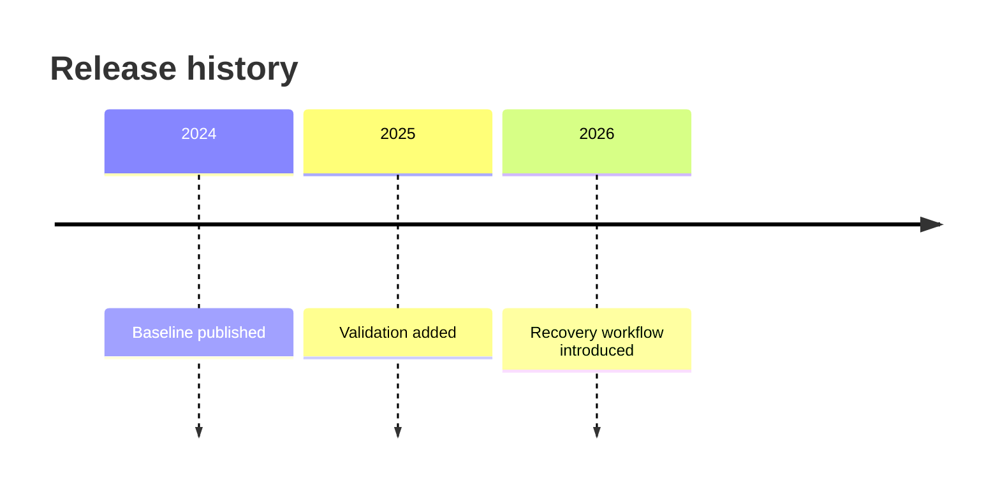
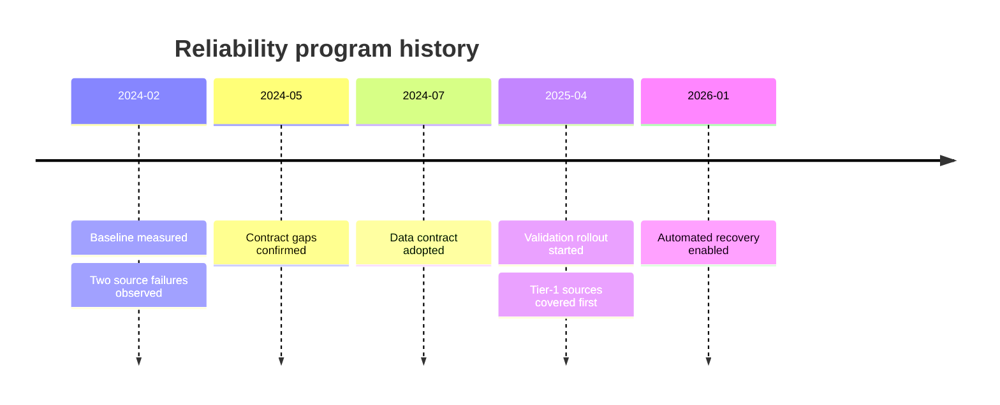
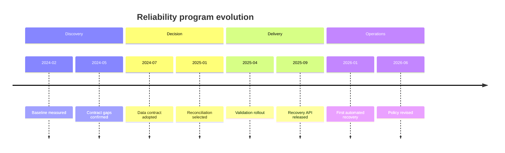
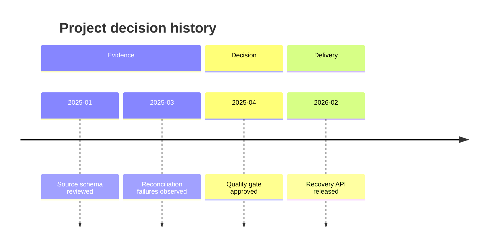
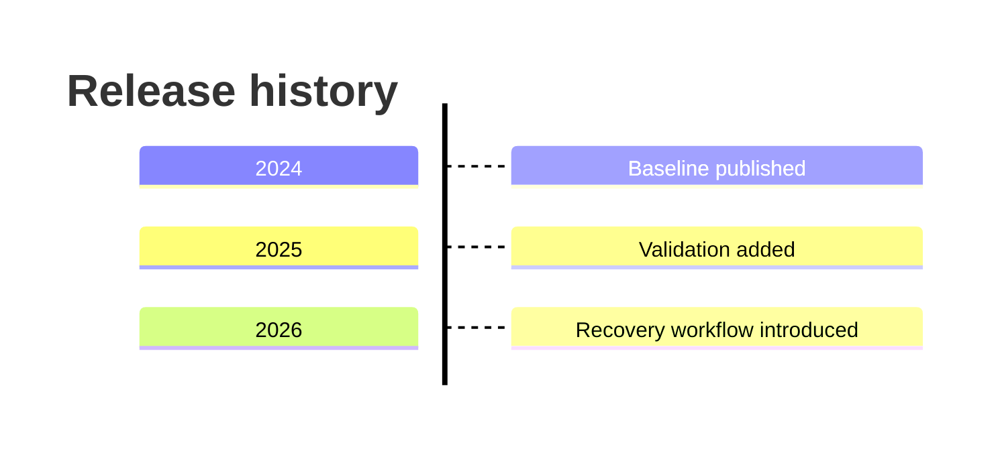

# Timeline

> Timeline syntax와 version-specific feature 지원은 target renderer와 Mermaid 공식 문서를 확인한다.

사건의 duration보다 **ordered periods, milestones와 era grouping**이 중요하면 `timeline`을 사용한다. Mermaid Timeline의 period는 date type이 아니라 text이며, renderer가 날짜를 parse·sort하거나 시간 간격을 scale로 계산하지 않는다.

Period에 arbitrary text를 쓸 수 있다는 grammar를 process step의 대체 문법으로 해석하지 않는다. `Plan → Build → Test`처럼 temporal bucket보다 절차·transition이 핵심이면 Flowchart가 더 직접적이다.

## Basic: Ordered Milestones

Source order가 rendered chronology를 소유한다. 실제 날짜가 있는 source를 timeline으로 옮길 때는 먼저 source facts를 시간순으로 정렬·검증하고, renderer가 잘못된 순서를 교정해 줄 것으로 기대하지 않는다.

Visual spacing도 elapsed time에 비례하지 않는다. `2024 → 2025`와 `2025 → 2030`이 비슷한 간격으로 보이더라도 같은 duration을 뜻하지 않는다.

## Temporal Precision, Order And Same-Period Events

Period label의 precision은 source evidence보다 높이지 않는다. Source가 `2025`까지만 말하면 정렬이나 미관을 위해 `2025-01` 또는 `2025-01-01`을 만들지 않는다. Approximate·uncertain timing이 중요한 경우에도 그 불확실성을 지우고 exact date처럼 보이게 하지 않는다.

Chronological order의 precision도 source보다 높이지 않는다. 두 사건의 선후가 확인되지 않았는데 declaration order만으로 total order를 만들지 않는다. 실제로 같은 temporal bucket에 속하고 선후가 중요하지 않다면 같은 period 아래 co-locate하고, 그렇지 않으면 order uncertainty를 보존할 수 있는 table이나 prose를 사용한다.

같은 temporal bucket에 여러 사실이 실제로 속할 때 한 period 아래 여러 event를 둘 수 있다.

같은 period 아래의 여러 event는 **co-located facts**일 뿐이다. Renderer가 period/event association을 arrow-like connector로 그리더라도 source에 causality, dependency 또는 approval 관계가 추가되는 것은 아니다.

- event의 위아래 순서만으로 causality, dependency, approval chain 또는 within-period chronology를 주장하지 않는다.
- 서로 다른 날짜에 일어난 사실을 compact하게 보이기 위해 하나의 period로 합치지 않는다.
- month → quarter → year처럼 source granularity를 낮춰야 한다면 질문에 필요한 수준인지 확인하고, 해석에 영향을 주는 aggregation은 드러낸다.
- within-period order가 중요하면 더 세밀한 source evidence가 있을 때 그 period를 사용하거나 sequence/flowchart 같은 다른 type을 검토한다.
- 한 period에 annotation을 계속 쌓지 않는다. 실제 co-located fact가 아닌 rationale, evidence detail이나 설명은 companion prose/table로 옮긴다.

## Sections Are Contiguous Grouping

`section`은 독립적인 parallel lane이 아니라 **뒤따르는 period들을 다음 section 전까지 묶는 contiguous grouping**이다. Era, release generation, contiguous phase처럼 chronology와 함께 이어지는 구간에 사용한다.

Owner, team, workstream처럼 시간이 지나며 반복해서 등장하는 category를 section별로 모으기 위해 실제 chronology를 재정렬하지 않는다. 같은 section label을 나중에 다시 열어 recurring lane처럼 사용하지도 않는다. Category가 interleave되면 section을 줄이거나 separate timelines, table 또는 질문에 더 직접적인 다른 representation을 사용한다.

## Decision History Without Invented Causality

Timeline은 decision history를 보여줄 수 있지만 **decision rationale나 evidence 관계를 edge로 표현하지 않는다.** Evidence와 decision이 서로 다른 시점에 존재하면 각각 실제 period에 둔다.

Source가 `evidence → decision` 관계를 명시적으로 뒷받침한다면 companion prose나 별도 relationship-oriented diagram으로 그 관계를 설명한다. 과거 evidence를 나중 milestone 아래 두 번째 event로 옮겨 같은 시점에 발생한 것처럼 보이게 하지 않는다.

## Direction And Viewport

Mermaid v11.14+는 `LR`과 `TD` direction을 지원한다. Direction은 presentation choice이며 source order와 chronology를 바꾸지 않는다.

Portrait reading viewport에서 LR이 과도하게 넓어지면 `TD`를 **후보로 검토**한다. TD는 chronology를 세로로 배치하지만 compact width나 안정적인 rendering을 보장하는 shortcut은 아니다. Target renderer가 TD를 지원하는지 확인하고, 실제 rendered artifact에서는 axis와 event connector marker, label wrapping, section width와 전체 viewport를 함께 검증한다. TD 결과가 불안정하거나 오히려 복잡해지면 LR, split 또는 fallback으로 돌아간다.

## Choosing Timeline Versus Other Types

- **Timeline**: ordered milestones, periods, eras와 contiguous grouping이 핵심일 때.
- **Gantt**: duration, overlap, start/end date, dependency 또는 proportional time axis가 핵심일 때.
- **Sequence / Flowchart**: message order, process transition, causality 또는 branching relationship이 핵심일 때.
- **Table**: exact timestamps, sortable records, recurring categories 또는 비교 가능한 여러 fields가 핵심일 때.

Timeline의 visual spacing이나 section layout으로 duration 또는 parallel ownership을 암시하지 않는다.

## Renderer-Sensitive Review

Timeline은 syntax validity, temporal fidelity와 visual stability를 따로 검증한다.

1. rendered period 순서가 source가 뒷받침하는 chronology와 일치하는가.
1. period label이나 declaration order가 source보다 더 높은 temporal precision을 발명하지 않았는가.
1. period granularity를 줄이면서 distinct events를 같은 시점으로 합치지 않았는가.
1. axis/event connector arrow를 causal·dependency edge처럼 읽히게 만들지 않았는가.
1. section 때문에 interleaved chronology가 재정렬되거나 같은 section이 lane처럼 재사용되지 않았는가.
1. LR/TD 선택이 target renderer에서 지원되고 실제 viewport에서 읽을 수 있는가.
1. 한 period의 많은 event나 긴 label이 전체 spacing·height를 불필요하게 키우지 않는가.
1. long title이 diagram width나 downscaling을 지배하지 않는가.

문제가 있으면 styling으로 숨기기보다 title·label 축약, detail offload, supported temporal granularity, section 축소, direction 변경 또는 diagram split을 먼저 검토한다.

## Rules

- Period text를 date parser나 automatic sorter처럼 취급하지 않는다.
- Period label이 실제 chronology를 나타내지 않으면 Timeline을 process diagram 대신 사용하지 않는다.
- Source가 뒷받침하는 범위에서만 declaration order를 chronology로 사용하고 temporal precision을 높이지 않는다.
- Visual distance를 elapsed duration으로 해석하지 않는다.
- Visual connector를 source의 causality·dependency relationship으로 승격하지 않는다.
- Same-period events는 co-location만 의미하며 설명 detail을 무제한 쌓는 surface가 아니다.
- Section은 contiguous grouping이며 recurring category를 위한 parallel lane이 아니다.
- Evidence, decision과 consequence의 실제 시점을 보존한다.
- TD는 viewport option이지 semantic 또는 renderer-stability 보장이 아니다.
- duration, overlap, dependency 또는 proportional time scale이 중요하면 Timeline 대신 더 직접적인 type을 사용한다.

## Portable Fallback

Target renderer가 Timeline이나 필요한 direction을 안정적으로 지원하지 않으면 source order, temporal precision과 의미 있는 section grouping을 보존하는 ordered list 또는 table로 전환한다. Duration·overlap이 중요한 경우에는 의미를 보존할 수 있을 때 Gantt를 사용하며, Timeline의 visual spacing이나 connector arrow를 fallback에서 실제 time scale 또는 causal relation처럼 재현하지 않는다.
