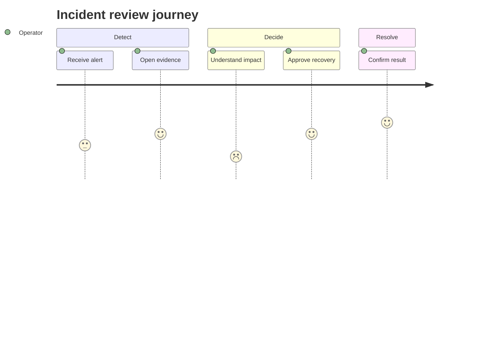
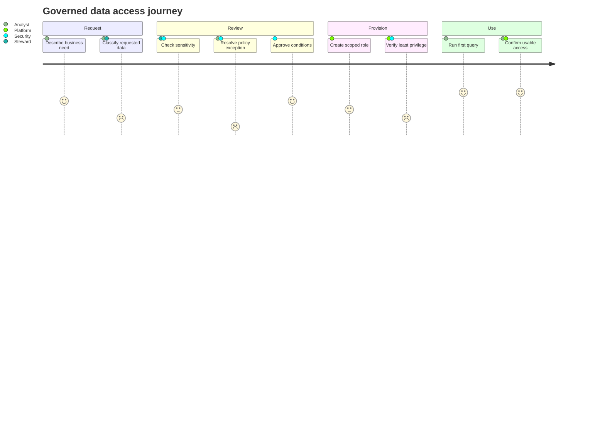

# User Journey

> `journey`의 현재 syntax와 renderer 지원은 target renderer와 Mermaid 공식 문서를 확인한다.

사람이 목표를 완료하는 **ordered journey step**, 각 step의 **1–5 experience score**, 그리고 그 step에 참여하는 actor를 함께 읽는 것이 핵심이면 `journey`를 사용한다.

Journey syntax는 task마다 score를 요구한다. Source에 score 근거가 없는데 diagram을 채우기 위해 임의로 `3` 같은 값을 만들지 않는다. 경험 점수 없이 절차·handoff만 설명해야 한다면 Flowchart/Swimlanes가 더 정확하고, actor별 정량 비교가 핵심이면 source table이나 chart를 사용한다.

## Basic: Source-Backed Journey

이 예제는 source가 `Detect → Decide → Resolve` 순서와 각 task의 1–5 score를 모두 뒷받침한다는 전제다. Score가 낮다는 사실만으로 원인, severity 또는 개선 우선순위를 추가로 추론하지 않는다.

## Score Semantics

Mermaid Journey의 score는 task당 하나의 숫자이며 공식 syntax 범위는 **1–5**다.

- Score가 survey, interview coding, workshop rating 또는 명시적 editorial assessment 중 무엇인지 해석에 필요하면 diagram 밖에서 basis를 밝힌다.
- 서로 다른 source, scale 또는 시점의 score를 같은 1–5 척도처럼 섞지 않는다.
- `1 → 5` 변화가 보인다고 해서 recovery, causal improvement 또는 intervention 효과를 자동으로 주장하지 않는다.
- 평균, 추세, 분산 또는 actor별 정량 비교가 핵심이면 Journey의 task score를 통계처럼 재사용하지 말고 원자료와 chart/table을 사용한다.
- Mermaid parser가 숫자를 받아들인다는 사실을 score validity로 간주하지 않는다. 최종 review에서 모든 score가 source-backed 1–5인지 확인한다.

## Actor Participation Is Not Ownership

Task 뒤의 actor 목록은 **그 task에 연결된 participant**를 나타낸다. 목록만으로 accountable owner, 승인 권한, handoff direction 또는 책임 비율을 만들지 않는다.

여러 actor가 한 task에 적혀도 **score는 actor별 점수가 아니라 그 task에 붙은 하나의 score**다. 같은 순간 Analyst는 `2`, Security는 `4`처럼 actor별 경험이 다르면 한 task의 actor list로 압축하지 않는다. Task를 source-backed 관점으로 나누거나 actor × step table/chart로 전환한다.

## Order And Sections

Journey의 declaration order는 읽는 journey step 순서를 만든다. 따라서 순서가 source-backed일 때만 ordered journey로 표현한다.

- `section`은 같은 journey phase의 task를 묶는다. Section 자체가 조직 boundary, ownership lane 또는 system component를 뜻하지 않는다.
- 인접한 두 task 사이에 dependency edge가 있는 것은 아니다. 앞 task가 다음 task의 원인·전제·trigger라는 사실은 별도 근거가 필요하다.
- Task width나 visual spacing을 elapsed time, effort 또는 중요도로 읽지 않는다.
- Source가 일부 step의 선후만 말하고 total order를 확정하지 않았다면 보기 좋은 순서를 임의로 만들지 않는다. Parallel/alternative path가 load-bearing이면 Flowchart나 Swimlanes를 검토한다.
- as-is와 to-be journey를 비교할 때 한 diagram 안에서 실제/제안 task를 섞어 현재 사실처럼 보이게 하지 않는다. 별도 diagram 또는 명시적 비교 table이 더 안전하다.

## Viewport And Density

Journey는 task가 늘수록 가로 폭과 actor legend 부담이 커진다.

- 상위 [Mermaid Diagram Reference](../mermaid-diagrams.md)의 Journey readability budget에 도달하면 phase별 split을 검토한다.
- 단순히 폭을 줄이려고 실제 journey step을 병합하거나 actor를 삭제하지 않는다.
- 긴 task label은 핵심 행동만 남기고 rationale·evidence는 companion prose로 이동한다.
- actor color, legend order와 기타 renderer presentation을 responsibility나 score semantics로 사용하지 않는다.

## Renderer-Sensitive Review

Journey는 syntax validity와 **experience-model fidelity**를 따로 검증한다.

1. 모든 task가 source-backed journey step이며 실제 순서가 확인됐는가.
1. 모든 score가 1–5 범위이고 같은 해석 basis를 공유하는가.
1. Score가 없던 source에 diagram을 맞추기 위한 값을 발명하지 않았는가.
1. 여러 actor가 붙은 task의 단일 score를 actor별 score처럼 읽히게 하지 않았는가.
1. Actor list를 ownership, approval authority 또는 handoff direction으로 과해석하지 않았는가.
1. Section을 phase grouping보다 강한 조직·system boundary로 사용하지 않았는가.
1. 낮은 점수 뒤 높은 점수가 나온다는 이유만으로 recovery나 causality를 주장하지 않았는가.
1. 정량 비교가 핵심인데 Journey score로 chart 역할을 대신하고 있지 않은가.
1. Task와 actor가 많아 읽기 어려우면 downscale보다 phase split을 검토했는가.

문제가 있으면 점수나 actor를 채워 넣어 Journey syntax에 맞추지 않는다. 먼저 source evidence와 representation choice를 고친다.

## Portable Fallback

Target renderer가 Journey를 지원하지 않거나 source가 1–5 score를 정당화하지 못하면 **phase, step order, score basis와 actor participation**을 필요한 범위에서 보존하는 table로 전환한다. Score가 불필요하고 process flow가 핵심이면 Flowchart/Swimlanes를 사용한다.
