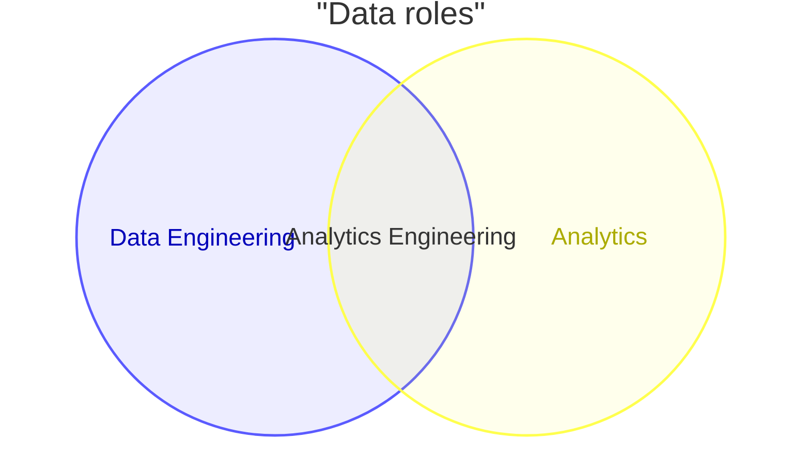
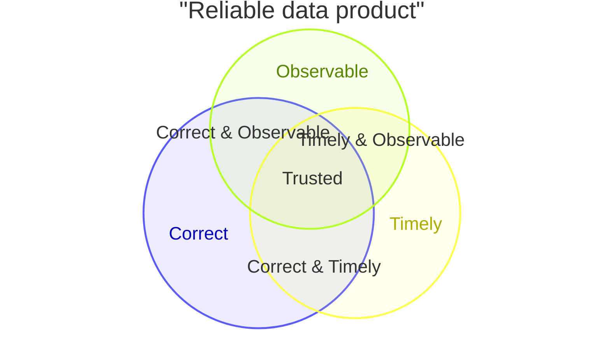

# Venn Diagram

> `venn-beta`는 비교적 새로운 syntax다. 현재 문법, layout과 target 지원은 Mermaid 공식 문서와 실제 renderer를 확인한다.

여러 **set의 membership overlap** 자체가 질문의 핵심이면 Venn diagram을 사용한다. Exact taxonomy, process, dependency 또는 정밀한 수치 비교가 핵심이면 다른 representation을 사용한다.

Mermaid DSL의 `union` keyword는 이름과 달리 **set-theoretic union(A ∪ B)이 아니라 두 개 이상 set의 overlap/intersection region**을 선언하는 데 사용된다. 이 차이를 문서와 review에서 명확히 유지한다.

## Basic: Two Sets And Overlap

`Analytics Engineering`은 `Engineering ∩ Analytics`에 해당하는 overlap label로 읽는다. 두 set의 전체 합집합을 뜻하지 않는다.

## Set Identity And Membership

Set identifier는 diagram 안의 stable identity다.

- 각 source set에는 unique identifier를 사용한다. 같은 identifier를 다른 label/size로 다시 선언해 서로 다른 set처럼 보이게 하지 않는다.
- `union`에 사용하는 identifier는 먼저 선언된 set을 참조한다.
- Display label과 identifier를 구분해 rename 시 모든 intersection reference가 같은 set을 가리키는지 확인한다.
- 같은 item이 어느 set에 속하는지 source가 불명확하면 보기 좋은 overlap을 만들기 위해 membership을 추론하지 않는다.
- Exact subset/superset containment가 핵심인데 overlap보다 hierarchy가 중요한 경우 Class/Mindmap/table 등 더 직접적인 표현을 사용한다.

## Qualitative Versus Quantitative Geometry

Size를 생략해도 renderer는 layout을 만들기 위한 default size를 사용한다. 따라서 **숫자를 쓰지 않았다고 circle area가 의미 없는 것은 아니지만, 그 geometry를 source-backed magnitude로 읽어서는 안 된다.**

- Qualitative diagram에서는 circle area와 overlap 면적을 정확한 population ratio처럼 설명하지 않는다.
- `:N` size를 사용할 때는 N이 무엇을 세는지, 같은 population/time basis인지 source가 명확해야 한다.
- Set size와 intersection size가 실제 count라면 `intersection ≤ each contributing set` 같은 기본 consistency를 먼저 검증한다.
- Size가 estimate, normalized weight 또는 illustrative weight라면 count처럼 표현하지 않는다.
- Exact comparison, percentage, confidence interval 또는 trend가 핵심이면 Venn geometry 대신 source table/chart를 사용한다.

## Advanced: Source-Backed Intersection Sizes

아래 예제는 모든 size가 같은 population과 snapshot에서 나온 count라는 전제다.

Triple intersection `6`은 각 pairwise intersection과 parent set보다 클 수 없다. Diagram을 작성하기 전에 이런 set arithmetic을 source data에서 검증한다.

## Higher-Arity Layout Needs Caution

세 개 이상 set의 overlap을 그릴 때 renderer가 layout을 위해 **source에 없는 pairwise subset data를 내부적으로 보충할 수 있다.** 이 synthetic data는 geometry 계산용이며 domain fact가 아니다.

- Triple overlap만 선언했다고 해서 화면에 생긴 모든 pairwise overlap area의 크기를 실제 pairwise count로 읽지 않는다.
- Pairwise magnitude가 질문에 중요하면 source-backed pairwise intersection을 명시하거나 matrix/table을 사용한다.
- Higher-arity geometry가 source relation을 안정적으로 전달하는지 actual target render로 확인한다.
- Set 수가 많아 declared overlap이 누락되거나 원하지 않은 overlap처럼 보이면 layout tuning으로 사실성을 주장하지 않는다. Intersection matrix, UpSet-style analysis 도구 또는 table 등 더 적절한 representation을 검토한다.

## Text Nodes And Styling

`text` node와 `style`은 overlap semantics를 보조하는 presentation layer다.

- Indented text는 최근 set/overlap region에 annotation을 배치하지만 membership count를 추가하지 않는다.
- Text 위치를 region의 정확한 centroid, rank 또는 importance로 해석하지 않는다.
- Text node가 많거나 region이 작으면 target renderer에서 위치가 불안정할 수 있으므로 핵심 label만 남긴다.
- Color/style 하나로 set membership, risk 또는 priority를 새로 만들지 않는다.

## Viewport And Density

Venn은 set과 intersection이 늘수록 geometry가 빠르게 복잡해진다.

- 중요한 overlap 몇 개만 남긴 excerpt라면 전체 set relationship을 완전하게 표현한다고 주장하지 않는다.
- 많은 set을 작은 viewport에 억지로 넣어 circle을 축소하지 않는다.
- 관계를 삭제해서 단순화하기보다 질문을 좁혀 set group을 나누거나 intersection matrix/table로 전환한다.

## Renderer-Sensitive Review

Venn Diagram은 syntax validity와 **set-membership fidelity**를 따로 검증한다.

1. Mermaid `union`을 실제 set union이 아니라 overlap/intersection으로 올바르게 사용했는가.
1. Set identifier가 unique하고 모든 intersection이 의도한 declared set을 참조하는가.
1. 모든 set membership과 declared intersection이 source-backed인가.
1. Size를 썼다면 같은 population/unit/time basis이며 set arithmetic이 모순되지 않는가.
1. Size를 생략한 geometry를 실제 magnitude처럼 읽히게 만들지 않았는가.
1. Higher-arity union의 synthetic pairwise layout area를 source data로 오해하지 않았는가.
1. Text node나 style이 membership·priority·magnitude를 대신하고 있지 않은가.
1. Diagram subset을 complete overlap inventory처럼 표현하지 않았는가.
1. 많은 set/overlap에서 actual renderer가 declared relationship을 안정적으로 보여주는가.
1. Exact quantitative comparison이 필요한데 Venn area만으로 수치를 전달하고 있지 않은가.

문제가 있으면 circle geometry를 조정해 의미를 맞추지 않는다. Source membership과 quantitative basis를 먼저 고치거나 더 적절한 representation으로 전환한다.

## Portable Fallback

Target renderer가 Venn을 안정적으로 지원하지 않으면 **set identity, membership/intersection, size와 population basis**를 보존하는 membership/intersection table로 전환한다. Exact quantitative comparison이 핵심이면 chart 또는 dedicated set-analysis 도구를 사용한다.
