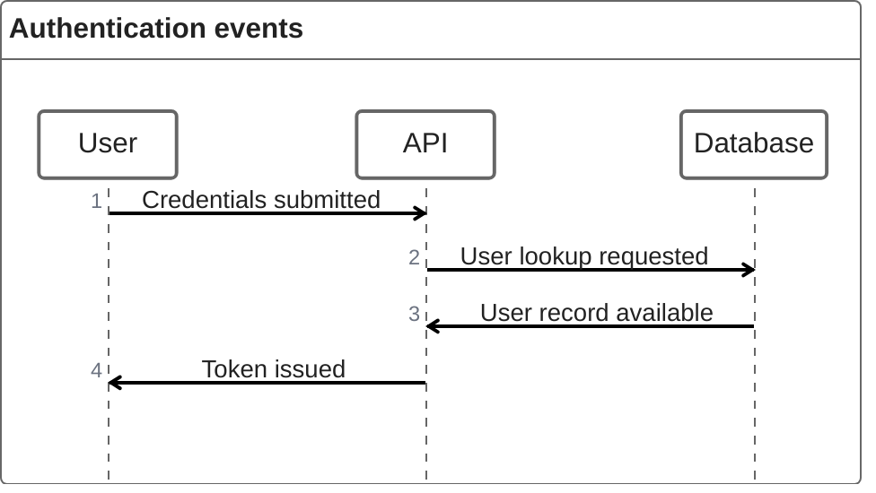
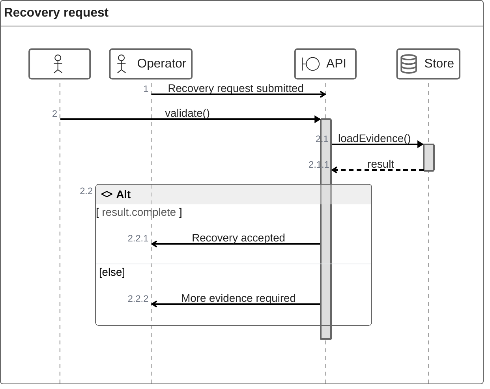
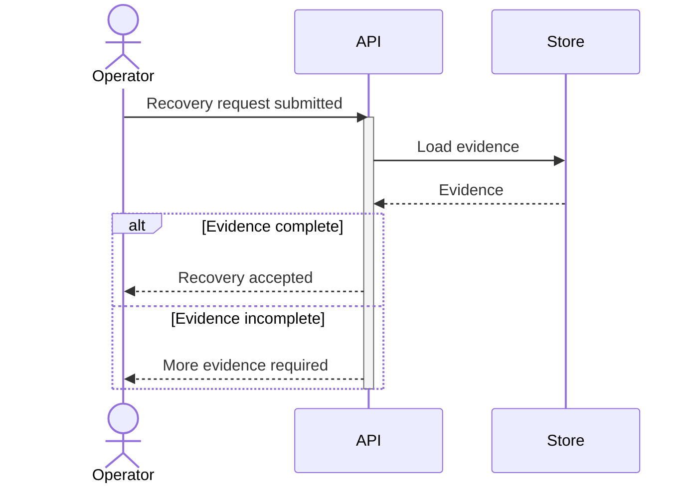

# ZenUML

> ZenUML은 Mermaid core sequence grammar와 다른 external diagram implementation을 사용한다. 현재 syntax, lazy-loading integration과 renderer 지원은 Mermaid 공식 문서와 실제 target에서 확인한다.

**Code-like call nesting과 control flow를 interaction order와 함께 읽는 것**이 핵심이고 target이 ZenUML을 실제로 지원할 때 `zenuml`을 사용한다. 단순 sequence를 코드처럼 보이게 만들기 위해 선택하지 않는다.

## Basic: Explicit Participants And Async Messages

ZenUML에서 `A->B` 형태는 **async message**다. 이 예제는 네 interaction이 non-blocking message라는 source 전제에서만 맞다. 단순 request/response를 보기 좋게 왕복 화살표로 만들거나 blocking call을 `->`로 표현하지 않는다.

Participant와 message order는 source-backed interaction을 보존한다. Code-like appearance가 runtime implementation language나 transport protocol까지 자동으로 증명하지 않는다.

## Message Kind Is Semantic

ZenUML은 sync, async, creation, reply message를 서로 다른 interaction으로 표현할 수 있다.

- Sync method-call syntax는 blocking call 의미가 source에 있을 때만 사용한다.
- `A->B` async syntax는 fire-and-forget/non-blocking interaction이 실제로 확인될 때만 사용한다.
- Creation message는 object/participant lifecycle creation이 source에 있을 때만 사용한다.
- Reply는 실제 response/return semantics가 있을 때만 표현한다. 보기 좋은 call stack을 만들기 위해 return을 발명하지 않는다.
- Arrow-style source를 기계적으로 ZenUML message kind에 대응시키지 않는다. 원래 notation이 sync/async를 말하지 않았다면 그 uncertainty를 유지한다.

## Nesting Represents Call Structure

ZenUML의 `{}` nesting은 sync/creation call structure를 code-like하게 보여주는 강한 semantic surface다.

이 예제에서 `Operator->API`와 `API->Operator`는 async message이고, `API.validate()`와 `Store.loadEvidence()`는 sync call/reply 구조다. Source가 이런 message-kind 차이를 실제로 뒷받침한다는 전제다.

- Nested block을 단순 visual indentation으로 사용하지 않는다. Parent call 안에서 child interaction이 실제로 일어나는 source일 때만 중첩한다.
- Assignment-looking text나 method-call notation을 source code 사실처럼 확대 해석하지 않는다. Diagram은 interaction model이며 실행 가능한 program이 아니다.
- `if`, loop, `par`, `try/catch/finally`, `opt`는 실제 behavioral condition을 표현할 때만 사용한다.
- `par`은 unordered를 뜻하는 약한 표현이 아니라 parallel execution claim이다.
- `try/catch/finally`는 exception-handling structure가 source에 있을 때만 사용한다. 단순 failure path를 code-like하게 만들기 위해 추가하지 않는다.

## Portable Fallback Must Preserve Meaning

Portable documentation이 중요하거나 target ZenUML 지원이 불확실하면 `sequenceDiagram` fallback을 사용하되 **surface syntax가 아니라 interaction semantics**를 옮긴다.

위 예제의 fallback은 standard Sequence Diagram이 ZenUML의 sync/async distinction을 완전히 같은 방식으로 소유하지 않는다는 점을 전제로 한다.

- Nested sync call은 activation/message order로 보존할 수 있지만 두 notation이 완전히 동일하다고 가정하지 않는다.
- ZenUML async/creation/reply semantics가 fallback target에서 정확히 대응되지 않으면 companion prose/table로 차이를 드러낸다.
- `try/catch/finally`를 단순 `alt success/else failure`로 바꾸면 exception/finally semantics가 달라질 수 있다. Exact exception flow가 load-bearing이면 기계적 fallback을 만들지 말고 source semantics를 별도로 설명한다.
- fallback 과정에서 acknowledgement, success branch 또는 return을 새로 만들지 않는다.

## Comments Are Visible Documentation

ZenUML의 `// comment`는 일반 source-code hidden comment처럼 취급하지 않는다. Mermaid 공식 ZenUML behavior에서는 message/fragment 위에 **rendered documentation text**로 나타날 수 있다.

- Diagram에 보이면 안 되는 내부 메모를 `//` comment로 숨기려 하지 않는다.
- 긴 comment/documentation block이 participant와 message layout을 압도하면 diagram 밖 prose로 이동한다.
- Comment rendering은 renderer-sensitive surface이므로 중요한 annotation이면 actual target render를 확인한다.

## Participant Annotators Are Presentation Plus Role Claim

`@Actor`, `@Boundary`, `@Database` 같은 annotator는 participant role을 더 구체적으로 보이게 한다.

- Source가 해당 role을 뒷받침할 때만 사용한다.
- Annotator shape를 deployment boundary, persistence guarantee 또는 UML stereotype 계약으로 확대 해석하지 않는다.
- Role이 중요하지 않으면 plain participant를 우선해 visual vocabulary를 줄인다.

## Actual Render Is The Acceptance Gate

Current Mermaid ZenUML adapter에서 core-side parser는 Mermaid API를 만족시키기 위한 **no-op parser**이고 실제 DSL parsing/rendering은 `@zenuml/core`의 renderer에서 수행된다.

따라서:

- `mermaid.parse()` 성공만으로 ZenUML source가 유효하다고 판정하지 않는다.
- Syntax, nesting, comment, annotator와 control-flow가 load-bearing이면 actual target render를 acceptance evidence로 사용한다.
- Target가 external diagram registration/lazy loading을 제공하지 않으면 `zenuml` declaration이 source상 맞아도 사용할 수 없다.
- Current integration은 experimental lazy-loading/async rendering surface이므로 renderer/version portability를 별도로 확인한다.

## Viewport And Density

Code-like nesting이 깊어지면 sequence width와 vertical depth가 함께 커진다.

- Method nesting, loop와 exception structure를 한 diagram에 모두 넣기보다 scenario별로 나눈다.
- 폭을 줄이기 위해 participant order나 message order를 바꾸지 않는다.
- nested block을 평탄화하면 call/control semantics가 변하는 경우 split을 우선한다.
- 표준 Sequence Diagram이 같은 질문을 더 단순하게 표현하면 ZenUML을 고집하지 않는다.

## Renderer-Sensitive Review

ZenUML은 **actual-render validity와 interaction fidelity**를 함께 검증한다.

1. ZenUML을 선택한 이유가 code-like nesting/control flow이며 단순 sequence syntax 취향이 아닌가.
1. Participant identity와 message order가 source와 일치하는가.
1. `->` async와 sync/creation/reply syntax가 source의 실제 message kind와 일치하는가.
1. `{}` nesting이 실제 call structure이며 단순 grouping이 아닌가.
1. `if`, loop, `par`, `try/catch/finally`가 실제 behavior를 나타내는가.
1. Annotator가 source-backed role이며 visual stereotype로 새 boundary를 만들지 않는가.
1. `//` comment를 hidden source comment로 잘못 사용하지 않았는가.
1. `sequenceDiagram` fallback이 condition, order, participant와 load-bearing message-kind 차이를 보존하는가.
1. Fallback이 source에 없던 success/return/failure path를 만들지 않는가.
1. `mermaid.parse()`만이 아니라 실제 target renderer에서 syntax와 layout을 확인했는가.

문제가 있으면 ZenUML 문법에 맞게 interaction을 발명하지 않는다. Source semantics를 좁히거나 더 portable한 Sequence Diagram/table로 전환한다.
