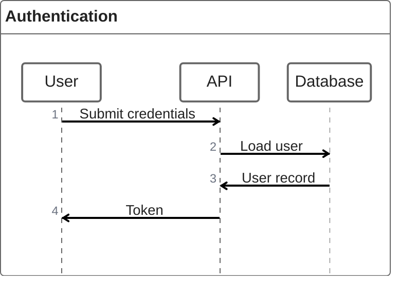
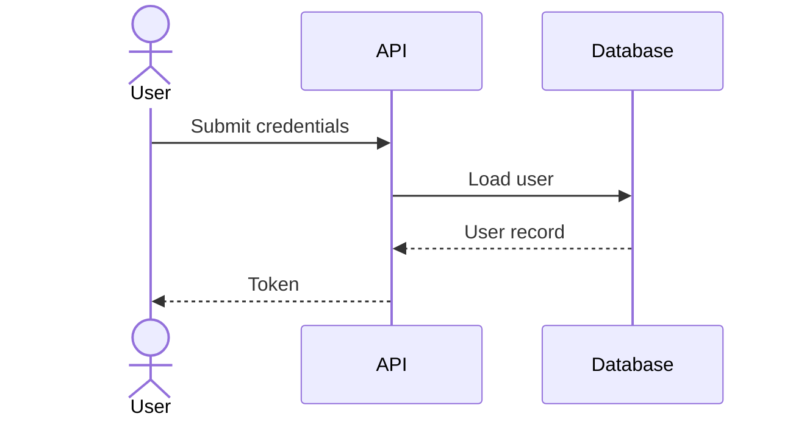
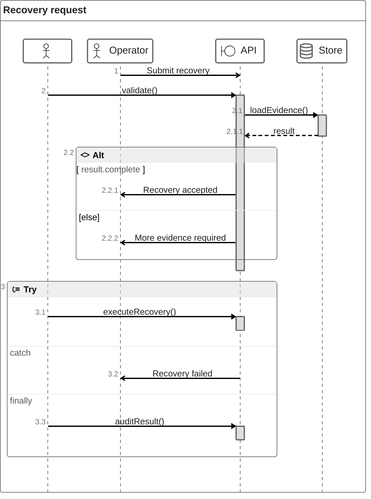
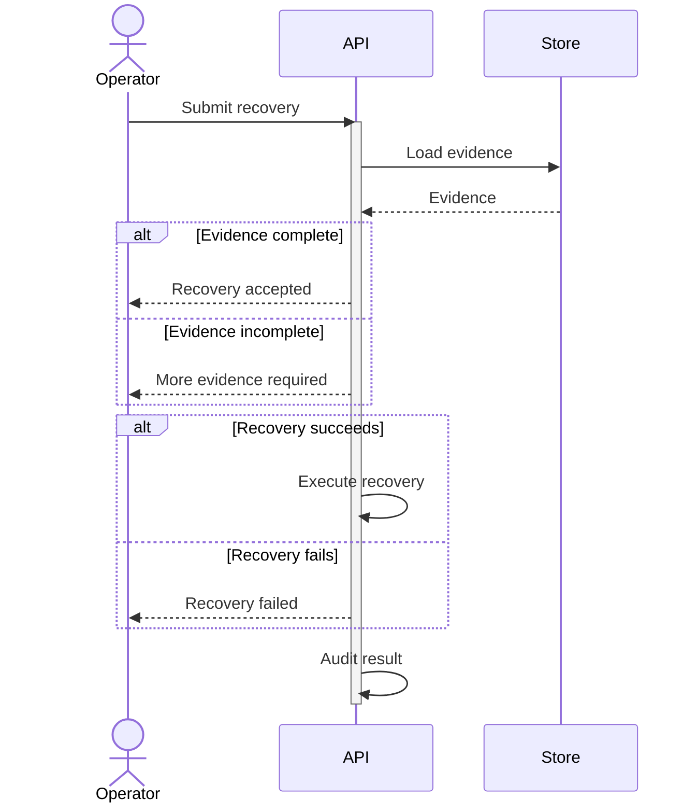

# ZenUML

ZenUML은 code-like interaction, nesting과 exception 흐름을 sequence 형태로 표현할 때 사용한다. 지원 방식은 Mermaid version과 embedding renderer에 따라 달라질 수 있으므로 **현재 공식 Mermaid 문서와 target renderer에서 실제 지원을 확인한다.**

Target이 ZenUML을 지원하면 일반 Mermaid source로 `zenuml` declaration을 사용한다. 지원 여부가 불확실하거나 portable Markdown이 우선이면 `sequenceDiagram` fallback을 기본으로 사용한다.

## Basic: ZenUML Source

## Basic: Portable Fallback

## Advanced: ZenUML Source

## Advanced: Portable Fallback

## Rules

- standard `sequenceDiagram`과 ZenUML 문법을 한 diagram 안에서 섞지 않는다.
- nested sync call, `if`, loop, `try/catch/finally`가 실제 이해를 높일 때만 ZenUML을 사용한다.
- target이 ZenUML을 지원한다고 확인하지 못했고 portability가 중요하면 `sequenceDiagram` fallback을 사용한다.
- ZenUML의 정확한 participant, annotation과 control-flow syntax는 local example보다 현재 공식 문서를 우선한다.
