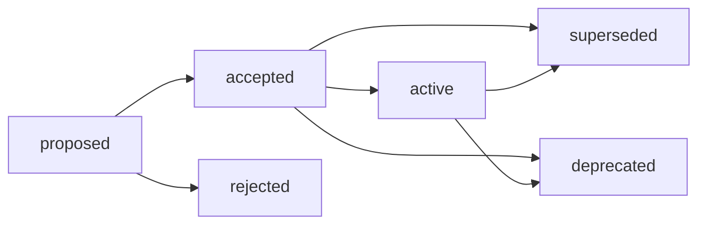

# 아키텍처 결정 기록 (ADR)

> 기술적 결정 추적 및 생명주기 관리.

## 1. 사용 시점

- 핵심 기술 스택을 도입하거나 교체할 때.
- 주요 아키텍처 패턴을 결정할 때.
- 시스템 트레이드오프가 수반되는 중대한 기술적 결정을 내릴 때.

## 2. 템플릿 의존성

- `templates/adr-000.md`를 사용하여 새로운 ADR 문서를 생성합니다.
- 대상 명명 규칙: `[ID]-[제목].md` (예: `adr-001-database.md`).

## 3. 작성 지침

- **컨텍스트 (Context)**: 배경과 해결하려는 문제를 설명합니다.
- **결정 (Decision)**: 선택한 기술적 경로 또는 정책을 명시합니다.
- **결과 (Consequences)**: 긍정적인 영향과 부정적인 트레이드오프(리스크)를 기록합니다.
- **상호 참조 (Cross-reference)**: 구현 상세 사항은 관련 SPEC 문서로 링크합니다.

## 4. 생명주기 관리

ADR 생명주기 상태를 관리합니다:

### 상태 (Status)

| 상태 | 활성 | 설명 |
| :--- | :--- | :--- |
| `proposed` | ✅ | 결정이 제안되어 검토 중입니다. |
| `accepted` | ✅ | 결정이 승인되었으나 구현 대기 중입니다. |
| `active` | ✅ | 결정이 구현되어 현재 사용 중입니다. |
| `deprecated` | ❌ | 결정이 더 이상 사용되지 않거나 제거될 예정입니다. |
| `superseded` | ❌ | 새로운 결정으로 대체되었습니다. |
| `rejected` | ❌ | 결정이 승인되지 않았습니다. |

### 생명주기 (Lifecycle)

