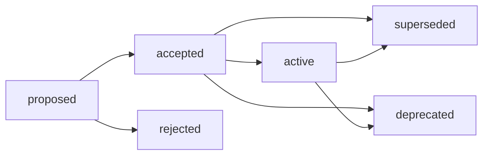

# Architecture Decision Records (ADR)

> Technical decision tracking and lifecycle management.

## 1. When to use

- Introduce or replace a core technology stack.
- Determine major architectural patterns.
- Make technical decisions involving significant system trade-offs.

## 2. Template Dependency

- Use `templates/adr-000.md` to scaffold new ADR documents.
- Target naming convention: `[ID]-[Title].md` (e.g., `adr-001-database.md`).

## 3. Authoring Instructions

- **Context**: State the background and the problem to resolve.
- **Decision**: Specify the chosen technical path or policy.
- **Consequences**: Document the positive impact and negative trade-offs (risks).
- **Cross-reference**: Link to related SPEC documents for implementation details.

## 4. Lifecycle Management

Manage ADR lifecycle states:

### Status

| Status | Active | Description |
| :--- | :--- | :--- |
| `proposed` | ✅ | Decision is proposed and under review. |
| `accepted` | ✅ | Decision is approved but pending implementation. |
| `active` | ✅ | Decision is implemented and currently in use. |
| `deprecated` | ❌ | Decision is obsolete or slated for removal. |
| `superseded` | ❌ | Decision has been replaced by a newer decision. |
| `rejected` | ❌ | Decision was not approved. |

### Lifecycle

