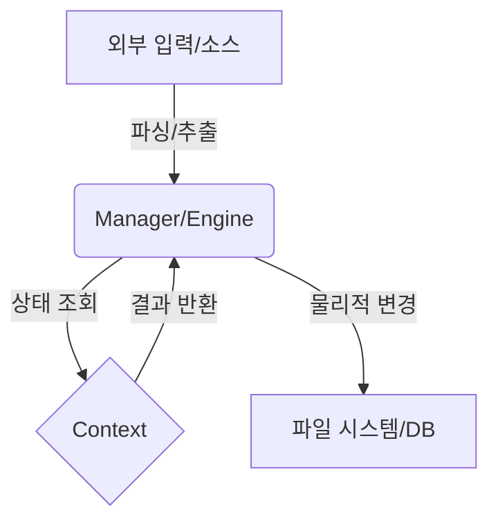

# [기능 명칭] SPEC (Integrated Specification & Design)

## 1. 개요 (Overview)

본 명세는 `[기능 명칭]`의 기획 의도와 기술적 구현 상세를 정의합니다. 이 컴포넌트의 단일 목표는 `[목적 입력]`입니다.

## 2. 기획 의도 (Rationale)

- **문제 해결**: `[수동 작업의 불편함, 데이터 파편화 등 해결하려는 문제]`
- **사용자 가치**: `[사용자가 얻게 되는 최종 이점]`
- **시스템 기여**: `[시스템 전체의 안정성이나 모듈성 향상 포인트]`

## 3. 기능 명세 (Functional Specifications)

### 3.1 핵심 동작
- `[동작 1]`: 사용자가 `[입력]`하면 시스템은 `[처리]`하여 `[결과]`를 제공합니다.
- `[동작 2]`: `[조건]`일 경우 시스템은 자동으로 `[자동화 동작]`을 수행합니다.

### 3.2 사용자/데이터 시나리오
- `[시나리오 A]`: `[정상 흐름 설명]`
- `[시나리오 B]`: `[예외 상황 및 대응 정책]`

## 4. 기술 설계 (Technical Design)

에이전트가 구현 시 참고할 구체적인 기술 명세입니다.

### 4.1 데이터 흐름 및 아키텍처 (Data Flow)

### 4.2 주요 데이터 구조 및 객체 모델

#### 데이터 스키마 (Data Schema)
| 필드명 | 타입 | 설명 | 필수 여부 |
| :--- | :--- | :--- | :---: |
| `field_name` | `str` | `[필드 설명]` | Y |
| `options` | `dict` | `[부가 설정]` | N |

#### 핵심 클래스/인터페이스 (Interface)
- **`ClassName`**: `[역할 설명]`
  - `method_name(param: type) -> return_type`: `[메서드 동작 상세]`

### 4.3 구현 핵심 매커니즘 (Internal Mechanics)
- **[알고리즘/로직 1]**: `[병합 알고리즘, 정규표현식 패턴 등 구체적 명시]`
- **[동기화 방식]**: `[비동기 처리, 락킹 메커니즘 등]`

## 5. 제약 사항 및 예외 처리 (Constraints)

- **[제약 사항]**: `[메모리 사용량, 절대 경로 의존성 배제, 특정 라이브러리 버전 등]`
- **[예외 정책]**: `[HTTP 404 시 재시도 횟수, 파일 부재 시 기본값 반환 등]`

---

## 6. 품질 및 테스트 기준 (QA)

- **검증 포인트**:
  - `[테스트 케이스 1]`
  - `[테스트 케이스 2]`
- **성능 하한선**: `[응답 시간, 최대 처리 용량 등]`
