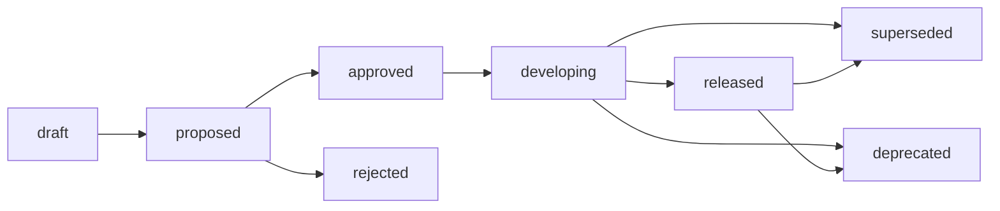

# Product Requirement Documents (PRD)

> Product vision tracking, user requirements definition, and lifecycle management.

## 1. When to use

- Define a new product, service, or major business feature.
- Clarify "What" needs to be built and "Why" it delivers value to users and the business.
- Establish a single source of truth for cross-functional alignment (Product, Design, Dev, QA).

## 2. Template Dependency

- Use `templates/prd-000.md` to scaffold new PRD documents.
- Target naming convention: `[ID]-[Title].md` (e.g., `prd-001-user-onboarding.md`).

## 3. Authoring Instructions

- **Overview & Goals**: Clearly define the high-level description, target audience (personas), and business/product objectives.
- **User Scenarios & Stories**: Describe step-by-step user journeys and outline core user stories in standard format (*"As a [user type], I want to [action] so that [benefit]"*).
- **Functional Requirements**: Detail functional requirements, prioritizing them (e.g., Must-Have, Should-Have, Could-Have) using tables.
- **UI/UX Flow & Wireframes**: Outline user navigation flows and describe UI/UX expectations.
- **Success Metrics (KPIs)**: Define measurable goals to determine if the released feature succeeded.
- **Cross-reference**: Link to related SPEC and ADR documents for engineering blueprints.

## 4. Lifecycle Management

Manage PRD lifecycle states:

### Status

| Status | Active | Description |
| :--- | :--- | :--- |
| `draft` | ✅ | Requirement definition is in early drafting stage. |
| `proposed` | ✅ | Requirement is proposed and under review/alignment. |
| `approved` | ✅ | Requirement is approved by stakeholders and ready for dev. |
| `developing` | ✅ | Requirement is currently in active implementation. |
| `released` | ✅ | Feature is deployed to production and under evaluation. |
| `rejected` | ❌ | Requirement was reviewed and not approved. |
| `deprecated` | ❌ | Requirement/feature is obsolete or removed. |
| `superseded` | ❌ | Requirement has been replaced by a newer PRD. |

### Lifecycle

