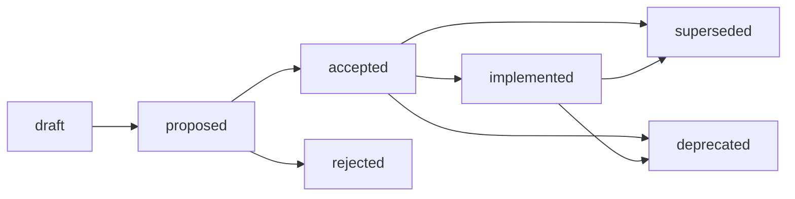

# 사양서 (SPEC)

> 상세 구현 설계 및 요구사항 추적.

## 1. 사용 시점

- 새로운 기능 구현을 시작할 때.
- 복잡한 로직이나 새로운 컴포넌트를 설계할 때.
- 승인된 ADR의 결과에 따른 상세 구현 사양을 작성할 때.

## 2. 템플릿 의존성

- `./templates/spec-000.md`를 사용하여 새로운 SPEC 문서를 생성합니다.
- 대상 명명 규칙: `[ID]-[제목].md` (예: `spec-001-user-auth.md`).

## 3. 작성 지침

- **근거 (Rationale)**: 해결하려는 문제와 제공하는 가치를 기술합니다.
- **사양 및 설계 (Specifications & Design)**: 데이터 스키마, API 인터페이스, 예외 처리 정책 등을 상세히 기술합니다.
- **단일 진실 공급원 (Single Source of Truth)**: 코드 변경이 발생할 때마다 SPEC 문서를 즉시 업데이트합니다.
- **상호 참조 (Cross-reference)**: 해당되는 경우 원천 ADR 문서로 링크합니다.

## 4. 생명주기 관리

### 상태 (Status)

| 상태 | 활성 | 설명 |
| :--- | :--- | :--- |
| `draft` | ✅ | 사양서 작성 초기 단계입니다. |
| `proposed` | ✅ | 사양서가 제안되어 검토 중입니다. |
| `accepted` | ✅ | 사양서가 승인되었으나 구현 대기 중입니다. |
| `implemented` | ✅ | 사양서가 구현되어 현재 사용 중입니다. |
| `deprecated` | ❌ | 사양서가 더 이상 유효하지 않거나 제거될 예정입니다. |
| `superseded` | ❌ | 새로운 사양서로 대체되었습니다. |
| `rejected` | ❌ | 사양서가 승인되지 않았습니다. |

### 생명주기 (Lifecycle)

