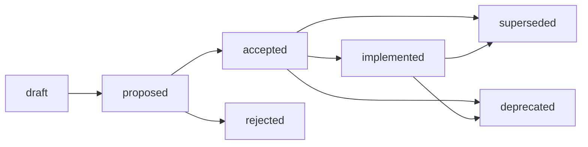

# Specifications (SPEC)

> Detailed implementation design and requirements tracking.

## 1. When to use

- Begin implementation of a new feature.
- Design complex logic or new components.
- Detail the implementation specifications resulting from an accepted ADR.

## 2. Template Dependency

- Use `./templates/spec-000.md` to scaffold new SPEC documents.
- Target naming convention: `[ID]-[Title].md` (e.g., `spec-001-user-auth.md`).

## 3. Authoring Instructions

- **Rationale**: State the problem to solve and the value provided.
- **Specifications & Design**: Detail data schemas, API interfaces, and exception handling policies.
- **Single Source of Truth**: Update the SPEC document immediately whenever code changes occur.
- **Cross-reference**: Link to the originating ADR document if applicable.

## 4. Lifecycle Management

### Status

| Status | Active | Description |
| :--- | :--- | :--- |
| `draft` | ✅ | Specification is in early drafting stage. |
| `proposed` | ✅ | Specification is proposed and under review. |
| `accepted` | ✅ | Specification is approved but pending implementation. |
| `implemented` | ✅ | Specification is implemented and currently in use. |
| `deprecated` | ❌ | Specification is obsolete or slated for removal. |
| `superseded` | ❌ | Specification has been replaced by a newer specification. |
| `rejected` | ❌ | Specification was not approved. |

### Lifecycle

