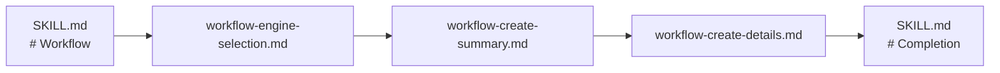

# Iceberg Code Review

> [!NOTE]
> 코드 리뷰 결과를 핵심부터 세부 내용까지 단계적으로 보여주는 아이스버그형 보고서 포맷을 제공합니다. 템플릿 기반 문서 생성과 프론트 매터·섹션 구조 검증을 지원하며, 리뷰 엔진은 필요에 따라 교체할 수 있습니다.

## Workflow

### Engine Selection

[engine-selection-workflow](references/workflow-engine-selection.md)를 따른다.

### Report Creation

1. [create-summary](references/workflow-create-summary.md)를 실행한다.
2. 생성된 summary file을 입력으로 [create-details](references/workflow-create-details.md)를 실행한다.
3. 각 생성 문서를 해당 워크플로의 검증 절차로 검증한다. 모든 생성 문서가 검증을 통과하면 완료한다.

## Priority

| Emoji | Priority | Description                                                        |
| :---: | :------- | :----------------------------------------------------------------- |
|  🔴   | `p0`     | 즉시 확인 또는 조치해야 함. 진행을 막거나 중대한 영향을 줄 수 있음 |
|  🟠   | `p1`     | 높은 우선순위로 현재 작업 범위에서 처리해야 함                     |
|  🟡   | `p2`     | 일반 우선순위. 계획된 검토·수정 과정에서 처리함                    |
|  🟢   | `p3`     | 낮은 우선순위. 후속 작업이나 여유가 있을 때 처리함                 |
|  🔵   | `p4`     | 참고 목적. 별도 조치 없이 기록을 유지함                            |

## References

| Review Engine | Trigger: When need Built-in engine |
| :--- | :--- |
| [code-understanding](references/engine-code-understanding.md) | 변경의 배경·의도·방향을 검토할 때 |
| [code-implementation](references/engine-code-implementation.md) | 코드 구현을 검토할 때 |
| [code-quality](references/engine-code-quality.md) | 코드 품질·정확성·변경 용이성을 검토할 때 |
| [code-operations](references/engine-code-operations.md) | 운영 가능성과 신뢰성을 검토할 때 |
| [code-risk](references/engine-code-risk.md) | 보안·성능·동시성 및 프로덕션 위험을 검토할 때 |

## Suggestions

| Agent Skill | Trigger: On Commanded |
| :--- | :--- |
| `caveman`[^external-agent-skill] | 간결한 문장 구조를 명령 받은 경우 |
| `ponytail`[^external-agent-skill] | 코드 오버 엔지니어링 리뷰를 명령 받은 경우 |

## Boundaries

- 리뷰만 수행
- 리뷰 대상 수정 금지

[^external-agent-skill]: 외부 에이전트 스킬
