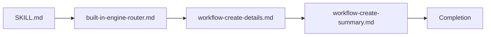

# Iceberg Code Review

> [!NOTE]
> 코드 리뷰 결과를 핵심부터 세부 내용까지 단계적으로 보여주는 아이스버그형 보고서 포맷을 제공합니다. 템플릿 기반 문서 생성과 프론트 매터·섹션 구조 검증을 지원하며, 리뷰 엔진은 필요에 따라 교체할 수 있습니다.

## Workflow



### Engine Selection

- Engine specified → use it.
- No engine, purpose given → apply relevant external skill/instructions; none → matching built-in engine.
- No engine, no purpose → default `implementation` + `quality`.
- New review area found mid-review → no engine addition. Recommend follow-up in report.
- Duplicate details across engines → merge; keep higher `priority`.

### Report Creation

1. 각 리뷰 결과마다 `create-details`를 실행해 대응하는 detail을 생성하고 검증한다.
2. 검증된 모든 detail을 참고하여 `create-summary`를 실행한다.
3. summary 검증이 통과하면 완료한다.

### Create details report

One review result → one validated detail. Finish before next.

1. Review target with selected engine or skill. Run relevant tests. Keep `PASS`, `FAIL`, `ERROR`, `SKIP` counts.
2. Set `domain` and `detail` slugs: lowercase letters, digits, hyphens.
3. Create detail in `<review_dir>`:

    ```bash
    <PYTHON_EXEC> "<SKILL_DIR>/scripts/create_detail.py" --review-dir "<review_dir>" --domain "<domain>" --detail "<detail>"
    ```

4. Fill verified issue, location, impact, recommendation, verification. Remove template comments and instructions.
5. Validate:

    ```bash
    <PYTHON_EXEC> "<SKILL_DIR>/scripts/validate_detail.py" "<detail_file_path>"
    ```

6. `FAIL: ...` → fix, rerun. Pass → next review result.

### Create summary report

create `__summary__.md`

1. Create in `<review_dir>`:

    ```bash
    <PYTHON_EXEC> "<SKILL_DIR>/scripts/create_summary.py" --review-dir "<review_dir>"
    ```

2. Read all validated details. Fill links and test counts. Remove template comments and instructions.
3. Validate:

    ```bash
    <PYTHON_EXEC> "<SKILL_DIR>/scripts/validate_summary.py" "<summary_file_path>"
    ```

4. `FAIL: ...` → fix, rerun. Pass → finish.

### Vaildate summary

## Priority

| Emoji | Priority | Description                                                        |
| :---: | :------- | :----------------------------------------------------------------- |
|  🔴   | `p0`     | 즉시 확인 또는 조치해야 함. 진행을 막거나 중대한 영향을 줄 수 있음 |
|  🟠   | `p1`     | 높은 우선순위로 현재 작업 범위에서 처리해야 함                     |
|  🟡   | `p2`     | 일반 우선순위. 계획된 검토·수정 과정에서 처리함                    |
|  🟢   | `p3`     | 낮은 우선순위. 후속 작업이나 여유가 있을 때 처리함                 |
|  🔵   | `p4`     | 참고 목적. 별도 조치 없이 기록을 유지함                            |

## Suggestions

| Agent Skill | Trigger: On Commanded |
| :--- | :--- |
| `caveman`[^external-agent-skill] | 간결한 문장 구조를 명령 받은 경우 |
| `ponytail`[^external-agent-skill] | 코드 오버 엔지니어링 리뷰를 명령 받은 경우 |

## Boundaries

- 리뷰만 수행
- 리뷰 대상 수정 금지

[^external-agent-skill]: 외부 에이전트 스킬
