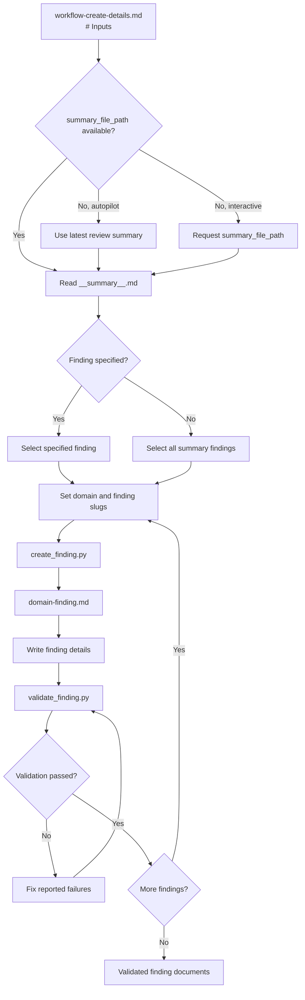

# Create Details Workflow



## Inputs

- `summary_file_path`: **required**. Path to a validated `__summary__.md` file.
  - If omitted in autopilot mode, use the latest review summary.
  - Otherwise, request it from the user.
- `finding`: Finding to detail. Default: every finding in `__summary__.md`.
- `domain`: Slug naming the finding domain.
- `<SKILL_DIR>`: Directory containing this skill's `scripts/` directory.
- `<PYTHON_EXEC>`: Selected Python interpreter.

## Details

### Select Findings

- Determine one `domain` and one `finding` slug for each finding document.
- Use lowercase letters, digits, and hyphens only for both slugs.
- Process every selected finding in sequence.

### Create `domain-finding.md`

```bash
<PYTHON_EXEC> "<SKILL_DIR>/scripts/create_finding.py" --summary-file "<summary_file_path>" --domain "<domain>" --finding "<finding>"
```

- Populate the generated `domain-finding.md` with the verified issue and location, impact, actionable recommendation, and verification method.
- Remove template comments and authoring instructions.

### Validate `domain-finding.md`

```bash
<PYTHON_EXEC> "<SKILL_DIR>/scripts/validate_finding.py" "<finding_file_path>"
```

- If validation reports `FAIL: ...`, fix the named issue and rerun `validate_finding.py`.
- Continue with the next finding only after validation succeeds.
