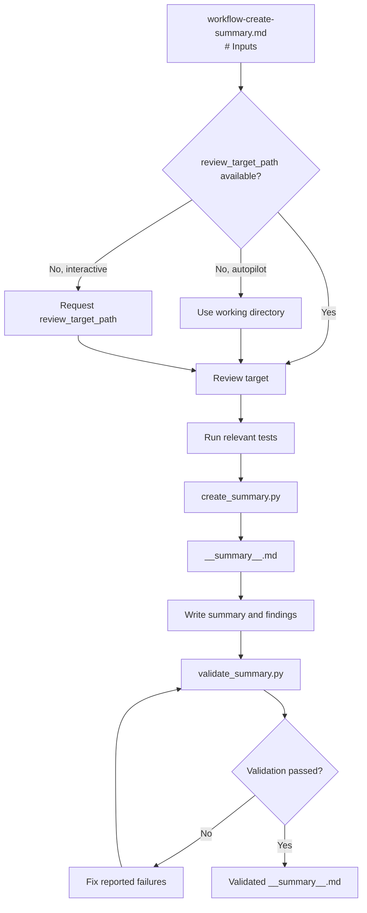

# Create Summary Workflow



## Inputs

- `review_target_path`: **required**. Review target file or directory.
  - If omitted in autopilot mode, use the current working directory.
  - Otherwise, request it from the user.
- `title_slug`: **required**. Lowercase letters, digits, and hyphens only.
- `<SKILL_DIR>`: Directory containing this skill's `scripts/` directory.
- `<PYTHON_EXEC>`: Selected Python interpreter.

## Details

### Review Target

- Apply a selected code-review skill when one is available.
- Review the specified code, PR, or diff.
- Choose and run tests appropriate to the review target and project environment.
- Collect `PASS`, `FAIL`, `ERROR`, and `SKIP` counts.

### Create `__summary__.md`

```bash
<PYTHON_EXEC> "<SKILL_DIR>/scripts/create_summary.py" --title-slug "<title_slug>" --workspace-dir "<workspace_absolute_path>"
```

- Record the absolute path emitted for `__summary__.md`.
- Populate all placeholders with the review findings and test results.
- Remove template comments and authoring instructions.

### Validate `__summary__.md`

```bash
<PYTHON_EXEC> "<SKILL_DIR>/scripts/validate_summary.py" "<summary_file_path>"
```

- If validation reports `FAIL: ...`, fix the named issue and rerun `validate_summary.py`.
- Continue only after validation succeeds.
