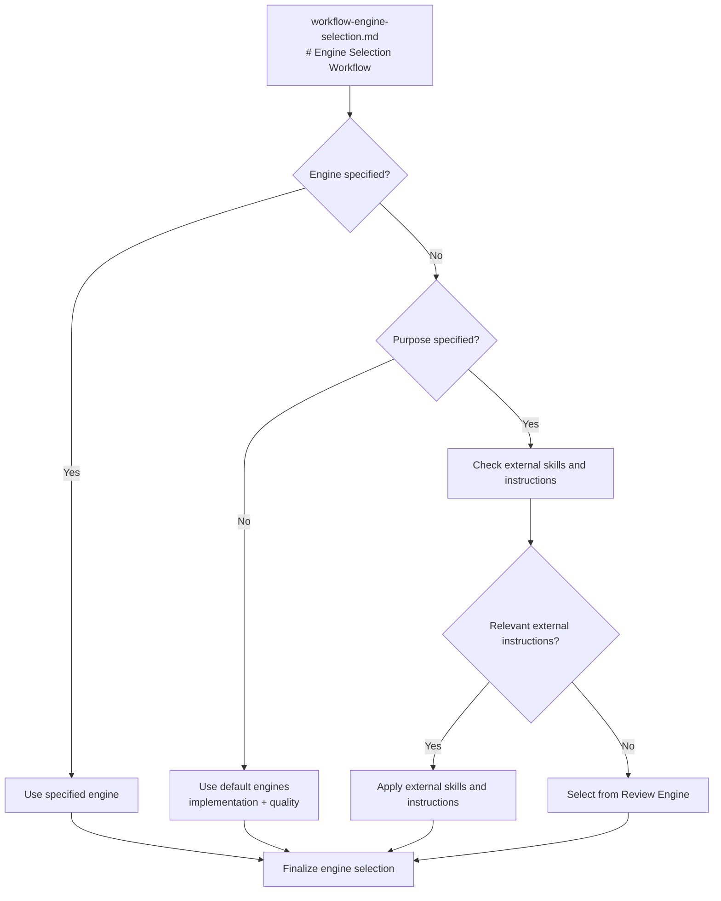

# Engine Selection Workflow

```mermaid
flowchart TD
    A[workflow-engine-selection.md<br/># Engine Selection Workflow] --> B{Engine specified?}
    B -->|Yes| C[Use specified engine]
    B -->|No| D{Purpose specified?}
    D -->|Yes| E[Check external skills and instructions]
    D -->|No| F[Use default engines<br/>implementation + quality]
    E --> G{Relevant external instructions?}
    G -->|Yes| H[Apply external skills and instructions]
    G -->|No| I[Select from Review Engine]
    C --> J[Finalize engine selection]
    F --> J
    H --> J
    I --> J
```

---

- 리뷰 중 다른 검토 영역을 발견해도 엔진을 추가하지 않는다. 필요한 경우 보고서에 추가 검토를 권고한다.
- 여러 엔진의 중복 지적은 합치고, 더 높은 `priority`를 유지한다.
