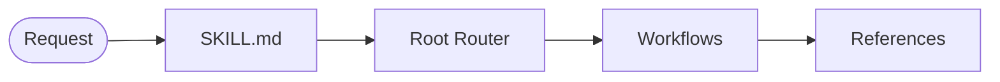
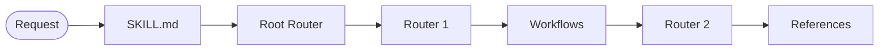

# Agent Skill Architecture Ultra

> [!NOTE]
> Prior knowledge: [`architecture.md`](architecture.md)

Advanced directory partitioning strategy to prevent asset clutter in `references/`. Keep passive knowledge, guidelines, and principles inside `references/`, while offloading structural and operational assets into specialized directories.

## Directory Ultra Breakdown

| Path | Required | Description |
| :--- | :---: | :--- |
| `references/` | ✅ | Passive knowledge, design specifications, and core principles. |
| `workflows/` | ❌ | Actionable procedural guidelines and task execution modules. |
| `router/` | ❌ | Dedicated routing logic and decision matrix assets. |
| `command/` | ❌ | Command-line interface flag handlers (e.g. `--help.md`, `--init.md`, `--config.md`, `--route.md`). |

## Patterns

### 1. Direct Flow

### 2. Cascading Flow

