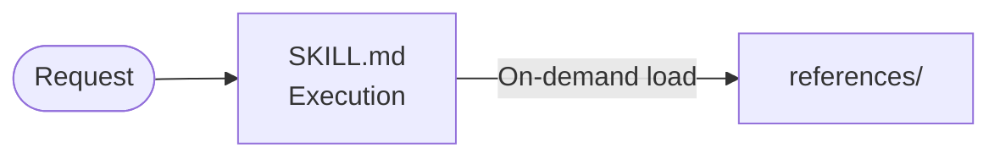

# Agent Skill Architecture

Standard Agent Skill Architecture (`agentskills.io` Spec)

## Directory

| Path | Required | Description |
| :--- | :---: | :--- |
| `SKILL.md` | ✅ | Root entry & execution rules. |
| `references/` | ❌ | Passive specs & domain knowledge. Add when docs are long or conditionally loaded. |
| `scripts/` | ❌ | Executable code. |
| `assets/` | ❌ | Static templates & materials. Add when output files are copied or reused. |

## Patterns

### Single-File Skill

### Skill with References

## References

- `architecture-ultra.md`: ultra 수준 에이전트 스킬 디렉토리 구성을 다룸.
